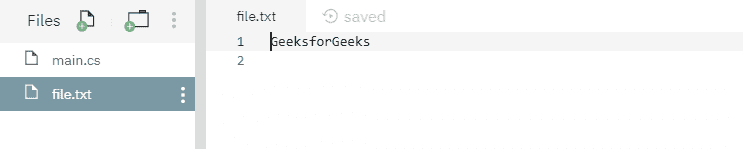
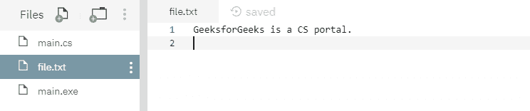
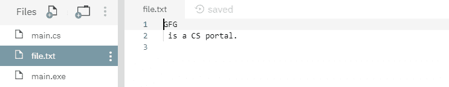

# File.AppendAllText(String, String, Encoding) 方法及示例

> 原文：[https://www.geeksforgeeks.org/file-appendalltextstring-string-encoding-method-in-csharp-with-examples/](https://www.geeksforgeeks.org/file-appendalltextstring-string-encoding-method-in-csharp-with-examples/)

`File.AppendAllText(String, String, Encoding)` 是一个内置的 `File` 类方法，用于使用指定的编码将指定的字符串追加到给定的文件中。如果该文件不存在，则创建一个新文件，然后追加完成。

**语法：**

```cs
public static void AppendAllText (string path, string contents, System.Text.Encoding encoding);
```

**参数：** 该函数接受三个参数，如下所示：

*   `path`：这是要追加给定内容的文件。
*   `contents`：这是要添加到文件中的指定内容。
*   `encoding`：这是指定的字符编码。

**异常：**

*   `ArgumentException`：路径是零长度字符串，只包含空格，或者包含一个或多个由 `InvalidPathChars` 定义的无效字符。
*   `ArgumentNullException`：路径为空。
*   `PathTooLongException`：给定的路径、文件名或两者都超过了系统定义的最大长度。
*   `DirectoryNotFoundException`：指定的路径无效（例如，目录不存在或位于未映射的驱动器上）。
*   `IOException`：打开文件时出现输入/输出错误。
*   `UnauthorizedAccessException`：路径指定了一个只读文件。或者当前平台不支持此操作。或者路径指定了一个目录。或者调用者没有所需的权限。
*   `NotSupportedException`：路径的格式无效。
*   `SecurityException`：调用方没有所需的权限。

下面是说明 `File.AppendAllText()` 方法的程序。

**程序 1：** 在运行下面的代码之前，创建了一个文件，其内容如下所示：



```cs
// C# program to illustrate the usage
// of File.AppendAllText() method

// Using System, System.IO,
// System.Text and System.Linq namespaces
using System;
using System.IO;
using System.Text;
using System.Linq;

class GFG {
    // Main() method
    public static void Main()
    {
        // Creating a file
        string myfile = @"file.txt";

        // Adding extra texts
        string appendText = " is a CS portal." + Environment.NewLine;
        File.AppendAllText(myfile, appendText, Encoding.UTF8);

        // Opening the file to read from.
        string readText = File.ReadAllText(myfile);
        Console.WriteLine(readText);
    }
}
```

**执行：**

```cs
mcs -out:main.exe main.cs
mono main.exe
GeeksforGeeks is a CS portal.
```

运行上述代码后，显示上述输出，文件内容如下所示：



**程序 2：** 最初没有创建文件，但是下面的代码本身创建了一个新文件并附加了指定的内容。

```cs
// C# program to illustrate the usage
// of File.AppendAllText() method

// Using System, System.IO,
// System.Text and System.Linq namespaces
using System;
using System.IO;
using System.Text;
using System.Linq;

class GFG {
    // Main() method
    public static void Main()
    {
        // Creating a file
        string myfile = @"file.txt";

        // Checking the existence of file
        if (!File.Exists(myfile)) {
            // Creating a file with below content
            string createText = "GFG" + Environment.NewLine;
            File.WriteAllText(myfile, createText);
        }

        // Adding extra texts
        string appendText = " is a CS portal." + Environment.NewLine;
        File.AppendAllText(myfile, appendText, Encoding.UTF8);

        // Opening the file to read from.
        string readText = File.ReadAllText(myfile);
        Console.WriteLine(readText);
    }
}
```

**执行：**

```cs
mcs -out:main.exe main.cs
mono main.exe
GFG
 is a CS portal.
```

运行上述代码后，显示了上述输出，并创建了一个新文件，如下所示：

