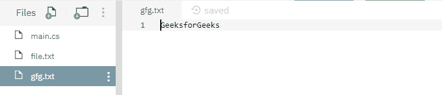
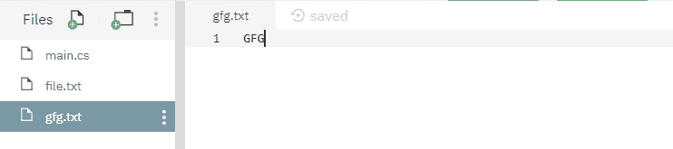

# File.Copy(String, String, Boolean) 方法及示例

> 原文：[https://www.geeksforgeeks.org/file-copystring-string-boolean-method-in-c-sharp-with-examples/](https://www.geeksforgeeks.org/file-copystring-string-boolean-method-in-c-sharp-with-examples/)

`File.Copy(String, String, Boolean)` 是一个内置的 `File` 类方法，用于将现有源文件的内容复制到另一个目标文件（如果存在），否则创建一个新的目标文件，然后完成复制过程。

### 语法

> `public static void Copy(string sourceFileName, string destFileName, bool overwrite);`

### 参数

该函数接受三个参数，如下所示：

*   **sourceFileName**：这是要复制数据的文件。
*   **destFileName**：这是数据将被粘贴到的文件。
*   **overwrite**：这是一个布尔值。如果目标文件可以被覆盖，则使用 `true`，否则使用 `false`。

### 例外

*   `UnauthorizedAccessException`：`destFileName` 为只读，或者如果 `destFileName` 存在并隐藏，但 `sourceFileName` 未隐藏，且 `overwrite` 为 `true`。
*   `ArgumentException`：`sourceFileName` 或 `destFileName` 是零长度字符串、仅包含空格，或包含一个或多个由 `InvalidPathChars` 定义的无效字符。或者 `sourceFileName` 或 `destFileName` 指定一个目录。
*   `ArgumentNullException`：`sourceFileName` 或 `destFileName` 为空。
*   `PathTooLongException`：指定的路径、文件名或两者都超过了系统定义的最大长度。
*   `DirectoryNotFoundException`：`sourceFileName` 或 `destFileName` 中指定的路径无效（例如，它位于未映射的驱动器上）。
*   `FileNotFoundException`：找不到 `sourceFileName`。
*   `IOException`：`destFileName` 存在且 `overwrite` 为 `false`，或出现输入/输出错误。
*   `NotSupportedException`：`sourceFileName` 或 `destFileName` 的格式无效。

下面是说明 `File.Copy(String, String, Boolean)` 方法的程序。

### 程序 1

在运行下面的代码之前，创建了两个文件，即源文件 `file.txt` 和目标文件 `gfg.txt`，内容如下所示：


#### C\#

```cs
// C# program to illustrate the usage
// of File.Copy() method

// Using System, System.IO,
// System.Text and System.Linq namespaces
using System;
using System.IO;
using System.Text;
using System.Linq;

class GFG {
    // Main() method
    public static void Main()
    {
        // Specifying two files
        string sourceFile = @"file.txt";
        string destinationFile = @"gfg.txt";
        try {
            // Copying source file's contents to
            // destination file
            File.Copy(sourceFile, destinationFile, true);
        }
        catch (IOException iox) {
            Console.WriteLine(iox.Message);
        }
        Console.WriteLine("Copying process has been done.");
    }
}
```

#### 执行

```cs
mcs -out:main.exe main.cs
mono main.exe
Copying process has been done.
```

运行上述代码后，显示上述输出，目标文件内容如下所示：



### 程序 2

在运行下面的代码之前，创建了两个文件，即源文件 `file.txt` 和目标文件 `gfg.txt`，内容如下所示：




#### C\#

```cs
// C# program to illustrate the usage
// of File.Copy() method

// Using System, System.IO,
// System.Text and System.Linq namespaces
using System;
using System.IO;
using System.Text;
using System.Linq;

class GFG {
    // Main() method
    public static void Main()
    {
        // Specifying two files
        string sourceFile = @"file.txt";
        string destinationFile = @"gfg.txt";
        try {
            // Copying source file's contents to
            // destination file
            File.Copy(sourceFile, destinationFile, true);
        }
        catch (IOException iox) {
            Console.WriteLine(iox.Message);
        }
        Console.WriteLine("Copying process has been done.");
    }
}
```

#### 执行

```cs
mcs -out:main.exe main.cs
mono main.exe
Copying process has been done.
```

运行上述代码后，显示上述输出，目标文件内容被源文件 `file.txt` 的内容覆盖，如下所示：


### 程序 3

在运行下面的代码之前，创建了两个文件，即源文件 `file.txt` 和目标文件 `gfg.txt`，内容如下所示：


#### C\#

```cs
// C# program to illustrate the usage
// of File.Copy() method

// Using System, System.IO,
// System.Text and System.Linq namespaces
using System;
using System.IO;
using System.Text;
using System.Linq;

class GFG {
    // Main() method
    public static void Main()
    {
        // Specifying two files
        string sourceFile = @"file.txt";
        string destinationFile = @"gfg.txt";
        try {
            // Copying source file's contents to
            // destination file
            File.Copy(sourceFile, destinationFile, false);
        }
        catch (IOException iox) {
            Console.WriteLine(iox.Message);
        }
    }
}
```

#### 执行

```cs
mcs -out:main.exe main.cs
mono main.exe
Could not create file "/home/runner/NutritiousHeavyRegression/gfg.txt". File already exists.
```

运行上述代码后，抛出上述错误，这是因为上述代码中使用的 `bool overwrite` 值为 `false`。