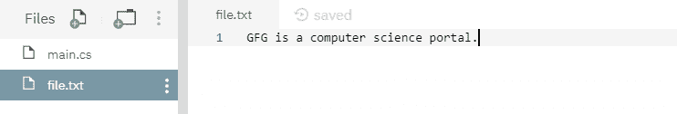
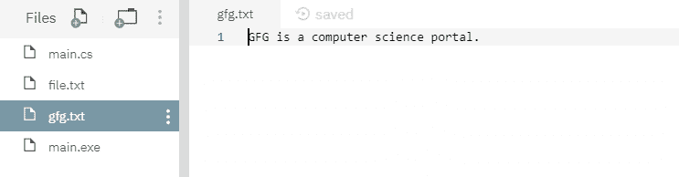
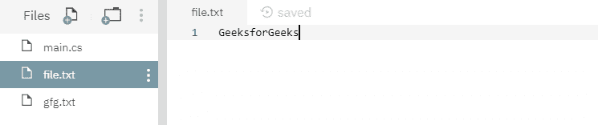
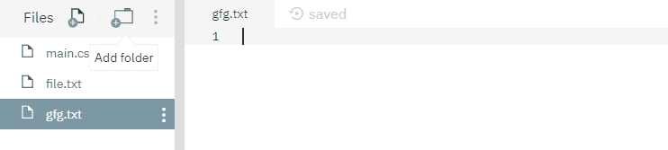

# File.Copy(String, String) 方法在 C# 中的示例

> 原文：[https://www.geeksforgeeks.org/file-copystring-string-method-in-c-sharp-with-examples/](https://www.geeksforgeeks.org/file-copystring-string-method-in-c-sharp-with-examples/)

`File.Copy(String, String)` 是一个内置的 `File` 类方法，用于将现有源文件内容复制到由该函数创建的另一个目标文件。

**语法：**

```cs
public static void Copy (string sourceFileName, string destFileName);
```

**参数：** 该函数接受两个参数，如下所示：
*   `sourceFileName`：这是要复制数据的文件。
*   `destFileName`：这是数据将被粘贴到的文件。此文件不能是已存在的文件或目录。

**异常：**
*   `UnauthorizedAccessException`：调用方没有所需的权限。
*   `ArgumentException`：`sourceFileName` 或 `destFileName` 是零长度字符串、仅包含空格，或包含一个或多个由 `InvalidPathChars` 定义的无效字符。或者 `sourceFileName` 或 `destFileName` 指定一个目录。
*   `ArgumentNullException`：`sourceFileName` 或 `destFileName` 为空。
*   `PathTooLongException`：给定的路径、文件名或两者都超过了系统定义的最大长度。
*   `DirectoryNotFoundException`：`sourceFileName` 或 `destFileName` 中给定的路径无效（例如，它位于未映射的驱动器上）。
*   `FileNotFoundException`：找不到 `sourceFileName`。
*   `IOException`：`destFileName` 存在。或者发生了输入/输出错误。
*   `NotSupportedException`：`sourceFileName` 或 `destFileName` 的格式无效。

下面是说明 `File.Copy(String, String)` 方法的程序。

**程序 1：** 在运行下面的代码之前，只创建了源文件 `file.txt`，如下图所示。下面的代码自己创建一个目标文件 `gfg.txt` 并将源文件内容复制到目标文件。



## 示例代码

```cs
// C# program to illustrate the usage
// of File.Copy() method

// Using System, System.IO,
// System.Text and System.Linq namespaces
using System;
using System.IO;
using System.Text;
using System.Linq;

class GFG {
    // Main() method
    public static void Main()
    {
        // Creating two files
        string sourceFile = @"file.txt";
        string destinationFile = @"gfg.txt";
        try {
            // Copying source file's contents to
            // destination file
            File.Copy(sourceFile, destinationFile);
        }
        catch (IOException iox) {
            Console.WriteLine(iox.Message);
        }
        Console.WriteLine("Copying process has been done.");
    }
}
```

**执行：**

```cs
mcs -out:main.exe main.cs
mono main.exe
Copying process has been done.
```

运行上述代码后，显示了上述输出，并创建了一个新的目标文件 `gfg.txt`，如下所示：



**程序 2：** 在运行下面的代码之前，创建了两个文件，内容如下所示：





## 示例代码

```cs
// C# program to illustrate the usage
// of File.Copy() method

// Using System, System.IO,
// System.Text and System.Linq namespaces
using System;
using System.IO;
using System.Text;
using System.Linq;

class GFG {
    // Main() method
    public static void Main()
    {
        // Specifying two files
        string sourceFile = @"file.txt";
        string destinationFile = @"gfg.txt";
        try {
            // Copying source file's contents to
            // destination file
            File.Copy(sourceFile, destinationFile);
        }
        catch (IOException iox) {
            Console.WriteLine(iox.Message);
        }
    }
}
```

**执行：**

```cs
mcs -out:main.exe main.cs
mono main.exe
Could not create file "/home/runner/NutritiousHeavyRegression/gfg.txt". File already exists.
```

运行上述代码后，会引发上述错误，因为目标文件是在运行程序之前创建的。