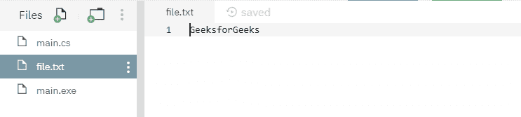
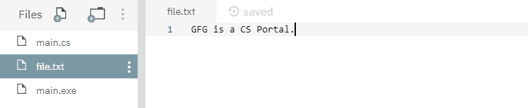

# File.Create(String, Int32, FileOptions) 方法详解及示例

> 原文：[https://www.geeksforgeeks.org/file-createstring-int32-fileoptions-method-in-c-sharp-with-examples/](https://www.geeksforgeeks.org/file-createstring-int32-fileoptions-method-in-c-sharp-with-examples/)

`File.Create(String, Int32, FileOptions)` 是一个内置的 `File` 类方法，用于覆盖现有文件，指定缓冲区大小和描述如何创建或覆盖文件的选项，如果指定的文件不存在，则创建新文件。

## 语法

```csharp
public static FileStream Create(string path, int bufferSize, FileOptions options);
```

## 参数

该函数接受三个参数，如下所示：

*   `path`：指定的文件路径。
*   `bufferSize`：指定的缓冲区大小。
*   `options`：描述如何创建或覆盖文件的文件选项值之一。

## 异常

*   `UnauthorizedAccessException`：调用方没有所需的权限。或者 `path` 指定了一个只读文件。或者路径指定了一个隐藏的文件。
*   `ArgumentException`：`path` 是零长度字符串，仅包含空格，或一个或多个无效字符（如 `InvalidPathChars` 所定义）。
*   `ArgumentNullException`：`path` 为空。
*   `PathTooLongException`：指定的路径、文件名或两者都超过了系统定义的最大长度。
*   `DirectoryNotFoundException`：给定的 `path` 无效。
*   `IOException`：创建文件时出现输入/输出错误。
*   `NotSupportedException`：`path` 的格式无效。

## 返回值

返回指定缓冲区大小的新文件。

以下是说明 `File.Create(String, Int32, FileOptions)` 方法的程序。

### 程序 1

最初，不创建文件。但是下面的代码本身用指定的内容创建了一个新的文件 `file.txt`。

```csharp
// C# program to illustrate the usage
// of File.Create(String, Int32, 
// FileOptions) method

// Using System, System.IO and
// System.Text namespaces
using System;
using System.IO;
using System.Text;

class GFG {
    public static void Main()
    {
        // Specifying a file
        string myfile = @"file.txt";

        // Calling the create() function
        using(FileStream fs = File.Create(myfile, 1024, FileOptions.RandomAccess))
        {
            // Adding the below contents into the file
            Byte[] info = new UTF8Encoding(true).GetBytes("GeeksforGeeks");
            fs.Write(info, 0, info.Length);
        }

        // Reading the file contents
        using(StreamReader sr = File.OpenText(myfile))
        {
            string s = "";
            while ((s = sr.ReadLine()) != null) {
                Console.WriteLine(s);
            }
        }
    }
}
```

**执行：**

```bash
mcs -out:main.exe main.cs
mono main.exe
```

输出：
```
GeeksforGeeks
```

运行上述代码后，显示上述输出，并创建一个新文件 `file.txt`，其指定内容如下所示：



### 程序 2

下面显示的文件 `file.txt` 是在运行下面的代码之前创建的。


```csharp
// C# program to illustrate the usage
// of File.Create(String, Int32,
// FileOptions) method

// Using System, System.IO and
// System.Text namespaces
using System;
using System.IO;
using System.Text;

class GFG {
    public static void Main()
    {
        // Specifying a file
        string myfile = @"file.txt";

        // Calling the create() function
        using(FileStream fs = File.Create(myfile, 1024, FileOptions.RandomAccess))
        {
            // overwriting the below contents into the file
            Byte[] info = new UTF8Encoding(true).GetBytes("GFG is a CS Portal.");
            fs.Write(info, 0, info.Length);
        }

        // Reading the file contents
        using(StreamReader sr = File.OpenText(myfile))
        {
            string s = "";
            while ((s = sr.ReadLine()) != null) {
                Console.WriteLine(s);
            }
        }
    }
}
```

**执行：**

```bash
mcs -out:main.exe main.cs
mono main.exe
```

输出：
```
GFG is a CS Portal.
```

运行上述代码后，将显示上述输出，现有文件内容将被覆盖。

