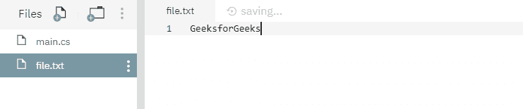
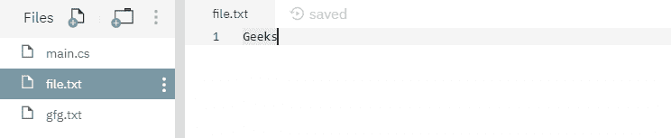
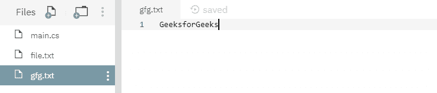

# C# 中的 File.Delete 方法详解与示例

> 原文：[https://www.geeksforgeeks.org/file-delete-method-in-c-sharp-with-examples/](https://www.geeksforgeeks.org/file-delete-method-in-c-sharp-with-examples/)

`File.Delete(String)` 是一个内置的 `File` 类方法，用于删除指定的文件。

## 语法

```cs
public static void Delete (string path);
```

## 参数

该函数接受一个参数，如下所示：

*   `Path`: 这是要删除的指定文件路径。

## 异常

*   `ArgumentException`: `path` 是一个零长度字符串，只包含空格或一个或多个无效字符（如 `InvalidPathChars` 所定义）。
*   `ArgumentNullException`: `path` 为空。
*   `DirectoryNotFoundException`: 给定的 `path` 无效。
*   `IOException`: 给定文件正在使用中。或者文件上有一个打开的句柄（操作系统是 Windows XP 或更早版本）。枚举目录和文件会导致句柄打开。有关更多信息，请参见“如何：枚举目录和文件”。
*   `NotSupportedException`: `path` 的格式无效。
*   `PathTooLongException`: 给定的 `path`、文件名或两者都超过了系统定义的最大长度。
*   `UnauthorizedAccessException`: 调用方没有所需的权限。或者该文件是正在使用的可执行文件。或者 `path` 是一个目录。或者 `path` 指定了一个只读文件。

## 示例

下面是说明 `File.Delete(String)` 方法的程序。

### 程序 1

在运行下面的代码之前，创建了一个文件 `file.txt`，内容如下所示：



```cs
// C# program to illustrate the usage
// of File.Delete(String) method

// Using System and System.IO namespaces
using System;
using System.IO;

public class GFG {
    // Using main() function
    public static void Main()
    {
        // Specifying a file
        String myfile = @"file.txt";

        // Calling the Delete() function to
        // delete the file file.txt
        File.Delete(myfile);

        // Printing a line
        Console.WriteLine("Specified file has been deleted");
    }
}
```

**执行：**

```cs
mcs -out:main.exe main.cs
mono main.exe
Specified file has been deleted
```

运行上述代码后，显示上述输出，文件 `file.txt` 已被删除。

### 程序 2

在运行下面的代码之前，已经创建了两个文件，如下所示：





```cs
// C# program to illustrate the usage
// of File.Delete(String) method

// Using System and System.IO namespaces
using System;
using System.IO;

public class GFG {
    // Using main() function
    public static void Main()
    {
        // Specifying two files
        String myfile1 = @"file.txt";
        String myfile2 = @"gfg.txt";

        // Calling the Delete() function to
        // delete the file file.txt and gfg.txt
        File.Delete(myfile1);
        File.Delete(myfile2);

        // Printing a line
        Console.WriteLine("Specified files have been deleted.");
    }
}
```

**执行：**

```cs
mcs -out:main.exe main.cs
mono main.exe
Specified files have been deleted.
```

运行上述代码后，显示上述输出，两个现有文件 `file.txt` 和 `gfg.txt` 已被删除。