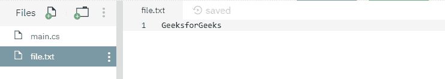

# File.Open(String, FileMode, FileAccess) Method in C# with Examples

> 原文: [https://www.geeksforgeeks.org/file-openstring-filemode-fileaccess-method-in-c-sharp-with-examples/](https://www.geeksforgeeks.org/file-openstring-filemode-fileaccess-method-in-c-sharp-with-examples/)

`File.Open(String, FileMode, FileAccess)` 是一个内置的 `File` 类方法，用于以指定的模式在指定的路径上打开一个 `FileStream`，并且在不共享的情况下进行访问。

## 语法

```cs
public static System.IO.FileStream Open(string path, System.IO.FileMode mode, System.IO.FileAccess access);
```

## 参数

该函数接受三个参数，如下所示：

- **`path`**: 这是要打开的文件。
- **`mode`**: 此模式值指定如果文件不存在是否创建新文件，并确定是保留还是覆盖现有文件的内容。
- **`access`**: 此值指定可以在文件上执行的操作。

## 异常

- **`ArgumentException`**: 指定的 `path` 是零长度字符串，只包含空格，或包含一个或多个由 `InvalidPathChars` 定义的无效字符。或 `access` 指定了读取，而 `mode` 指定了创建、新建、截断或追加。
- **`ArgumentNullException`**: `path` 为空。
- **`PathTooLongException`**: 指定的 `path`、文件名或两者都超过了系统定义的最大长度。
- **`DirectoryNotFoundException`**: 指定的 `path` 无效。
- **`IOException`**: 打开文件时出现输入/输出错误。
- **`UnauthorizedAccessException`**: `path` 指定了一个只读文件，而 `access` 未被读取。或者 `path` 指定了一个目录。或者调用者没有所需的权限。或者 `mode` 为创建，指定文件为隐藏文件。
- **`ArgumentOutOfRangeException`**: `mode` 或 `access` 指定了无效值。
- **`FileNotFoundException`**: 在 `path` 中指定的文件未找到。
- **`NotSupportedException`**: `path` 的格式无效。

## 返回值

返回一个非共享的 `FileStream`，提供对指定文件的访问，具有指定的模式和访问权限。

以下是说明 `File.Open(String, FileMode, FileAccess)` 方法的程序。

## 程序 1

下面的代码创建一个临时文件，将一些指定的内容写入其中，打开该文件并打印其内容。

```cs
// C# program to illustrate the usage
// of File.Open(String, FileMode,
// FileAccess) method

// Using System, System.IO and
// System.Text namespaces
using System;
using System.IO;
using System.Text;

class GFG {
    public static void Main()
    {
        // Creating a temporary file
        string path = Path.GetTempFileName();
        using(FileStream fs = File.Open(path, FileMode.Open))
        {
            // Putting some contents
            Byte[] info = new UTF8Encoding(true).GetBytes("GFG is a CS Portal.");
            fs.Write(info, 0, info.Length);
        }

        // Opening the stream and reading it back.
        using(FileStream fs = File.Open(path, FileMode.Open, FileAccess.Read))
        {
            byte[] b = new byte[1024];
            UTF8Encoding temp = new UTF8Encoding(true);

            while (fs.Read(b, 0, b.Length) > 0) {
                Console.WriteLine(temp.GetString(b));
            }
        }
    }
}
```

**输出:**

```cs
GFG is a CS Portal.
```

## 程序 2

最初创建一个文件 `file.txt`，内容如下所示：



下面这段代码将打开文件 `file.txt` 并打印其内容。

```cs
// C# program to illustrate the usage
// of File.Open(String, FileMode,
// FileAccess) method

// Using System, System.IO and
// System.Text namespaces
using System;
using System.IO;
using System.Text;

class GFG {
    public static void Main()
    {
        // Specifying a file path
        string path = @"file.txt";

        // Opening above file and reading it back.
        using(FileStream fs = File.Open(path, FileMode.Open, FileAccess.Read))
        {
            byte[] b = new byte[1024];
            UTF8Encoding temp = new UTF8Encoding(true);

            while (fs.Read(b, 0, b.Length) > 0) {
                // Printing the file contents
                Console.WriteLine(temp.GetString(b));
            }
        }
    }
}
```

**输出:**

```cs
GeeksforGeeks
```