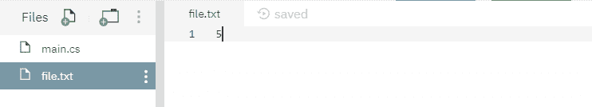

# File.ReadAllBytes(String) 方法详解（C# 示例）

> 原文：[https://www.geeksforgeeks.org/file-readallbytes-method-in-csharp-with-examples/](https://www.geeksforgeeks.org/file-readallbytes-method-in-csharp-with-examples/)

`File.ReadAllBytes(String)` 是一个内置的 `File` 类方法，用于打开指定或创建的二进制文件，然后将文件内容读入字节数组，然后关闭文件。

**语法：**

```cs
public static byte[] ReadAllBytes (string path);
```

**参数：** 该函数接受一个参数，如下图所示：

> *   `Path`：这是要打开以供读取的指定文件。

**例外：**

*   `ArgumentException`：`path` 是一个零长度字符串，只包含空格或一个或多个无效字符，如 `InvalidPathChars` 所定义。
*   `ArgumentNullException`：`path` 为空。
*   `PathTooLongException`：指定的 `path`、文件名或两者都超过了系统定义的最大长度。
*   `DirectoryNotFoundException`：指定的 `path` 无效。
*   `IOException`：打开文件时出现输入/输出错误。
*   `UnauthorizedAccessException`：当前平台不支持此操作。或者 `path` 指定了一个目录。或者调用者没有所需的权限。
*   `FileNotFoundException`：在 `path` 中指定的文件未找到。
*   `NotSupportedException`：`path` 的格式无效。
*   `SecurityException`：调用方没有所需的权限。

**返回值：** 返回包含文件内容的字节数组。

以下是说明 `File.ReadAllBytes(String)` 方法的程序。

### 程序 1：
最初创建一个文件 `file.txt`，内容如下所示：



```cs
// C# program to illustrate the usage
// of File.ReadAllBytes(String) method

// Using System and System.IO namespaces
using System;
using System.IO;

class GFG {
    public static void Main()
    {
        // Specifying a file
        string path = @"file.txt";

        // Calling the ReadAllBytes() function
        byte[] readText = File.ReadAllBytes(path);
        foreach(byte s in readText)
        {
            // Printing the binary array value of
            // the file contents
            Console.WriteLine(s);
        }
    }
}
```

**输出：**

```cs

```

### 程序 2：
最初没有创建文件。下面代码自己创建一个文件 `file.txt` 带有一些指定的内容。

```cs
// C# program to illustrate the usage
// of File.ReadAllBytes(String) method

// Using System and System.IO namespaces
using System;
using System.IO;

class GFG {
    public static void Main()
    {
        // Specifying a file
        string path = @"file.txt";

        // Adding below contents to the file
        string[] createText = { "GFG" };
        File.WriteAllLines(path, createText);

        // Calling the ReadAllBytes() function
        byte[] readText = File.ReadAllBytes(path);
        foreach(byte s in readText)
        {
            // Printing the binary array value of
            // the file contents
            Console.WriteLine(s);
        }
    }
}
```

**输出：**

```cs

```