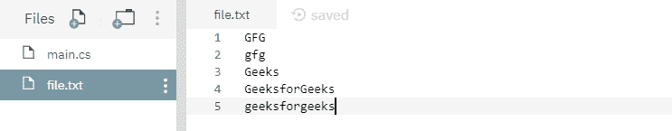

# C# 中的 File.ReadAllText(String, Encoding) 方法示例

> 原文：[https://www.geeksforgeeks.org/file-readalltextstring-encoding-method-in-c-sharp-with-examples/](https://www.geeksforgeeks.org/file-readalltextstring-encoding-method-in-c-sharp-with-examples/)

`File.ReadAllText(String, Encoding)` 是一个内置的 `File` 类方法，用于打开一个文本文件，然后用指定的编码读取文件中的所有文本，然后关闭文件。

**语法：**

```cs
public static string ReadAllText (string path, System.Text.Encoding encoding);
```

**参数：** 该函数接受一个参数，如下所示：
*   `path`：这是要打开以进行读取的指定文件。
*   `encoding`：这应用于文件内容的编码。

**异常：**

*   `ArgumentException`：`path` 是一个零长度字符串，只包含空格或一个或多个无效字符，如 `InvalidPathChars` 所定义。
*   `ArgumentNullException`：`path` 为空。
*   `PathTooLongException`：指定的 `path`、文件名或两者都超过了系统定义的最大长度。
*   `DirectoryNotFoundException`：指定的 `path` 无效。
*   `IOException`：打开文件时出现输入/输出错误。
*   `UnauthorizedAccessException`：`path` 指定了一个只读文件。或者当前平台不支持此操作。或者 `path` 指定了一个目录。或者调用者没有所需的权限。
*   `FileNotFoundException`：在 `path` 中指定的文件未找到。
*   `NotSupportedException`：`path` 的格式无效。
*   `SecurityException`：调用方没有所需的权限。

**返回值：** 返回包含文件中所有文本的字符串。

以下是说明 `File.ReadAllText(String, Encoding)` 方法的程序。

**程序 1：** 最初创建一个文件 `file.txt`，内容如下所示：



## C#

```cs
// C# program to illustrate the usage
// of File.ReadAllText(String, Encoding) method

// Using System, System.IO and
// System.Text namespaces
using System;
using System.IO;
using System.Text;

class GFG {
    public static void Main()
    {
        // Specifying a file
        string path = @"file.txt";

        // Calling the ReadAllText(String, Encoding)
        // function
        string readText = File.ReadAllText(path, Encoding.UTF8);

        // Printing the file contents
        Console.WriteLine(readText);
    }
}
```

**输出：**

```cs
GFG
gfg
Geeks
GeeksforGeeks
geeksforgeeks
```

**程序 2：** 最初没有创建文件。下面代码自己创建一个文件 `file.txt` 带有一些指定的内容。

## C#

```cs
// C# program to illustrate the usage
// of File.ReadAllText(String, Encoding) method

// Using System, System.IO and
// System.Text namespaces
using System;
using System.IO;
using System.Text;

class GFG {
    public static void Main()
    {
        // Specifying a file
        string path = @"file.txt";

        // Adding below contents to the file
        string[] createText = { "GFG", "is a", "CS", "portal" };
        File.WriteAllLines(path, createText, Encoding.UTF8);

        // Calling the ReadAllText() function
        string readText = File.ReadAllText(path, Encoding.UTF8);

        // Printing the file contents
        Console.WriteLine(readText);
    }
}
```

**输出：**

```cs
GFG
is a
CS
portal
```