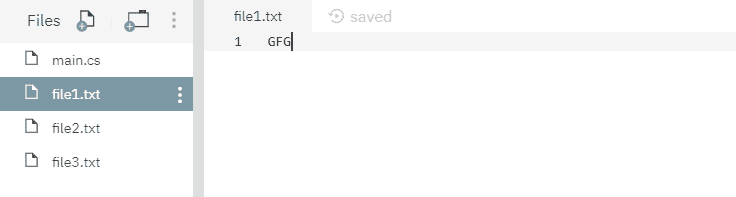
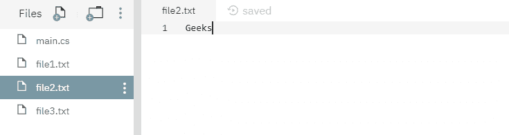
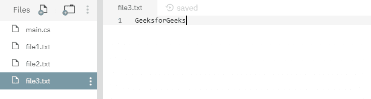
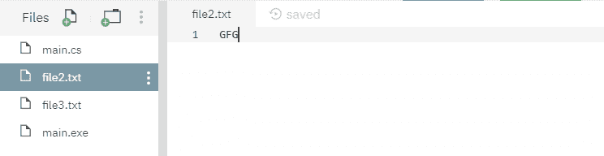
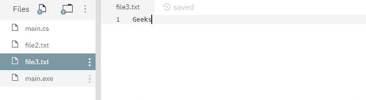
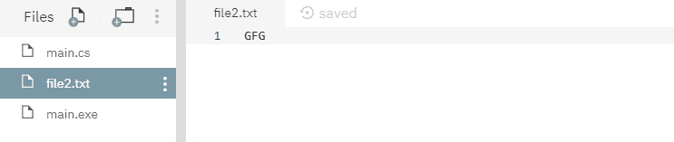

# File.Replace(String, String, String) 方法详解及示例

> 原文: [https://www.geeksforgeeks.org/file-replacestring-string-string-method-in-c-sharp-with-examples/](https://www.geeksforgeeks.org/file-replacestring-string-string-method-in-c-sharp-with-examples/)

`File.Replace(String, String, String)` 是一个内置的 `File` 类方法，用于用源文件的内容替换指定目标文件的内容，然后删除源文件并创建被替换文件的备份。

**语法:**

> `public static void Replace(string sourceFileName, string destinationFileName, string destinationBackupFileName);`

**参数:** 该函数接受三个参数，如下所示:

> *   `sourceFileName`: 指定的源文件。
> *   `destinationFileName`: 指定的目标文件，其内容将被源文件的内容替换。
> *   `destinationBackupFileName`: 此文件包含被替换的目标文件内容的备份。

**异常:**

*   `ArgumentException`: 由 `destinationFileName` 参数描述的路径不是合法形式。或者 `destinationBackupFileName` 参数描述的路径不是合法形式。
*   `ArgumentNullException`: `destinationFileName` 参数为空。
*   `DriveNotFoundException`: 指定了无效的驱动器。
*   `FileNotFoundException`: 找不到当前 `File` 对象描述的文件。或者找不到 `destinationBackupFileName` 参数描述的文件。
*   `IOException`: 打开文件时出现输入/输出错误。或者 `sourceFileName` 和 `destinationFileName` 参数指定相同的文件。
*   `PathTooLongException`: 指定的路径、文件名或两者都超过了系统定义的最大长度。
*   `PlatformNotSupportedException`: 操作系统为 Windows 98 第二版或更早版本，文件系统不是 NTFS。
*   `UnauthorizedAccessException`: `sourceFileName` 或 `destinationFileName` 参数指定了一个只读文件。或者当前平台不支持此操作。或源或目标参数指定目录而不是文件。或者调用者没有所需的权限。

下面是说明 `File.Replace(String, String, String)` 方法的程序。

## 程序 1

在运行下面的代码之前，已经创建了三个文件，其中源文件为 `file1.txt`，目标文件为 `file2.txt`，备份文件为 `file3.txt`。这些文件的内容如下所示:







```cs
// C# program to illustrate the usage
// of File.Replace(String, String, String) method

// Using System and System.IO namespaces
using System;
using System.IO;

class GFG {
    public static void Main()
    {
        // Specifying 3 files
        string sourceFileName = "file1.txt";
        string destinationFileName = "file2.txt";
        string destinationBackupFileName = "file3.txt";

        // Calling the Replace() function
        File.Replace(sourceFileName, destinationFileName,
                     destinationBackupFileName);

        Console.WriteLine("Replacement process has been done.");
    }
}
```

**输出:**

```cs
Replacement process has been done.
```

运行上述代码后，显示上述输出，删除源文件，其余两个文件的内容如下所示:





## 程序 2

在运行下面的代码之前，已经创建了两个文件，其中源文件是 `file1.txt`，目标文件是 `file2.txt`，没有备份文件，因为我们不想保留被替换文件的备份。这些文件的内容如下所示:


```cs
// C# program to illustrate the usage
// of File.Replace(String, String, String) method

// Using System and System.IO namespaces
using System;
using System.IO;

class GFG {
    public static void Main()
    {
        // Specifying 2 files
        string sourceFileName = "file1.txt";
        string destinationFileName = "file2.txt";

        // Calling the Replace() function with
        // null parameter inplace of backup file because
        // we do not want to keep backup of the
        // replaced file.
        File.Replace(sourceFileName, destinationFileName, null);

        Console.WriteLine("Replacement process has been done.");
    }
}
```

**输出:**

```cs
Replacement process has been done.
```

运行上述代码后，显示上述输出，删除源文件，目标文件内容如下所示:

