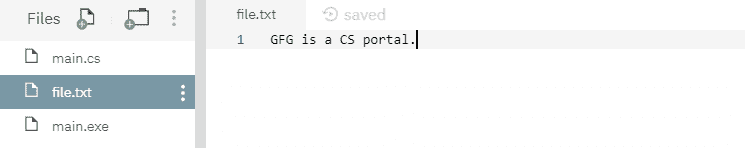
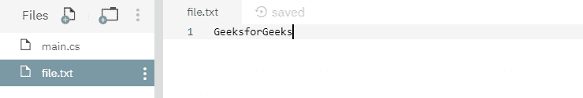

# 文件 `WriteAllBytes()` 方法示例 (C#)

> 原文: [https://www.geeksforgeeks.org/file-writeallbytes-method-in-csharp-with-examples/](https://www.geeksforgeeks.org/file-writeallbytes-method-in-csharp-with-examples/)

`File.WriteAllBytes(String)` 是一个内置的 `File` 类方法，用于创建新文件，然后将指定的字节数组写入文件，然后关闭文件。如果目标文件已经存在，它将被覆盖。

## 语法

```cs
public static void WriteAllBytes (string path, byte[] bytes);
```

## 参数

该函数接受两个参数，如下所示：

*   `Path`: 这是要写入字节数组的指定文件。
*   `Byte`: 这是要写入文件的指定字节。

## 例外

*   `ArgumentException`: `path` 是一个零长度字符串，只包含空格或一个或多个无效字符，如 `InvalidPathChars` 所定义。
*   `ArgumentNullException`: `path` 为空或字节数组为空。
*   `PathTooLongException`: 指定的 `path`、文件名或两者都超过了系统定义的最大长度。
*   `DirectoryNotFoundException`: 指定的 `path` 无效。
*   `IOException`: 打开文件时出现输入/输出错误。
*   `UnauthorizedAccessException`: `path` 指定了一个只读文件。或者 `path` 指定了一个隐藏的文件。或者当前平台不支持此操作。或者 `path` 指定了一个目录。或者调用者没有所需的权限。
*   `NotSupportedException`: `path` 的格式无效。
*   `SecurityException`: 调用方没有所需的权限。

下面是说明 `File.WriteAllBytes(string, byte[])` 方法的程序。

### 程序 1

最初，没有创建文件。在下面的代码中，它自己创建了一个文件 `file.txt` 并写入一些指定的字节数组，然后最终关闭该文件。

```cs
// C# program to illustrate the usage
// of File.WriteAllBytes() method

// Using System, System.IO
// and System.Text namespaces
using System;
using System.IO;
using System.Text;

class GFG {
    static void Main(string[] args)
    {
        // Specifying a file name
        var path = @"file.txt";

        // Specifying a byte array
        string text = "GFG is a CS portal.";
        byte[] data = Encoding.ASCII.GetBytes(text);

        // Calling the WriteAllBytes() function
        // to write specified byte array to the file
        File.WriteAllBytes(path, data);
        Console.WriteLine("The data has been written to the file.");
    }
}
```

**输出:**

```cs
The data has been written to the file.
```

上面的代码给出了如上所示的输出，并创建了一个具有如下所示的一些指定内容的文件：



### 程序 2

最初，创建了一个文件，内容如下所示：


下面的代码，用指定的字节数组数据覆盖上面的文件内容。

```cs
// C# program to illustrate the usage
// of File.WriteAllBytes() method

// Using System, System.IO
// and System.Text namespaces
using System;
using System.IO;
using System.Text;

class GFG {
    static void Main(string[] args)
    {
        // Specifying a file name
        var path = @"file.txt";

        // Specifying a byte array data
        string text = "GeeksforGeeks";
        byte[] data = Encoding.ASCII.GetBytes(text);

        // Calling the WriteAllBytes() function
        // to overwrite the file contents with the
        // specified byte array data
        File.WriteAllBytes(path, data);
        Console.WriteLine("The data has been overwritten to the file.");
    }
}
```

**输出:**

```cs
The data has been overwritten to the file.
```

运行上述代码后，显示上述输出，文件内容被覆盖，如下图：

