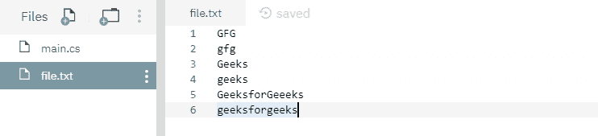
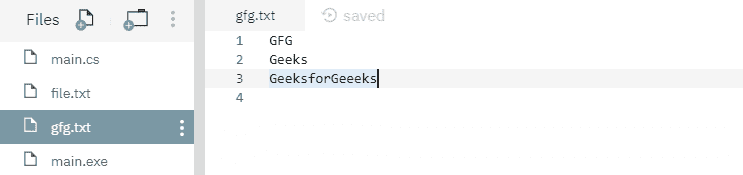
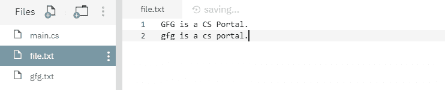
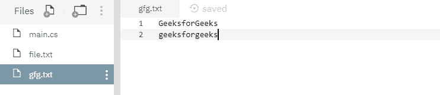
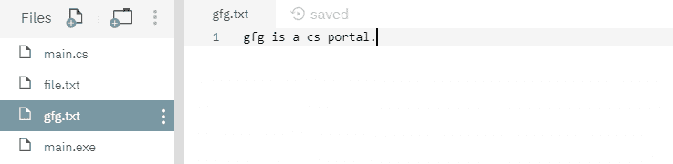

# File.WriteAllLines(String, IEnumerable<String>) 方法示例

> 原文：[https://www.geeksforgeeks.org/file-writealllinesstring-ienumerablestring-method-in-c-sharp-with-examples/](https://www.geeksforgeeks.org/file-writealllinesstring-ienumerablestring-method-in-c-sharp-with-examples/)

`File.WriteAllLines(String, IEnumerable<String>)` 是一个内置的 `File` 类方法，用于创建一个新文件，将一组字符串写入文件，然后关闭文件。

## 语法

> public static void WriteAllLines(string path, System.Collections.Generic.IEnumerable<string> contents);

## 参数

该函数接受两个参数，如下所示：

*   `path`：这是要写入字符串集的指定文件。
*   `contents`：这是要写入文件的指定行。

## 异常

*   `ArgumentException`：`path` 是一个零长度字符串，只包含空格，或者一个或多个由 `GetInvalidPathChars()` 方法定义的无效字符。
*   `ArgumentNullException`：`path` 或 `contents` 为 `null`。
*   `DirectoryNotFoundException`：`path` 无效。
*   `IOException`：打开文件时出现输入/输出错误。
*   `PathTooLongException`：`path` 超过了系统定义的最大长度。
*   `NotSupportedException`：`path` 的格式无效。
*   `SecurityException`：调用方没有所需的权限。
*   `UnauthorizedAccessException`：`path` 指定了一个只读文件。或者 `path` 指定了一个隐藏的文件。或者当前平台不支持此操作。或者 `path` 是一个目录。或者调用方没有所需的权限。

下面是说明 `File.WriteAllLines(String, IEnumerable)` 方法的程序。

## 程序 1

在运行下面的代码之前，创建一个文件 `file.txt`，其内容将被过滤，如下所示：



下面的代码自己创建了一个新文件 `gfg.txt`，其中包含过滤后的字符串。

```cs
// C# program to illustrate the usage
// of File.WriteAllLines(String, 
// IEnumerable<String>) method

// Using System, System.IO
// and System.Linq namespaces
using System;
using System.IO;
using System.Linq;

class GFG {
    // Specifying a file from where
    // some contents are going to be filtered
    static string Path = @"file.txt";

    static void Main(string[] args)
    {
        // Reading content of file.txt
        var da = from line in File.ReadLines(Path)
                 // Selecting lines started with "G"
                 where(line.StartsWith("G"))
                 select line;

        // Creating a new file gfg.txt with the
        // filtered contents
        File.WriteAllLines(@"gfg.txt", da);
        Console.WriteLine("Writing the filtered collection "+
                     "of strings to the file has been done.");
    }
}
```

### 输出

```cs
Writing the filtered collection of strings to the file has been done.
```

运行上述代码后，显示上述输出，并创建一个新文件 `gfg.txt`，如下所示：



## 程序 2

在运行下面的代码之前，创建了两个文件 `file.txt` 和 `gfg.txt`，内容如下：





下面的代码用文件 `file.txt` 的选定内容覆盖文件 `gfg.txt`。

```cs
// C# program to illustrate the usage
// of File.WriteAllLines(String,
// IEnumerable<String>) method

// Using System, System.IO
// and System.Linq namespaces
using System;
using System.IO;
using System.Linq;

class GFG {
    // Specifying a file from where
    // some contents are going to be filtered
    static string Path = @"file.txt";

    static void Main(string[] args)
    {
        // Reading the contents of file.txt
        var da = from line in File.ReadLines(Path)
                 // Selecting lines started with "g"
                 where(line.StartsWith("g"))
                 select line;

        // Overwriting the file gfg.txt with the
        // selected string of the file file.txt
        File.WriteAllLines(@"gfg.txt", da);
        Console.WriteLine("Overwriting the selected collection"+
                      " of strings to the file has been done.");
    }
}
```

### 输出

```cs
Overwriting the selected collection of strings to the file has been done.
```

运行上述代码后，显示上述输出，文件 `gfg.txt` 内容如下所示：

