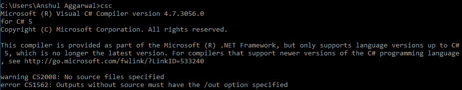
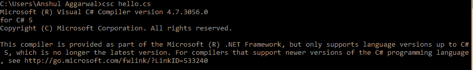
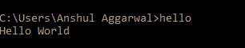

# C# 中的 Hello World

> 原文：[https://www.geeksforgeeks.org/hello-world-in-c-sharp/](https://www.geeksforgeeks.org/hello-world-in-c-sharp/)

你好世界！当你钻研一门新的编程语言时，编写“Hello World”程序是最基本的，也是第一个程序。这只是在输出屏幕上打印“你好世界！”。在 [C#](https://www.geeksforgeeks.org/introduction-to-c-sharp/) 中，一个基本程序由以下内容组成：

*   **命名空间声明**
*   **类声明和定义**
*   **类成员（如变量、方法等）**
*   **Main 方法**
*   **语句或表达式**

### 示例

```cs
// C# program to print Hello World!
using System;

// namespace declaration
namespace HelloWorldApp {

// Class declaration
    class Geeks {

// Main Method
        static void Main(string[] args) {

// statement
            // printing Hello World!
            Console.WriteLine("Hello World!");

// To prevents the screen from 
            // running and closing quickly
            Console.ReadKey();
        }
    }
}
```

### 输出

```cs
Hello World!
```

### 说明

*   **using System：** `System` 是一个[命名空间](https://www.geeksforgeeks.org/c-namespaces/)，里面包含了常用的类型。`using` 指令通过 `.` 指定。
*   **namespace HelloWorldApp：** 这里的 `namespace` 是用来定义名字空间的关键字。`HelloWorldApp` 是给命名空间的用户定义名称。更多详情可参考 [C# | 命名空间](https://www.geeksforgeeks.org/c-namespaces/)。
*   **class Geeks：** 这里 `class` 是用于声明类的关键字。`Geeks` 是用户自定义的类名称。
*   **static void Main(string[] args)：** 这里 `static` 关键字告诉我们这个方法不需要实例化类就可以访问。`void` 关键字告诉我们这个方法不会返回任何东西。`Main()` 方法是我们应用的切入点。在我们的程序中，`Main()` 方法用语句 `Console.WriteLine("Hello World!");` 指定其行为。
*   **Console.WriteLine()：** 这里 `WriteLine()` 是在 `System` 命名空间中定义的 `Console` 类的一个方法。
*   **Console.ReadKey()：** 这是给 VS.NET 用户的。这使得程序等待按键，并阻止屏幕快速运行和关闭。

## 如何运行 C# 程序？

一般有 **3 种方式**编译执行 C# 程序：

*   **使用在线 C# 编译器：** 可以使用各种在线 [IDE](https://ide.geeksforgeeks.org/ZVr7YapAeH)。它可以用来运行 C# 程序而无需安装。
*   **使用 Visual Studio IDE：** 微软提供了一款名为 Visual Studio 的 IDE（集成开发环境）工具，使用 C#、VB（Visual Basic）等不同编程语言开发应用。为了商业目的安装和使用 Visual Studio，它必须从微软购买许可证。出于学习（非商业）目的，微软提供了免费的 Visual Studio 社区版。要了解如何在 Visual Studio 中运行程序，可以参考[这个](https://www.geeksforgeeks.org/setting-environment-c/)。
*   **使用命令行：** 也可以使用命令行选项运行 C# 程序。以下步骤演示了如何在 Windows 操作系统中的命令行上运行 C# 程序：
    1.  首先，打开一个文本编辑器，如记事本或 Notepad++。
    2.  在文本编辑器中写入代码，用 `.cs` 扩展名保存文件。
    3.  打开 `cmd`（命令提示符），运行命令 `csc` 检查编译器版本。它指定您是否安装了有效的编译器。如果您确认安装了编译器，则可以避免此步骤。
        [](https://media.geeksforgeeks.org/wp-content/uploads/Step3.png)
    4.  要编译代码，在 `cmd` 中键入 `csc filename.cs`。如果您的程序没有错误，它将在您保存程序的同一目录中创建一个 `filename.exe` 文件。假设您将上述程序保存为 `hello.cs`。那么您将在 `cmd` 中写入 `csc hello.cs`。这将创建一个 `hello.exe`。
        [](https://media.geeksforgeeks.org/wp-content/uploads/step4-2.png)
    5.  现在您有两种方式来执行 `hello.exe`。首先，您只需键入文件名，即 `hello`，`cmd` 就会给出输出。其次，您可以转到保存程序的目录，在那里找到 `filename.exe`。您只需双击该文件，它就会给出输出。
        [](https://media.geeksforgeeks.org/wp-content/uploads/step5-1.png)