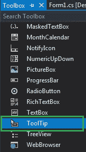
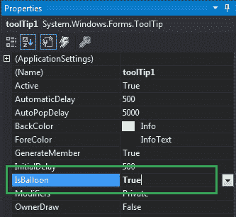
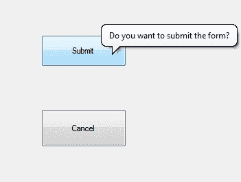
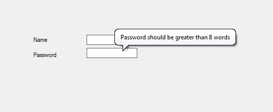

# 如何在 C# 中制作气球工具提示窗口？

> 原文：[https://www.geeksforgeeks.org/how-to-make-a-balloon-tooltip-window-in-c-sharp/](https://www.geeksforgeeks.org/how-to-make-a-balloon-tooltip-window-in-c-sharp/)

在 Windows 窗体中，工具提示代表一个微小的弹出框，当您将指针或光标放在控件上时，该框会出现，其目的是提供有关 Windows 窗体中控件的简要说明。在工具提示中，您可以使用 `IsBalloon` 属性来更改工具提示窗口的形状。

在这个属性的帮助下，你可以将工具提示窗口从标准的矩形窗口改为气球窗口。您可以通过两种不同的方式设置此属性：

## 设计时

最简单的方法是按照以下步骤设置 `IsBalloon` 属性的值：

1.  **第一步**：创建如下图所示的窗口表单：
    `Visual Studio -> File -> New -> Project -> Windows Forms App`
    
2.  **第二步**：从工具箱中拖动 `ToolTip` 并将其放到窗体上。当您将此 `ToolTip` 拖放到窗体上时，它将自动添加到当前 Windows 窗体中每个控件的属性（命名为 `ToolTip` 或 `ToolTip1`）中。
    
3.  **第三步**：拖放后，转到 `ToolTip` 的属性并设置 `IsBalloon` 属性的值。
    

**输出：**


## 运行时

比上面的方法稍微复杂一点。在此方法中，您可以在给定语法的帮助下以编程方式设置工具提示的 `IsBalloon` 属性：

```cs
public bool IsBalloon { get; set; }
```

这里，该属性的值为 `System.Boolean` 类型。如果该属性的值设置为 `true`，则工具提示窗口为气球窗口。如果此属性的值设置为 `false`，则工具提示窗口属于标准矩形窗口。此属性的默认值为 `false`。

以下步骤展示了如何动态设置工具提示的 `IsBalloon` 属性：

1.  **步骤 1**：使用 `ToolTip()` 构造函数创建工具提示，该构造函数由 `ToolTip` 类提供。

```cs
// Creating a ToolTip
ToolTip t = new ToolTip();
```

2.  **第二步**：创建工具提示后，设置 `ToolTip` 类提供的工具提示的 `IsBalloon` 属性。

```cs
// Setting the IsBalloon property
t.IsBalloon = true;
```

3.  **第三步**：最后，使用 `SetToolTip()` 方法将此 `ToolTip` 添加到控件。此方法包含控件名称和您希望在工具提示框中显示的文本。

```cs
t.SetToolTip(box1, "Name should start with Capital letter");
```

**示例：**

```cs
using System;
using System.Collections.Generic;
using System.ComponentModel;
using System.Data;
using System.Drawing;
using System.Linq;
using System.Text;
using System.Threading.Tasks;
using System.Windows.Forms;

namespace WindowsFormsApp34
{
    public partial class Form1 : Form
    {
        public Form1()
        {
            InitializeComponent();
        }

        private void Form1_Load(object sender, EventArgs e)
        {
            // Creating and setting the properties of the Label
            Label l1 = new Label();
            l1.Location = new Point(140, 122);
            l1.Text = "Name";

            // Adding this Label control to the form
            this.Controls.Add(l1);

            // Creating and setting the properties of the TextBox
            TextBox box1 = new TextBox();
            box1.Location = new Point(248, 119);
            box1.BorderStyle = BorderStyle.FixedSingle;

            // Adding this TextBox control to the form
            this.Controls.Add(box1);

            // Creating and setting the properties of Label
            Label l2 = new Label();
            l2.Location = new Point(140, 152);
            l2.Text = "Password";

            // Adding this Label control to the form
            this.Controls.Add(l2);

            // Creating and setting the properties of the TextBox
            TextBox box2 = new TextBox();
            box2.Location = new Point(248, 145);
            box2.BorderStyle = BorderStyle.FixedSingle;

            // Adding this TextBox control to the form
            this.Controls.Add(box2);

            // Creating and setting the properties of the ToolTip
            ToolTip t = new ToolTip();
            t.Active = true;
            t.AutoPopDelay = 4000;
            t.InitialDelay = 600;
            t.IsBalloon = true;
            t.SetToolTip(box1, "Name should start with Capital letter");
            t.SetToolTip(box2, "Password should be greater than 8 words");
        }
    }
}
```

**输出：**

