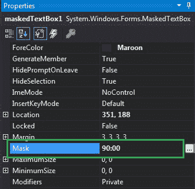
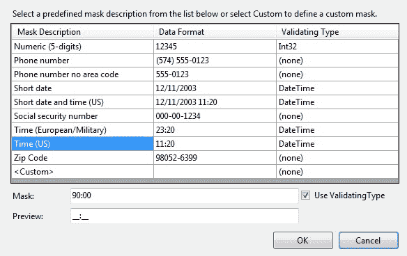
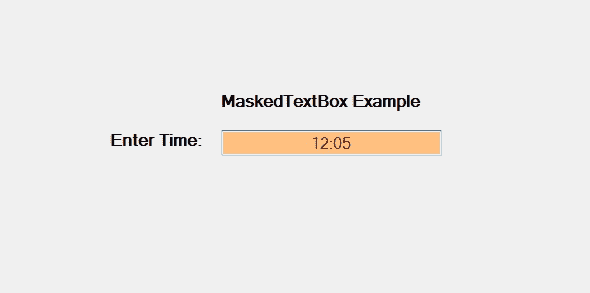

# 如何在 C# 中屏蔽文本框中的输入？

> 原文：[https://www.geeksforgeeks.org/how-to-mask-input-in-maskedtextbox-in-c-sharp/](https://www.geeksforgeeks.org/how-to-mask-input-in-maskedtextbox-in-c-sharp/)

在 C# 中，`MaskedTextBox` 控件为表单上的用户输入（如日期、电话号码等）提供了一个验证过程。或者换句话说，它被用来提供区分正确和不正确用户输入的屏蔽。在 `MaskedTextBox` 控件中，您可以使用 `Mask` 属性来屏蔽输入，该属性将在运行时用于在框中输入某些特定类型的输入。

例如，如果您想在 `MaskedTextBox` 中输入电话号码，那么您将使用 `Mask` 属性。此属性将输入转换为电话号码格式。这是 `MaskedTextBox` 的默认属性，如果您试图在 `MaskedTextBox` 已经被上一个掩码屏蔽时更改 `Mask`，因此它将根据新的掩码重新定位该输入。如果重新定位失败，那么它将从 `MaskedTextBox` 中清除现有的输入。此属性的默认值为空字符串，意味着它可以包含任何字符串。您可以通过两种不同的方式设置此属性：

## 1. 设计时

设置 `MaskedTextBox` 的 `Mask` 属性是最简单的方法，如下步骤所示：

*   **第一步：** 创建如下图所示的窗口表单：
    **Visual Studio -> File -> New -> Project -> Windows Forms App**
    
*   **第二步：** 接下来，将 `MaskedTextBox` 控件从工具箱拖放到表单上。如下图所示：
    
*   **第三步：** 拖放完成后，转到 `MaskedTextBox` 的属性窗口并设置其 `Mask` 属性。如下图所示：
    

以下是 `MaskedTextBox` 中可用的掩码：


**输出：**


## 2. 运行时

比上面的方法稍微复杂一点。在此方法中，您可以在给定语法的帮助下，以编程方式设置 `MaskedTextBox` 控件的 `Mask` 属性：

```csharp
public string Mask { get; set; }
```

这里，字符串表示当前掩码。如果应用于该属性的字符串不属于有效的掩码，那么它将抛出 `InvalidEnumArgumentException`。以下步骤显示了如何动态设置 `MaskedTextBox` 的 `Mask` 属性：

*   **步骤 1：** 使用 `MaskedTextBox()` 构造函数创建一个 `MaskedTextBox`，该构造函数由 `MaskedTextBox` 类提供。

```csharp
// Creating a MaskedTextBox
MaskedTextBox m = new MaskedTextBox();
```

*   **步骤 2：** 创建 `MaskedTextBox` 后，设置 `MaskedTextBox` 类提供的 `Mask` 属性。

```csharp
// Setting the mask
m.Mask = "00/00/0000";
```

*   **步骤 3：** 最后，使用以下语句将此 `MaskedTextBox` 控件添加到窗体：

```csharp
// Adding MaskedTextBox control on the form
this.Controls.Add(m);
```

## 示例

```csharp
using System;
using System.Collections.Generic;
using System.ComponentModel;
using System.Data;
using System.Drawing;
using System.Linq;
using System.Text;
using System.Threading.Tasks;
using System.Windows.Forms;

namespace WindowsFormsApp38
{
    public partial class Form1 : Form
    {
        public Form1()
        {
            InitializeComponent();
        }

        private void Form1_Load(object sender, EventArgs e)
        {
            // Creating and setting the properties of the Label
            Label l1 = new Label();
            l1.Location = new Point(413, 98);
            l1.Size = new Size(176, 20);
            l1.Text = " Example";
            l1.Font = new Font("Bell MT", 12);

            // Adding label on the form
            this.Controls.Add(l1);

            // Creating and setting the properties of the Label
            Label l2 = new Label();
            l2.Location = new Point(242, 135);
            l2.Size = new Size(126, 20);
            l2.Text = "Phone number:";
            l2.Font = new Font("Bell MT", 12);

            // Adding label on the form
            this.Controls.Add(l2);

            // Creating and setting the properties of MaskedTextBox
            MaskedTextBox m = new MaskedTextBox();
            m.Location = new Point(374, 137);
            m.Mask = "00/00/0000";
            m.Size = new Size(176, 20);
            m.Name = "MyBox";
            m.BorderStyle = BorderStyle.Fixed3D;
            m.BackColor = Color.LightBlue;
            m.ForeColor = Color.HotPink;
            m.Font = new Font("Bell MT", 18);

            // Adding MaskedTextBox control on the form
            this.Controls.Add(m);
        }
    }
}
```

**输出：**
