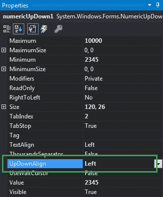
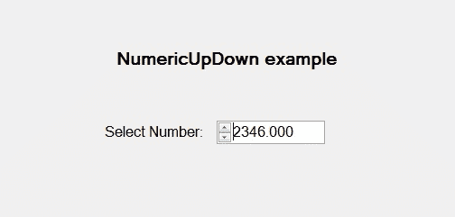
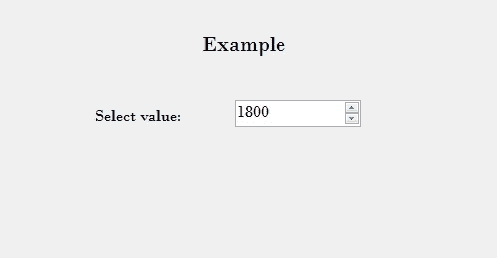

# 如何在 C# 中设置 NumericUpDown 的上下按钮对齐方式？

> 原文：[https://www.geeksforgeeks.org/how-to-set-alignment-of-up-and-down-buttons-of-numericupdown-in-c-sharp/](https://www.geeksforgeeks.org/how-to-set-alignment-of-up-and-down-buttons-of-numericupdown-in-c-sharp/)

在 Windows 窗体中，`NumericUpDown`控件用于提供显示数值的 Windows 旋转框或上下控件。或者换句话说，`NumericUpDown`控件提供了一个使用上下箭头移动并保存一些预定义数值的界面。在`NumericUpDown`控件中，可以使用`UpDownAlign`属性设置上下控件的上下按钮的对齐方式。此属性有两个值，这些值是在`LeftRightAlignment`枚举下定义的，这些值是：

*   `Left`：对齐`NumericUpDown`控件左侧的上下按钮。
*   `Right`：将`NumericUpDown`控件右侧的上下按钮对齐。

该属性的默认值是`Right`。您可以通过两种不同的方式设置此属性：

## 1. 设计时间

最简单的方法是设置`NumericUpDown`的上下按钮的对齐方式，如下步骤所示：

*   **Step 1:** 创建一个 Windows 窗体，如下图所示：
    `Visual Studio->File->New->Project->Windows Forms App`
    

*   **Step 2:** 接下来，从工具箱中拖放`NumericUpDown`控件到窗体上，如下图所示：
    

*   **Step 3:** 拖放后，转到`NumericUpDown`的属性窗口，设置上下按钮的对齐方式，如下图所示：
    

**输出：**


## 2. 运行时

比上面的方法稍微复杂一点。在此方法中，您可以借助给定的语法，以编程方式设置`NumericUpDown`控件的向上和向下按钮的对齐方式：

```cs
public System.Windows.Forms.LeftRightAlignment UpDownAlign { get; set; }
```

这里，`LeftRightAlignment`表示这个属性的值。如果值不属于`LeftRightAlignment`枚举，它将抛出`InvalidEnumArgumentException`。以下步骤显示了如何动态设置`NumericUpDown`的向上和向下按钮的对齐方式：

*   **Step 1:** 使用`NumericUpDown()`构造函数创建`NumericUpDown`，该构造函数由`NumericUpDown`类提供。
    ```cs
    // Creating a NumericUpDown
    NumericUpDown n = new NumericUpDown();
    ```

*   **Step 2:** 创建`NumericUpDown`后，设置`NumericUpDown`类提供的`UpDownAlign`属性。
    ```cs
    // Setting the UpDownAlign property
    n.UpDownAlign = LeftRightAlignment.Right;
    ```

*   **Step 3:** 最后，使用以下语句将此`NumericUpDown`控件添加到窗体：
    ```cs
    // Adding NumericUpDown control on the form
    this.Controls.Add(n);
    ```

**示例：**
```cs
using System;
using System.Collections.Generic;
using System.ComponentModel;
using System.Data;
using System.Drawing;
using System.Linq;
using System.Text;
using System.Threading.Tasks;
using System.Windows.Forms;

namespace WindowsFormsApp44
{
    public partial class Form1 : Form
    {
        public Form1()
        {
            InitializeComponent();
        }

        private void Form1_Load(object sender, EventArgs e)
        {
            // Creating and setting the
            // properties of the labels
            Label l1 = new Label();
            l1.Location = new Point(348, 61);
            l1.Size = new Size(215, 25);
            l1.Text = "Example";
            l1.Font = new Font("Bodoni MT", 16);
            this.Controls.Add(l1);

            Label l2 = new Label();
            l2.Location = new Point(242, 136);
            l2.Size = new Size(103, 20);
            l2.Text = "Select value:";
            l2.Font = new Font("Bodoni MT", 12);
            this.Controls.Add(l2);

            // Creating and setting the
            // properties of NumericUpDown
            NumericUpDown n = new NumericUpDown();
            n.Location = new Point(386, 130);
            n.Size = new Size(126, 26);
            n.Font = new Font("Bodoni MT", 12);
            n.Minimum = 1800;
            n.Maximum = 3000;
            n.Increment = 1;
            n.UpDownAlign = LeftRightAlignment.Right;

            // Adding this control
            // to the form
            this.Controls.Add(n);
        }
    }
}
```

**输出：**
