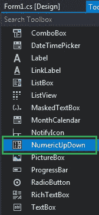
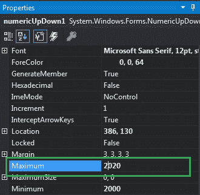
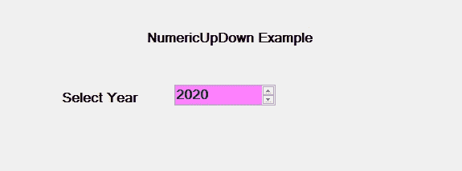
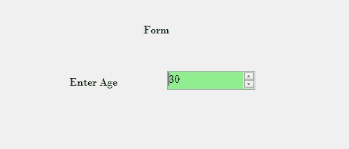

# 如何在 C# 中设置 NumericUpDown 中的最大值？

> 原文: [https://www.geeksforgeeks.org/how-to-set-maximum-value-in-numericupdown-in-c-sharp/](https://www.geeksforgeeks.org/how-to-set-maximum-value-in-numericupdown-in-c-sharp/)

在 Windows 窗体中，`NumericUpDown` 控件用于提供显示数值的 Windows 旋转框或上下控件。或者换句话说，`NumericUpDown` 控件提供了一个使用上下箭头移动并保存一些预定义数值的界面。在 `NumericUpDown` 控件中，可以使用 `Maximum` 属性设置上下控件的最大值。此属性的默认值为 100。您可以通过两种不同的方式设置此属性：

## 设计时间

最简单的方法是设置 `NumericUpDown` 的最大值，如下步骤所示：

*   **Step 1:** 创建一个 Windows 窗体，如下图所示：
    `Visual Studio -> 文件 -> 新建 -> 项目 -> window formapp`
    

*   **Step 2:** 接下来，从工具箱中拖放 `NumericUpDown` 控件到窗体上，如下图所示：
    

*   **Step 3:** 拖放完成后，转到 `NumericUpDown` 的属性窗口并为其设置最大值，如下图所示：
    

**输出:**


## 运行时

比上面的方法稍微复杂一点。在此方法中，您可以借助给定的语法以编程方式设置 `NumericUpDown` 控件的最大值：

```cs
public decimal Maximum { get; set; }
```

这里，这个属性的值代表 `NumericUpDown` 的最大值。以下步骤显示了如何动态设置 `NumericUpDown` 的最大值：

*   **步骤 1:** 使用 `NumericUpDown()` 构造函数创建 `NumericUpDown`，该构造函数由 `NumericUpDown` 类提供。
    ```cs
    // Creating a NumericUpDown
    NumericUpDown n = new NumericUpDown();
    ```

*   **第二步:** 创建 `NumericUpDown` 后，设置 `NumericUpDown` 类提供的 `NumericUpDown` 的 `Maximum` 属性。
    ```cs
    // Setting the maximum value
    n.Maximum = 30;
    ```

*   **Step 3:** 最后使用以下语句将此 `NumericUpDown` 控件添加到窗体：
    ```cs
    // Adding NumericUpDown control on the form
    this.Controls.Add(n);
    ```

**示例:**
```cs
using System;
using System.Collections.Generic;
using System.ComponentModel;
using System.Data;
using System.Drawing;
using System.Linq;
using System.Text;
using System.Threading.Tasks;
using System.Windows.Forms;

namespace WindowsFormsApp42 {
    public partial class Form1 : Form {
        public Form1() {
            InitializeComponent();
        }

        private void Form1_Load(object sender, EventArgs e) {
            // Creating and setting the 
            // properties of the labels
            Label l1 = new Label();
            l1.Location = new Point(348, 61);
            l1.Size = new Size(215, 20);
            l1.Text = "Form";
            l1.Font = new Font("Bodoni MT", 12);
            this.Controls.Add(l1);

            Label l2 = new Label();
            l2.Location = new Point(242, 136);
            l2.Size = new Size(103, 20);
            l2.Text = "Enter Age";
            l2.Font = new Font("Bodoni MT", 12);
            this.Controls.Add(l2);

            // Creating and setting the 
            // properties of NumericUpDown
            NumericUpDown n = new NumericUpDown();
            n.Location = new Point(386, 130);
            n.Size = new Size(126, 26);
            n.Font = new Font("Bodoni MT", 12);
            n.Value = 18;
            n.Minimum = 18;
            n.Maximum = 30;
            n.BackColor = Color.LightGreen;
            n.ForeColor = Color.DarkGreen;
            n.Increment = 1;
            n.Name = "MySpinBox";

            // Adding this control
            // to the form
            this.Controls.Add(n);
        }
    }
}
```

**输出:**
