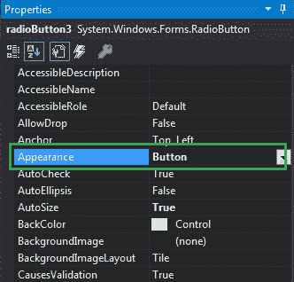
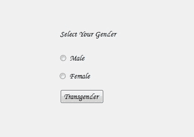

# 如何在 C# 中设置 RadioButton 的外观？

> 原文：[https://www.geeksforgeeks.org/how-to-set-the-appearance-of-radiobutton-in-c-sharp/](https://www.geeksforgeeks.org/how-to-set-the-appearance-of-radiobutton-in-c-sharp/)

在 Windows 窗体中，单选按钮控件用于从选项组中选择一个选项。例如，从给定的列表中选择您的性别，因此您将在三个选项中仅选择一个选项，如男性或女性或变性者。在 Windows 窗体中，您可以使用单选按钮的`Appearance`属性来设置窗体中单选按钮的外观。`Appearance`属性设置为`Normal`，那么它的行为就像正常的单选按钮，如果`Appearance`属性设置为`Button`，那么它将像切换按钮一样工作。该属性的默认值为`Normal`。您可以通过两种不同的方式设置此属性：

## 1. 设计时

设置单选按钮外观最简单的方法，如下步骤所示：

*   **第一步：** 创建如下图所示的窗口表单：
    `Visual Studio -> File -> New -> Project -> Windows Forms App`
    
*   **步骤 2：** 从工具箱中拖动`RadioButton`控件，并将其放到 windows 窗体上。您可以根据需要在 windows 窗体上的任何位置放置一个`RadioButton`控件。
    
*   **步骤 3：** 拖放完成后，转到`RadioButton`控件的属性窗口以设置其外观。
    

**输出：**


## 2. 运行时

比上面的方法稍微复杂一点。在此方法中，您可以借助给定的语法以编程方式设置单选按钮控件的外观：

```cs
public System.Windows.Forms.Appearance Appearance { get; set; }
```

这里，`Appearance`代表外观值。有两种类型的外观值可用，一种是`Normal`，另一种是`Button`。如果分配给该属性的值不属于`Appearance`枚举值，它将引发`InvalidEnumArgumentException`。以下步骤显示了如何动态设置单选按钮的外观：

*   **步骤 1：** 使用`RadioButton`类提供的`RadioButton()`构造函数创建单选按钮。

```cs
// Creating radio button
RadioButton r1 = new RadioButton();
```

*   **步骤 2：** 创建单选按钮后，设置`RadioButton`类提供的`Appearance`属性。

```cs
// Setting the appearance of the radio button
r1.Appearance = Appearance.Button;
```

*   **步骤 3：** 最后，使用`Add()`方法将此`RadioButton`控件添加到窗体。

```cs
// Add this radio button to the form
this.Controls.Add(r1);
```

## 示例

```cs
using System;
using System.Collections.Generic;
using System.ComponentModel;
using System.Data;
using System.Drawing;
using System.Linq;
using System.Text;
using System.Threading.Tasks;
using System.Windows.Forms;

namespace WindowsFormsApp21
{
    public partial class Form1 : Form
    {
        public Form1()
        {
            InitializeComponent();
        }

        private void Form1_Load(object sender, EventArgs e)
        {
            // Creating and setting label
            Label l = new Label();
            l.AutoSize = true;
            l.Location = new Point(176, 40);
            l.Text = "Select Your Branch";
            l.ForeColor = Color.DarkGreen;

            // Adding this label to the form
            this.Controls.Add(l);

            // Creating and setting the properties of the RadioButton
            RadioButton r1 = new RadioButton();
            r1.AutoSize = true;
            r1.Text = "CSE";
            r1.Location = new Point(286, 39);
            r1.ForeColor = Color.DarkGreen;
            r1.Appearance = Appearance.Button;

            // Adding this radio button to the form
            this.Controls.Add(r1);

            // Creating and setting the properties of the RadioButton
            RadioButton r2 = new RadioButton();
            r2.AutoSize = true;
            r2.Text = "ECE";
            r2.Location = new Point(356, 40);
            r2.ForeColor = Color.DarkGreen;
            r2.Appearance = Appearance.Normal;

            // Adding this radio button to the form
            this.Controls.Add(r2);
        }
    }
}
```

**输出：**

