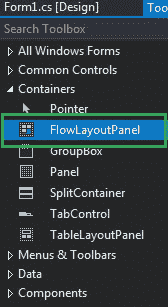
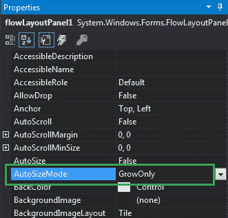
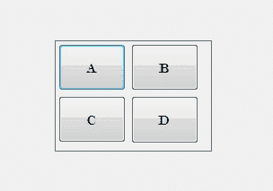
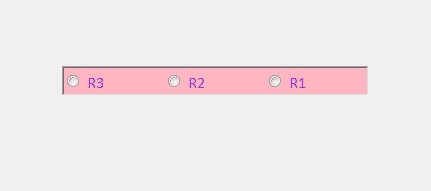

# 如何在 C# 中设置 FlowLayoutPanel 的自动大小模式？

> 原文：[https://www.geeksforgeeks.org/how-to-set-the-auto-size-mode-of-flowlayoutpanel-in-c-sharp/](https://www.geeksforgeeks.org/how-to-set-the-auto-size-mode-of-flowlayoutpanel-in-c-sharp/)

在 Windows 窗体中，`FlowLayoutPanel` 控件用于在水平或垂直流动方向上排列其子控件。或者换句话说，`FlowLayoutPanel` 是一个容器，用于在其中水平或垂直组织不同或相同类型的控件。在 `FlowLayoutPanel` 控件中，您可以使用 `AutoSizeMode` 属性设置一个值，该值指示当 `AutoSize` 属性的值设置为真时 `FlowLayoutPanel` 的行为。此属性有两个在 `AutoSizeMode` 枚举下定义的不同值，这些值是：

*   `GrowOnly`：该值表示 `FlowLayoutPanel` 根据内容增长，但如果内容较少则不收缩。
*   `GrowAndShrink`：该值表示 `FlowLayoutPanel` 根据其中的内容增长和收缩。

该属性的默认值为 `GrowOnly`。您可以通过两种不同的方式设置此属性：

## 1. 设计时

设置 `FlowLayoutPanel` 的 `AutoSizeMode` 属性是最简单的方法，如以下步骤所示：

*   **第一步**：创建如下图所示的窗口表单：
    `Visual Studio->File->New->Project->Windows Forms App`
    
*   **第二步**：接下来，将 `FlowLayoutPanel` 控件从工具箱拖放到窗体上，如下图所示：
    
*   **第三步**：拖放完成后，转到 `FlowLayoutPanel` 的属性窗口，并设置其 `AutoSizeMode` 属性，如下图所示：
    

**输出：**


## 2. 运行时

比上面的方法稍微复杂一点。在此方法中，您可以借助给定的语法以编程方式设置 `FlowLayoutPanel` 控件的 `AutoSizeMode` 属性：

```cs
public virtual System.Windows.Forms.AutoSizeMode AutoSizeMode { get; set; }
```

这里，`AutoSizeMode` 表示 `FlowLayoutPanel` 控件的大小模式。如果此属性的值不属于 `AutoSizeMode` 枚举值，它将引发 `InvalidEnumArgumentException`。以下步骤显示了如何动态设置 `FlowLayoutPanel` 的 `AutoSizeMode` 属性：

*   **步骤 1**：使用 `FlowLayoutPanel()` 构造函数创建一个 `FlowLayoutPanel`，该构造函数由 `FlowLayoutPanel` 类提供。

```cs
// Creating a FlowLayoutPanel
FlowLayoutPanel f = new FlowLayoutPanel();
```

*   **步骤 2**：创建完 `FlowLayoutPanel` 后，设置 `FlowLayoutPanel` 类提供的 `AutoSizeMode` 属性。

```cs
// Setting the AutoSizeMode property
f.AutoSizeMode = AutoSizeMode.GrowAndShrink;
```

*   **步骤 3**：最后将此 `FlowLayoutPanel` 控件添加到窗体中，并使用以下语句在 `FlowLayoutPanel` 中添加子控件：

```cs
// Adding a FlowLayoutPanel control to the form
this.Controls.Add(f);

// Adding child controls to the FlowLayoutPanel
f.Controls.Add(r1);
```

## 示例

```cs
using System;
using System.Collections.Generic;
using System.ComponentModel;
using System.Data;
using System.Drawing;
using System.Linq;
using System.Text;
using System.Threading.Tasks;
using System.Windows.Forms;

namespace WindowsFormsApp50
{
    public partial class Form1 : Form
    {
        public Form1()
        {
            InitializeComponent();
        }

        private void Form1_Load(object sender, EventArgs e)
        {
            // Creating and setting the properties of FlowLayoutPanel
            FlowLayoutPanel f = new FlowLayoutPanel();
            f.Location = new Point(380, 124);
            f.AutoSize = true;
            f.AutoSizeMode = AutoSizeMode.GrowAndShrink;
            f.Name = "Mycontainer";
            f.Font = new Font("Calibri", 12);
            f.FlowDirection = FlowDirection.RightToLeft;
            f.BorderStyle = BorderStyle.Fixed3D;
            f.ForeColor = Color.BlueViolet;
            f.BackColor = Color.LightPink;
            f.Visible = true;

            // Adding this control to the form
            this.Controls.Add(f);

            // Creating and setting the properties of radio buttons
            RadioButton r1 = new RadioButton();
            r1.Location = new Point(3, 3);
            r1.Size = new Size(95, 20);
            r1.Text = "R1";

            // Adding this control to the FlowLayoutPanel
            f.Controls.Add(r1);

            RadioButton r2 = new RadioButton();
            r2.Location = new Point(94, 3);
            r2.Size = new Size(95, 20);
            r2.Text = "R2";

            // Adding this control to the FlowLayoutPanel
            f.Controls.Add(r2);

            RadioButton r3 = new RadioButton();
            r3.Location = new Point(3, 26);
            r3.Size = new Size(95, 20);
            r3.Text = "R3";

            // Adding this control to the FlowLayoutPanel
            f.Controls.Add(r3);
        }
    }
}
```

**输出：**
