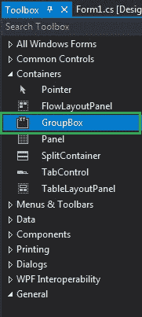
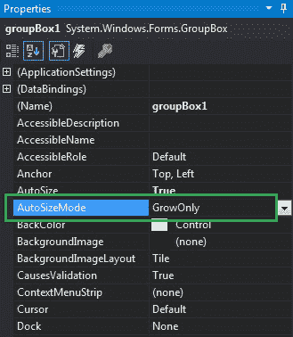
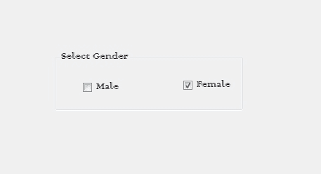

# 如何在 C# 中设置 GroupBox 的自动大小模式？

> 原文：[https://www.geeksforgeeks.org/how-to-set-the-auto-size-mode-of-the-groupbox-in-c-sharp/](https://www.geeksforgeeks.org/how-to-set-the-auto-size-mode-of-the-groupbox-in-c-sharp/)

在 Windows 窗体中，`GroupBox` 是一个容器，其中包含多个控件，这些控件相互关联。或者换句话说，`GroupBox` 是一组控件周围的框架显示，带有合适的可选标题。或者使用一个组框对一个组中的相关控件进行分类。在组框中，您可以使用 `AutoSizeMode` 属性设置一个值，该值指示当 `AutoSize` 属性的值设置为 `true` 时组框的行为。此属性的值是在 `AutoSizeMode` 枚举下定义的，其值为：

*   `GrowOnly`：该值表示 `GroupBox` 根据内容增长，但如果内容较少则不收缩。
*   `GrowAndShrink`：该值表示 `GroupBox` 根据其中存在的内容进行增长和收缩。

该属性的默认值为 `GrowOnly`。您可以通过两种不同的方式设置此属性：

## 设计时

设置 `GroupBox` 的 `AutoSizeMode` 属性是最简单的方法，如以下步骤所示：

### 第一步
创建如下图所示的窗口表单：
`Visual Studio -> File -> New -> Project -> Windows Forms App`


### 第二步
接下来，从工具箱中拖放 `GroupBox` 控件到窗体上，如下图所示：


### 第三步
拖放后，转到 `GroupBox` 的属性窗口并设置其 `AutoSizeMode` 属性，如下图所示：


**输出：**


## 运行时

比上面的方法稍微复杂一点。在此方法中，您可以在给定语法的帮助下，以编程方式设置当 `AutoSize` 属性设置为 `true` 时 `GroupBox` 的行为方式：

```cs
public System.Windows.Forms.AutoSizeMode AutoSizeMode { get; set; }
```

这里，`AutoSizeMode` 用于设置该属性的值。以下步骤显示了如何动态设置组框的 `AutoSizeMode` 属性：

### 步骤 1
使用 `GroupBox` 类提供的 `GroupBox()` 构造函数创建一个 `GroupBox`。

```cs
// Creating a GroupBox
GroupBox gbox = new GroupBox();
```

### 步骤 2
创建完 `GroupBox` 后，设置 `GroupBox` 类提供的 `GroupBox` 的 `AutoSizeMode` 属性。

```cs
// Setting Auto Size Mode
gbox.AutoSizeMode = AutoSizeMode.GrowAndShrink;
```

### 步骤 3
最后，将此 `GroupBox` 控件添加到窗体，并使用以下语句将其他控件添加到 `GroupBox` 上：

```cs
// Adding groupbox in the form
this.Controls.Add(gbox);

// Adding this control to the GroupBox
gbox.Controls.Add(c2);
```

## 示例

```cs
using System;
using System.Collections.Generic;
using System.ComponentModel;
using System.Data;
using System.Drawing;
using System.Linq;
using System.Text;
using System.Threading.Tasks;
using System.Windows.Forms;

namespace WindowsFormsApp46
{
    public partial class Form1 : Form
    {
        public Form1()
        {
            InitializeComponent();
        }

        private void Form1_Load(object sender, EventArgs e)
        {
            // Creating and setting properties of the GroupBox
            GroupBox gbox = new GroupBox();
            gbox.Location = new Point(179, 145);
            gbox.Text = "Select Gender";
            gbox.Name = "Mybox";
            gbox.Font = new Font("Colonna MT", 12);
            gbox.Visible = true;
            gbox.AutoSize = true;
            gbox.AutoSizeMode = AutoSizeMode.GrowAndShrink;

            // Adding groupbox in the form
            this.Controls.Add(gbox);

            // Creating and setting properties of the CheckBox
            CheckBox c1 = new CheckBox();
            c1.Location = new Point(40, 42);
            c1.Size = new Size(69, 20);
            c1.Text = "Male";

            // Adding this control to the GroupBox
            gbox.Controls.Add(c1);

            // Creating and setting properties of the CheckBox
            CheckBox c2 = new CheckBox();
            c2.Location = new Point(183, 39);
            c2.Size = new Size(79, 20);
            c2.Text = "Female";

            // Adding this control to the GroupBox
            gbox.Controls.Add(c2);
        }
    }
}
```

**输出：**
