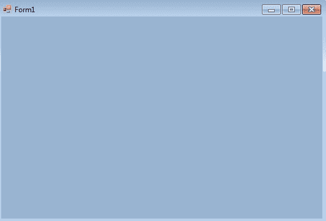
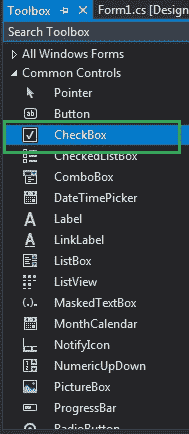
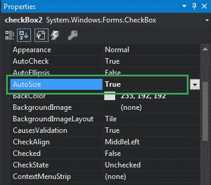
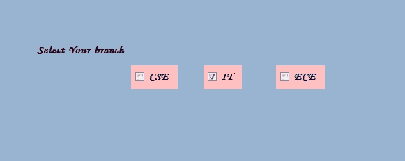
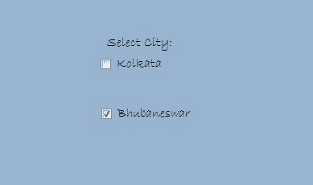

# 如何在 C# 中设置 CheckBox 的自动大小？

> 原文：[https://www.geeksforgeeks.org/how-to-set-the-autosize-of-the-checkbox-in-c-sharp/](https://www.geeksforgeeks.org/how-to-set-the-autosize-of-the-checkbox-in-c-sharp/)

CheckBox 控件是 Windows 窗体的一部分，用于接受用户的输入。或者换句话说，CheckBox 控件允许我们从给定的列表中选择单个或多个元素。您可以使用 CheckBox 的 `AutoSize` 属性自动设置复选框的大小。

该属性的值属于 `System.Boolean` 类型，表示如果你想根据内容调整 CheckBox 的大小，则为 `true`，否则为 `false`。此属性的默认值为 `true`。在 Windows 窗体中，可以通过两种不同的方式设置该属性：

## 1. 设计时

使用以下步骤设置 CheckBox 的 `AutoSize` 属性是最简单的方法：

### 第一步：创建 Windows 窗体

创建如下图所示的 Windows 窗体：
`Visual Studio->File->New->Project->Windows Forms App`



### 步骤 2：添加 CheckBox 控件

从工具箱中拖动 CheckBox 控件，并将其放到窗口窗体上。您可以根据需要将 CheckBox 放在 Windows 窗体上的任何位置。



### 第 3 步：设置 AutoSize 属性

拖放后，您将转到 CheckBox 控件的属性窗口来设置 `AutoSize` 属性的值。



### 输出



## 2. 运行时

比上面的方法稍微复杂一点。在此方法中，您可以使用以下语法设置 CheckBox 的 `AutoSize` 属性：

```cs
public override bool AutoSize { get; set; }
```

以下步骤用于设置 CheckBox 的 `AutoSize` 属性：

### 步骤 1：创建 CheckBox

使用 `CheckBox` 类提供的 `CheckBox()` 构造函数创建一个 CheckBox。

```cs
// Creating checkbox
CheckBox Mycheckbox = new CheckBox();
```

### 步骤 2：设置 AutoSize 属性

创建 CheckBox 后，设置 `CheckBox` 类提供的 `AutoSize` 属性。

```cs
// Set the AutoSize property of the CheckBox
Mycheckbox.AutoSize = true;
```

### 第 3 步：添加到窗体

最后使用 `Add()` 方法将该 CheckBox 控件添加到窗体中。

```cs
// Add this checkbox to form
this.Controls.Add(Mycheckbox);
```

### 示例

```cs
using System;
using System.Collections.Generic;
using System.ComponentModel;
using System.Data;
using System.Drawing;
using System.Linq;
using System.Text;
using System.Threading.Tasks;
using System.Windows.Forms;

namespace WindowsFormsApp5 {

    public partial class Form1 : Form {

        public Form1()
        {
            InitializeComponent();
        }

        private void Form1_Load(object sender, EventArgs e)
        {
            // Creating and setting the properties of label
            Label l = new Label();
            l.Text = "Select City:";
            l.AutoSize = true;
            l.Location = new Point(233, 111);
            l.Font = new Font("Bradley Hand ITC", 12);

            // Adding label to form
            this.Controls.Add(l);

            // Creating and setting the properties of CheckBox
            CheckBox Mycheckbox = new CheckBox();
            Mycheckbox.Height = 50;
            Mycheckbox.Width = 100;
            Mycheckbox.Location = new Point(229, 136);
            Mycheckbox.Text = "Kolkata";
            Mycheckbox.AutoSize = true;
            Mycheckbox.Font = new Font("Bradley Hand ITC", 12);

            // Adding checkbox to form
            this.Controls.Add(Mycheckbox);

            // Creating and setting the properties of CheckBox
            CheckBox Mycheckbox1 = new CheckBox();
            Mycheckbox1.Height = 50;
            Mycheckbox1.Width = 100;
            Mycheckbox1.Location = new Point(230, 198);
            Mycheckbox1.Text = "Bhubaneswar";
            Mycheckbox1.AutoSize = true;
            Mycheckbox1.Font = new Font("Bradley Hand ITC", 12);

            // Adding checkbox to form
            this.Controls.Add(Mycheckbox1);
        }
    }
}
```

### 输出

