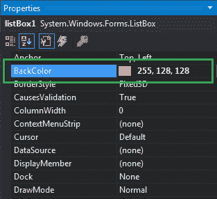
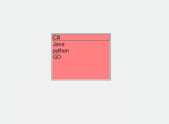
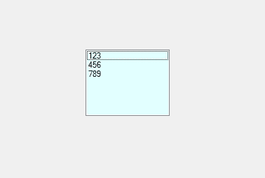

# 如何在 C# 中设置列表框的背景色？

> 原文：[https://www.geeksforgeeks.org/how-to-set-the-background-color-of-a-listbox-in-c-sharp/](https://www.geeksforgeeks.org/how-to-set-the-background-color-of-a-listbox-in-c-sharp/)

在 Windows 窗体中，`ListBox` 控件用于显示列表中的多个元素，用户可以从中选择一个或多个元素，这些元素通常显示在多个列中。在列表框中，您可以使用列表框的 `BackColor` 属性来设置列表框的背景颜色，这使得您的列表框更有吸引力。您可以通过两种不同的方式设置此属性：

## 设计时

设置列表框背景色最简单的方法，如下图所示：

*   **步骤 1：** 创建一个 Windows 窗体，如下图所示：
    **Visual Studio -> 文件 -> 新建 -> 项目 -> Windows 窗体应用**
    

*   **步骤 2：** 从工具箱中拖动 `ListBox` 控件，并将其放到 Windows 窗体上。根据您的需要，您可以将列表框控件放在窗口窗体的任何位置。

*   **步骤 3：** 拖放完成后，转到 `ListBox` 控件的属性窗口以设置其背景色。
    

**输出：**


## 运行时

比上面的方法稍微复杂一点。在此方法中，您可以借助给定的语法以编程方式设置 `ListBox` 控件的背景色：

```csharp
public override System.Drawing.Color BackColor { get; set; }
```

这里，`Color` 表示列表框的背景颜色。以下步骤显示了如何动态设置列表框的背景色：

*   **步骤 1：** 使用 `ListBox` 类提供的 `ListBox()` 构造函数创建列表框。

```csharp
// Creating ListBox using 
// ListBox class constructor
ListBox mylist = new ListBox();
```

*   **步骤 2：** 创建 `ListBox` 后，设置 `ListBox` 类提供的 `BackColor` 属性。

```csharp
// Setting the background color
mylist.BackColor = Color.LightCyan;
```

*   **步骤 3：** 最后，使用 `Add()` 方法将此 `ListBox` 控件添加到窗体。

```csharp
// Add this ListBox to the form
this.Controls.Add(mylist);
```

**示例：**

```csharp
using System;
using System.Collections.Generic;
using System.ComponentModel;
using System.Data;
using System.Drawing;
using System.Linq;
using System.Text;
using System.Threading.Tasks;
using System.Windows.Forms;

namespace WindowsFormsApp25
{
    public partial class Form1 : Form
    {
        public Form1()
        {
            InitializeComponent();
        }

        private void Form1_Load(object sender, EventArgs e)
        {
            // Creating and setting the 
            // properties of the ListBox
            ListBox mylist = new ListBox();
            mylist.Location = new Point(287, 109);
            mylist.Size = new Size(120, 95);
            mylist.BackColor = Color.LightCyan;
            mylist.Items.Add(123);
            mylist.Items.Add(456);
            mylist.Items.Add(789);

            // Adding ListBox 
            // control to the form
            this.Controls.Add(mylist);
        }
    }
}
```

**输出：**
