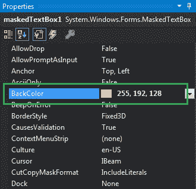
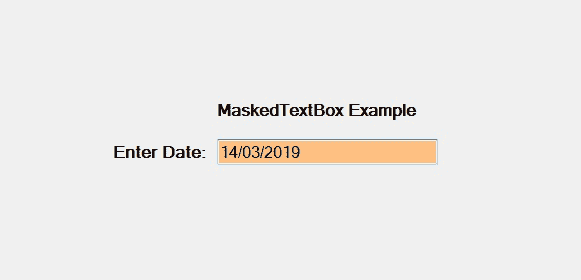
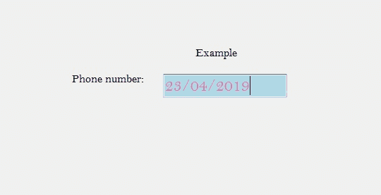

# 如何在 C# 中设置 MaskedTextBox 的背景色？

> 原文：[https://www.geeksforgeeks.org/how-to-set-the-background-color-of-the-maskedtextbox-in-c-sharp/](https://www.geeksforgeeks.org/how-to-set-the-background-color-of-the-maskedtextbox-in-c-sharp/)

在 C# 中，`MaskedTextBox` 控件为表单上的用户输入（如日期、电话号码等）提供了一个验证过程。或者换句话说，它被用来提供区分正确和不正确用户输入的屏蔽。在 `MaskedTextBox` 控件中，可以使用 `BackColor` 属性设置 `MaskedTextBox` 的背景颜色，这有助于使您的 `MaskedTextBox` 更有吸引力。您可以通过两种不同的方式设置此属性：

## 1. 设计时

最简单的方法是设置掩码文本框的背景颜色，如下步骤所示：

*   **Step 1:** 创建一个 Windows 窗体，如下图所示：
    **Visual Studio -> File -> New -> Project -> WindowsFormApp**


*   **Step 2:** 接下来，从工具箱中拖放 `MaskedTextBox` 控件到窗体上，如下图所示：


*   **Step 3:** 拖放完成后，转到 `MaskedTextBox` 的属性窗口，设置其背景颜色，如下图所示：



**输出：**



## 2. 运行时

比上面的方法稍微复杂一点。在此方法中，您可以在给定语法的帮助下，以编程方式设置 `MaskedTextBox` 控件的背景色：

```cs
public override System.Drawing.Color BackColor { get; set; }
```

在这里，`Color` 表示 `MaskedTextBox` 控件的背景颜色。下面的步骤展示了如何动态设置 `MaskedTextBox` 的背景色：

*   **步骤 1:** 使用 `MaskedTextBox()` 构造函数创建一个 `MaskedTextBox`，该构造函数由 `MaskedTextBox` 类提供。

```cs
// Creating a MaskedTextBox
MaskedTextBox m = new MaskedTextBox();
```

*   **步骤 2:** 创建 `MaskedTextBox` 后，设置 `MaskedTextBox` 类提供的 `MaskedTextBox` 的 `BackColor` 属性。

```cs
// Setting the Background color
m.BackColor = Color.LightBlue;
```

*   **步骤 3:** 最后，使用以下语句将此 `MaskedTextBox` 控件添加到窗体：

```cs
// Adding MaskedTextBox control on the form
this.Controls.Add(m);
```

**示例：**

```cs
using System;
using System.Collections.Generic;
using System.ComponentModel;
using System.Data;
using System.Drawing;
using System.Linq;
using System.Text;
using System.Threading.Tasks;
using System.Windows.Forms;

namespace WindowsFormsApp38
{
    public partial class Form1 : Form
    {
        public Form1()
        {
            InitializeComponent();
        }

        private void Form1_Load(object sender, EventArgs e)
        {
            // Creating and setting the 
            // properties of the Label
            Label l1 = new Label();
            l1.Location = new Point(413, 98);
            l1.Size = new Size(176, 20);
            l1.Text = " Example";
            l1.Font = new Font("Bell MT", 12);

            // Adding label on the form
            this.Controls.Add(l1);

            // Creating and setting the 
            // properties of the Label
            Label l2 = new Label();
            l2.Location = new Point(242, 135);
            l2.Size = new Size(126, 20);
            l2.Text = "Phone number:";
            l2.Font = new Font("Bell MT", 12);

            // Adding label on the form
            this.Controls.Add(l2);

            // Creating and setting the 
            // properties of MaskedTextBox
            MaskedTextBox m = new MaskedTextBox();
            m.Location = new Point(374, 137);
            m.Mask = "00/00/0000";
            m.Size = new Size(176, 20);
            m.Name = "MyBox";
            m.BorderStyle = BorderStyle.Fixed3D;
            m.BackColor = Color.LightBlue;
            m.ForeColor = Color.HotPink;
            m.Font = new Font("Bell MT", 18);

            // Adding MaskedTextBox 
            // control on the form
            this.Controls.Add(m);
        }
    }
}
```

**输出：**
