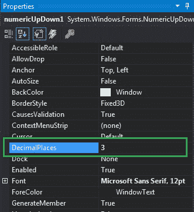
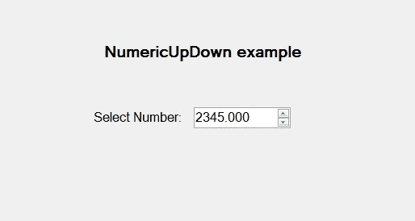
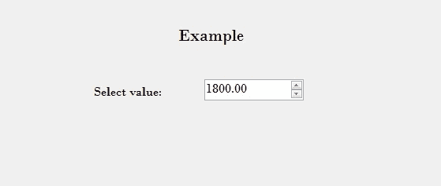

# 如何在 C# 中设置 NumericUpDown 中的小数位数？

> 原文: [https://www.geeksforgeeks.org/how-to-set-the-decimal-places-in-the-numericupdown-in-c-sharp/](https://www.geeksforgeeks.org/how-to-set-the-decimal-places-in-the-numericupdown-in-c-sharp/)

在 Windows 窗体中，`NumericUpDown` 控件用于提供显示数值的 Windows 旋转框或上下控件。或者换句话说，`NumericUpDown` 控件提供了一个使用上下箭头移动并保存一些预定义数值的界面。在 `NumericUpDown` 控件中，您可以使用 `DecimalPlaces` 属性设置将在上下控件中显示的小数位数。此属性的默认值为 0。您可以通过两种不同的方式设置此属性：

## 1. 设计时间

最简单的方法是在 `NumericUpDown` 中设置小数位数，如下步骤所示：

*   **第一步:** 创建如下图所示的窗口表单:
    **Visual Studio -> File -> New -> Project -> Windows Forms App**
    
*   **第二步:** 接下来，从工具箱中拖放 `NumericUpDown` 控件到窗体上，如下图所示：
    
*   **第三步:** 拖放完成后，转到 `NumericUpDown` 的属性窗口，并设置小数位数，如下图所示：
    

**输出:**


## 2. 运行时

比上面的方法稍微复杂一点。在此方法中，您可以在给定语法的帮助下，以编程方式设置将显示在 `NumericUpDown` 控件中的小数位数：

```cs
public int DecimalPlaces { get; set; }
```

该属性的值为 `System.Int32` 类型，表示上下控件中显示的小数位数。如果该属性的值小于 0 或大于 99，它将抛出 `ArgumentOutOfRangeException`。以下步骤显示了如何动态设置 `NumericUpDown` 中的小数位数：

*   **步骤 1:** 使用 `NumericUpDown()` 构造函数创建 `NumericUpDown`，该构造函数由 `NumericUpDown` 类提供。

```cs
// Creating a NumericUpDown
NumericUpDown n = new NumericUpDown();
```

*   **第 2 步:** 创建 `NumericUpDown` 后，设置 `NumericUpDown` 类提供的 `NumericUpDown` 的 `DecimalPlaces` 属性。

```cs
// Setting the Decimal Places
n.DecimalPlaces = 2;
```

*   **步骤 3:** 最后，使用以下语句将此 `NumericUpDown` 控件添加到窗体：

```cs
// Adding NumericUpDown 
// control on the form
this.Controls.Add(n);
```

**示例:**

```cs
using System;
using System.Collections.Generic;
using System.ComponentModel;
using System.Data;
using System.Drawing;
using System.Linq;
using System.Text;
using System.Threading.Tasks;
using System.Windows.Forms;

namespace WindowsFormsApp44
{
    public partial class Form1 : Form
    {
        public Form1()
        {
            InitializeComponent();
        }

        private void Form1_Load(object sender, EventArgs e)
        {
            // Creating and setting the
            // properties of the labels
            Label l1 = new Label();
            l1.Location = new Point(348, 61);
            l1.Size = new Size(215, 25);
            l1.Text = "Example";
            l1.Font = new Font("Bodoni MT", 16);
            this.Controls.Add(l1);

            Label l2 = new Label();
            l2.Location = new Point(242, 136);
            l2.Size = new Size(103, 20);
            l2.Text = "Select value:";
            l2.Font = new Font("Bodoni MT", 12);
            this.Controls.Add(l2);

            // Creating and setting the
            // properties of NumericUpDown
            NumericUpDown n = new NumericUpDown();
            n.Location = new Point(386, 130);
            n.Size = new Size(126, 26);
            n.Font = new Font("Bodoni MT", 12);
            n.Minimum = 1800;
            n.Maximum = 3000;
            n.Increment = 1;
            n.DecimalPlaces = 2;

            // Adding this control
            // to the form
            this.Controls.Add(n);
        }
    }
}
```

**输出:**

