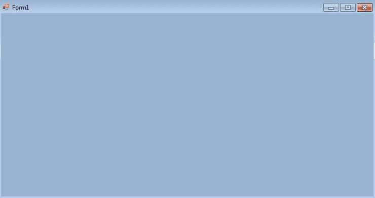
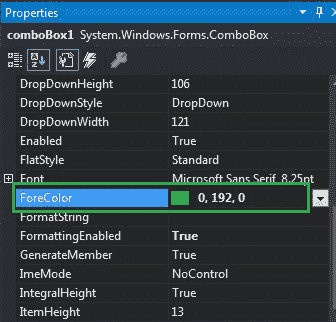
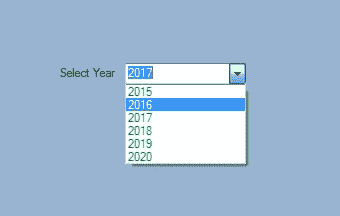
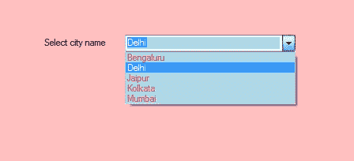

# 如何在 C# 中设置组合框的前景色？

> 原文：[https://www.geeksforgeeks.org/how-to-set-the-foreground-color-of-the-combobox-in-c-sharp/](https://www.geeksforgeeks.org/how-to-set-the-foreground-color-of-the-combobox-in-c-sharp/)

在 Windows 窗体中，组合框在单个控件中提供了两种不同的功能，这意味着组合框同时作为文本框和列表框工作。在组合框中，一次只显示一个项目，其余项目出现在下拉菜单中。您可以使用`ForeColor`属性设置组合框的前景色。它为您的组合框控件提供了更有吸引力的外观。您可以使用两种不同的方法设置此属性：

## 设计时

使用以下步骤设置组合框控件的前景色是最简单的方法：

1.  **第一步**：创建如下图所示的窗口表单：
    `Visual Studio->File->New->Project->windows form`
    
2.  **第二步**：从工具箱中拖动组合框控件，并将其放到窗口窗体上。根据您的需要，您可以将组合框控件放在窗口窗体的任何位置。
    
3.  **第三步**：拖放后，转到`ComboBox`控件的属性以设置组合框的前景色。
    

**输出：**


## 运行时

比上面的方法稍微复杂一点。在此方法中，您可以借助给定的语法以编程方式设置组合框的前景色：

```cs
public override System.Drawing.Color ForeColor { get; set; }
```

这里，`Color`表示组合框的前景色。以下步骤用于设置组合框的前景色：

1.  **步骤 1**：使用`ComboBox`类提供的`ComboBox()`构造函数创建组合框。

```cs
// Creating ComboBox using ComboBox class
ComboBox mybox = new ComboBox();
```

2.  **第二步**：创建组合框后，设置组合框的前景色。

```cs
// Set the foreground color of the ComboBox 
mybox.ForeColor = Color.DeepPink;
```

3.  **第三步**：最后使用`Add()`方法将此组合框控件添加到窗体。

```cs
// Add this ComboBox to form
this.Controls.Add(mybox);
```

## 示例

```cs
using System;
using System.Collections.Generic;
using System.ComponentModel;
using System.Data;
using System.Drawing;
using System.Linq;
using System.Text;
using System.Threading.Tasks;
using System.Windows.Forms;

namespace WindowsFormsApp11 {
    public partial class Form1 : Form {
        public Form1() {
            InitializeComponent();
        }

        private void Form1_Load(object sender, EventArgs e) {
            // Creating and setting the properties of label
            Label l = new Label();
            l.Location = new Point(222, 80);
            l.Size = new Size(99, 18);
            l.Text = "Select city name";

            // Adding this label to the form
            this.Controls.Add(l);

            // Creating and setting the properties of comboBox
            ComboBox mybox = new ComboBox();
            mybox.Location = new Point(327, 77);
            mybox.Size = new Size(216, 26);
            mybox.Sorted = true;
            mybox.BackColor = Color.LightBlue;
            mybox.ForeColor = Color.DeepPink;
            mybox.Name = "My_Cobo_Box";
            mybox.Items.Add("Mumbai");
            mybox.Items.Add("Delhi");
            mybox.Items.Add("Jaipur");
            mybox.Items.Add("Kolkata");
            mybox.Items.Add("Bengaluru");

            // Adding this ComboBox to the form
            this.Controls.Add(mybox);
        }
    }
}
```

**输出：**
