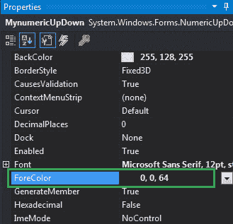
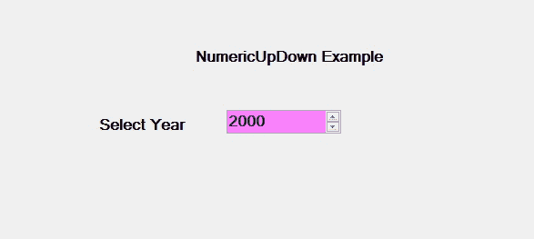
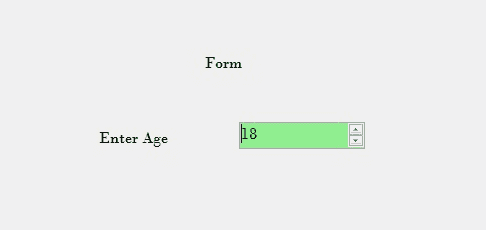

# 如何在 C# 中设置 NumericUpDown 的前景色？

> 原文：[https://www.geeksforgeeks.org/how-to-set-the-foreground-color-of-the-numericupdown-in-c-sharp/](https://www.geeksforgeeks.org/how-to-set-the-foreground-color-of-the-numericupdown-in-c-sharp/)

在 Windows 窗体中，`NumericUpDown` 控件用于提供显示数值的 Windows 旋转框或上下控件。或者换句话说，`NumericUpDown` 控件提供了一个使用上下箭头移动并保存一些预定义数值的界面。在 `NumericUpDown` 控件中，可以使用 `ForeColor` 属性设置前景色，这样可以使控件更有吸引力。您可以通过两种不同的方式设置此属性：

## 设计时

最简单的方法是设置 `NumericUpDown` 的前景色，如下步骤所示：

1.  **第一步**：创建如下图所示的窗口表单：
    **Visual Studio->File->New->Project->Windows Forms App**
    
2.  **第二步**：接下来，从工具箱中拖放 `NumericUpDown` 控件到窗体上，如下图所示：
    
3.  **第三步**：拖放后，转到 `NumericUpDown` 的属性窗口，设置其前景色，如下图所示：
    

**输出：**



## 运行时

比上面的方法稍微复杂一点。在此方法中，您可以在给定语法的帮助下以编程方式设置 `NumericUpDown` 控件的前景色：

```csharp
public override System.Drawing.Color ForeColor { get; set; }
```

这里，`Color` 表示 `NumericUpDown` 控件的前景色。以下步骤显示了如何动态设置 `NumericUpDown` 的前景色：

1.  **步骤 1**：使用 `NumericUpDown()` 构造函数创建 `NumericUpDown`，该构造函数由 `NumericUpDown` 类提供。

    ```csharp
    // Creating a NumericUpDown
    NumericUpDown n = new NumericUpDown();
    ```

2.  **第二步**：创建 `NumericUpDown` 后，设置 `NumericUpDown` 类提供的 `ForeColor` 属性。

    ```csharp
    // Setting the foreground color
    n.ForeColor = Color.DarkGreen;
    ```

3.  **步骤 3**：最后，使用以下语句将此 `NumericUpDown` 控件添加到窗体：

    ```csharp
    // Adding NumericUpDown 
    // control on the form
    this.Controls.Add(n);
    ```

**示例：**

```csharp
using System;
using System.Collections.Generic;
using System.ComponentModel;
using System.Data;
using System.Drawing;
using System.Linq;
using System.Text;
using System.Threading.Tasks;
using System.Windows.Forms;

namespace WindowsFormsApp42
{
    public partial class Form1 : Form
    {
        public Form1()
        {
            InitializeComponent();
        }

        private void Form1_Load(object sender, EventArgs e)
        {
            // Creating and setting the
            // properties of the labels
            Label l1 = new Label();
            l1.Location = new Point(348, 61);
            l1.Size = new Size(215, 20);
            l1.Text = "Form";
            l1.Font = new Font("Bodoni MT", 12);
            this.Controls.Add(l1);

            Label l2 = new Label();
            l2.Location = new Point(242, 136);
            l2.Size = new Size(103, 20);
            l2.Text = "Enter Age";
            l2.Font = new Font("Bodoni MT", 12);
            this.Controls.Add(l2);

            // Creating and setting the 
            // properties of NumericUpDown
            NumericUpDown n = new NumericUpDown();
            n.Location = new Point(386, 130);
            n.Size = new Size(126, 26);
            n.Font = new Font("Bodoni MT", 12);
            n.Value = 18;
            n.Minimum = 18;
            n.Maximum = 30;
            n.BackColor = Color.LightGreen;
            n.ForeColor = Color.DarkGreen;
            n.Increment = 1;
            n.Name = "MySpinBox";

            // Adding this control to the form
            this.Controls.Add(n);
        }
    }
}
```

**输出：**

