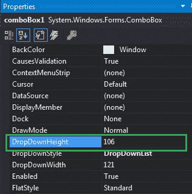
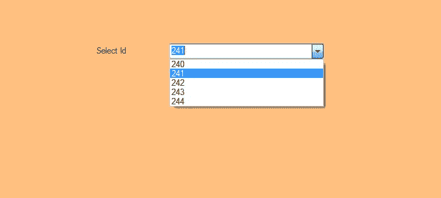

# 如何在 C# 中设置组合框中下拉列表的高度？

> 原文：[https://www.geeksforgeeks.org/how-to-set-the-height-of-the-drop-down-list-in-the-combobox-in-c-sharp/](https://www.geeksforgeeks.org/how-to-set-the-height-of-the-drop-down-list-in-the-combobox-in-c-sharp/)

在 Windows 窗体中，组合框在单个控件中提供了两种不同的功能，这意味着组合框同时作为文本框和列表框工作。在组合框中，一次只显示一个项目，其余项目出现在下拉菜单中。您可以使用`DropDownHeight`属性在组合框中设置下拉列表的高度（以像素为单位）。您可以使用两种不同的方法设置此属性：

## 设计时

使用以下步骤设置组合框控件的`DropDownHeight`属性是最简单的方法：

1.  创建如下图所示的窗口表单：
    **Visual Studio->File->New->Project->windows formpp**
    
2.  从工具箱中拖动组合框控件，并将其放到窗口窗体上。根据您的需要，您可以将组合框控件放在窗口窗体的任何位置。
3.  拖放完成后，转到`ComboBox`控件的属性窗口，设置其`DropDownHeight`属性。
    

**输出：**


## 运行时

比上面的方法稍微复杂一点。在此方法中，您可以在给定语法的帮助下，以编程方式设置组合框中下拉列表的高度：

```cs
public int DropDownHeight { get; set; }
```

这里，该属性的值为`System.Int32`型。如果该属性的值小于 1，它将引发`ArgumentException`。以下步骤用于设置组合框元素的`DropDownHeight`属性：

1.  使用`ComboBox`类提供的`ComboBox()`构造函数创建组合框。

```cs
// Creating ComboBox using ComboBox class
ComboBox mybox = new ComboBox();
```

2.  创建组合框后，设置`ComboBox`类提供的组合框的`DropDownHeight`属性。

```cs
// Set DropDownHeight property of the combobox
mybox.DropDownHeight = 26;
```

3.  最后，使用`Add()`方法将此组合框控件添加到窗体。

```cs
// Add this ComboBox to form
this.Controls.Add(mybox);
```

**示例：**

```cs
using System;
using System.Collections.Generic;
using System.ComponentModel;
using System.Data;
using System.Drawing;
using System.Linq;
using System.Text;
using System.Threading.Tasks;
using System.Windows.Forms;

namespace WindowsFormsApp14 {
    public partial class Form1 : Form {
        public Form1() {
            InitializeComponent();
        }

        private void Form1_Load(object sender, EventArgs e) {
            // Creating and setting the properties of label
            Label l = new Label();
            l.Location = new Point(222, 80);
            l.Size = new Size(99, 18);
            l.Text = "Select Id";

            // Adding this label to the form
            this.Controls.Add(l);

            // Creating and setting the properties of comboBox
            ComboBox mybox = new ComboBox();
            mybox.Location = new Point(327, 77);
            mybox.Size = new Size(216, 26);
            mybox.MaxLength = 3;
            mybox.DropDownStyle = ComboBoxStyle.DropDown;
            mybox.DropDownHeight = 26;
            mybox.Items.Add(240);
            mybox.Items.Add(241);
            mybox.Items.Add(242);
            mybox.Items.Add(243);
            mybox.Items.Add(244);

            // Adding this ComboBox to the form
            this.Controls.Add(mybox);
        }
    }
}
```

**输出：**

设置下拉高度前：


设置好下拉高度后：
