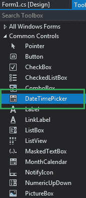
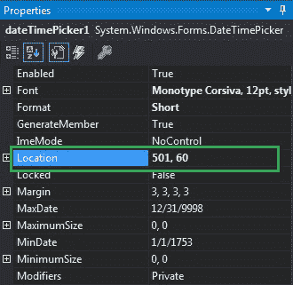
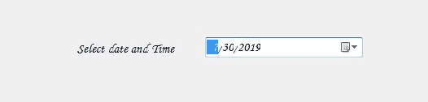
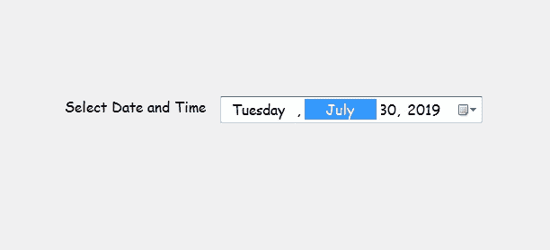

# 如何在 C# 中设置 DateTimePicker 的位置？

> 原文：[https://www.geeksforgeeks.org/how-to-set-the-location-of-the-datetimepicker-in-c-sharp/](https://www.geeksforgeeks.org/how-to-set-the-location-of-the-datetimepicker-in-c-sharp/)

在 Windows 窗体中，`DateTimePicker`控件用于在窗体中选择和显示具有特定格式的日期/时间。在日期选择器控件中，可以使用`Location`属性设置日期选择器在窗体上的位置。此属性为您提供控件的坐标。您可以通过两种不同的方式设置此属性：

## 设计时间

设置日期时间选择器的位置是最简单的方法，如以下步骤所示：

*   **Step 1:** 创建一个 Windows 窗体，如下图所示：

**Visual Studio -> 文件 -> 新建 -> 项目 -> Windows Forms App**


*   **Step 2:** 接下来，从工具箱中拖放`DateTimePicker`控件到窗体上，如下图所示：



*   **Step 3:** 拖放完成后，转到`DateTimePicker`的属性窗口并设置其`Location`，如下图所示：



**输出：**



## 运行时

比上面的方法稍微复杂一点。在此方法中，您可以借助给定的语法以编程方式设置`DateTimePicker`控件的位置：

```cs
public System.Drawing.Point Location { get; set; }
```

这里，`Point`包含日期时间选择器控件的坐标。以下步骤显示了如何动态设置日期时间选择器的位置：

*   **步骤 1:** 使用`DateTimePicker`类提供的`DateTimePicker()`构造函数创建一个`DateTimePicker`。

```cs
// Creating a DateTimePicker
DateTimePicker dt = new DateTimePicker();
```

*   **步骤 2:** 创建日期时间选择器后，设置由`DateTimePicker`类提供的`Location`属性。

```cs
// Setting the location
dt.Location = new Point(360, 162);
```

*   **第 3 步:** 最后使用下面的语句将这个`DateTimePicker`控件添加到表单中：

```cs
// Adding this control to the form
this.Controls.Add(dt);
```

**示例：**

```cs
using System;
using System.Collections.Generic;
using System.ComponentModel;
using System.Data;
using System.Drawing;
using System.Linq;
using System.Text;
using System.Threading.Tasks;
using System.Windows.Forms;

namespace WindowsFormsApp48
{
    public partial class Form1 : Form
    {
        public Form1()
        {
            InitializeComponent();
        }

        private void Form1_Load(object sender, EventArgs e)
        {
            // Creating and setting the
            // properties of the Label
            Label lab = new Label();
            lab.Location = new Point(183, 162);
            lab.Size = new Size(172, 20);
            lab.Text = "Select Date and Time";
            lab.Font = new Font("Comic Sans MS", 12);

            // Adding this control 
            // to the form
            this.Controls.Add(lab);

            // Creating and setting the 
            // properties of the DateTimePicker
            DateTimePicker dt = new DateTimePicker();
            dt.Location = new Point(360, 162);
            dt.Size = new Size(292, 26);
            dt.MaxDate = new DateTime(2500, 12, 20);
            dt.MinDate = new DateTime(1753, 1, 1);
            dt.Format = DateTimePickerFormat.Long;
            dt.Name = "MyPicker";
            dt.Font = new Font("Comic Sans MS", 12);
            dt.Visible = true;
            dt.Value = DateTime.Today;

            // Adding this control
            // to the form
            this.Controls.Add(dt);
        }
    }
}
```

**输出：**

