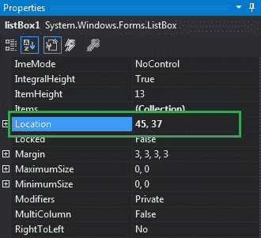

# 如何在 C# 中设置列表框的位置？

> 原文：[https://www.geeksforgeeks.org/how-to-set-the-location-of-the-listbox-in-c-sharp/](https://www.geeksforgeeks.org/how-to-set-the-location-of-the-listbox-in-c-sharp/)

在 Windows 窗体中，`ListBox` 控件用于显示列表中的多个元素，用户可以从中选择一个或多个元素，这些元素通常显示在多个列中。在列表框中，可以使用列表框的 `Location` 属性设置列表框的位置。此属性包含列表框控件左上角相对于其窗体左上角的坐标。您可以通过两种不同的方式设置此属性：

## 设计时

最简单的方法是设置列表框的位置，如以下步骤所示：

1.  **第一步**：创建如下图所示的窗口表单：
    **Visual Studio -> File -> New -> Project -> Windows Forms App**
    
2.  **步骤 2**：从工具箱中拖动 `ListBox` 控件，并将其放到 Windows 窗体上。根据您的需要，您可以将列表框控件放在窗口窗体的任何位置。
    
3.  **步骤 3**：拖放完成后，转到 `ListBox` 控件的属性窗口以设置其 `Location`。
    

**输出：**


## 运行时

比上面的方法稍微复杂一点。在此方法中，您可以借助给定的语法以编程方式设置 `ListBox` 控件的位置：

```cs
public System.Drawing.Point Location { get; set; }
```

这里，`Point` 表示列表框控件相对于其表单左上角的左上角。以下步骤显示了如何动态设置列表框的位置：

1.  **步骤 1**：使用 `ListBox` 类提供的 `ListBox()` 构造函数创建列表框。

    ```cs
    // Creating ListBox using ListBox class constructor
    ListBox mylist = new ListBox();
    ```

2.  **步骤 2**：创建 `ListBox` 后，设置 `ListBox` 类提供的 `Location` 属性。

    ```cs
    // Setting the location
    mylist.Location = new Point(287, 109);
    ```

3.  **步骤 3**：最后，使用 `Add()` 方法将此 `ListBox` 控件添加到窗体。

    ```cs
    // Add this ListBox to the form
    this.Controls.Add(mylist);
    ```

**示例：**

```cs
using System;
using System.Collections.Generic;
using System.ComponentModel;
using System.Data;
using System.Drawing;
using System.Linq;
using System.Text;
using System.Threading.Tasks;
using System.Windows.Forms;

namespace WindowsFormsApp25
{
    public partial class Form1 : Form
    {
        public Form1()
        {
            InitializeComponent();
        }

        private void Form1_Load(object sender, EventArgs e)
        {
            // Creating and setting the
            // properties of ListBox
            ListBox mylist = new ListBox();
            mylist.Location = new Point(287, 109);
            mylist.Size = new Size(120, 95);
            mylist.ForeColor = Color.Purple;
            mylist.Items.Add(123);
            mylist.Items.Add(456);
            mylist.Items.Add(789);

            // Adding ListBox control
            // to the form
            this.Controls.Add(mylist);
        }
    }
}
```

**输出：**

