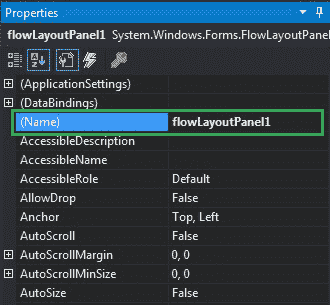
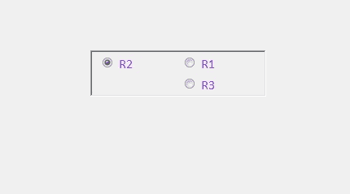

# 如何在 C# 中设置 FlowLayoutPanel 的名称？

> 原文: [https://www.geeksforgeeks.org/how-to-set-the-name-of-flowlayoutpanel-in-c-sharp/](https://www.geeksforgeeks.org/how-to-set-the-name-of-flowlayoutpanel-in-c-sharp/)

在 Windows 窗体中，`FlowLayoutPanel` 控件用于在水平或垂直流动方向上排列其子控件。或者换句话说，`FlowLayoutPanel` 是一个容器，用于在其中水平或垂直组织不同或相同的控件。在 `FlowLayoutPanel` 控件中，可以使用 `Name` 属性设置表单中控件的名称。您可以通过两种不同的方式设置此属性：

## 设计时

设置 `FlowLayoutPanel` 的名称是最简单的方法，如以下步骤所示：

*   **Step 1:** 创建一个 Windows 窗体，如下图所示：
    **Visual Studio -> File -> New -> Project -> WindowsFormApp**


*   **Step 2:** 接下来，从工具箱中拖放 `FlowLayoutPanel` 控件到窗体上，如下图所示：


*   **Step 3:** 拖放完成后，转到 `FlowLayoutPanel` 的属性窗口并设置其名称。



**输出:**


## 运行时

比上面的方法稍微复杂一点。在此方法中，您可以借助给定的语法以编程方式设置 `FlowLayoutPanel` 控件的名称：

```cs
public string Name { get; set; }
```

以下步骤展示了如何动态设置 `FlowLayoutPanel` 的名称：

*   **步骤 1:** 使用 `FlowLayoutPanel()` 构造函数创建一个 `FlowLayoutPanel`，该构造函数由 `FlowLayoutPanel` 类提供。

```cs
// Creating a FlowLayoutPanel
FlowLayoutPanel f = new FlowLayoutPanel();
```

*   **步骤 2:** 创建完 `FlowLayoutPanel` 后，设置 `FlowLayoutPanel` 类提供的 `Name` 属性。

```cs
// Setting the name
f.Name = "Mycontainer";
```

*   **第 3 步:** 最后将此 `FlowLayoutPanel` 控件添加到窗体中，并使用以下语句在 `FlowLayoutPanel` 中添加子控件：

```cs
// Adding a FlowLayoutPanel control to the form
this.Controls.Add(f);

// Adding child controls to the FlowLayoutPanel
f.Controls.Add(r1);
```

**示例:**

```cs
using System;
using System.Collections.Generic;
using System.ComponentModel;
using System.Data;
using System.Drawing;
using System.Linq;
using System.Text;
using System.Threading.Tasks;
using System.Windows.Forms;

namespace WindowsFormsApp50
{
    public partial class Form1 : Form
    {
        public Form1()
        {
            InitializeComponent();
        }

        private void Form1_Load(object sender, EventArgs e)
        {
            // Creating and setting the properties of FlowLayoutPanel
            FlowLayoutPanel f = new FlowLayoutPanel();
            f.Location = new Point(380, 124);
            f.Size = new Size(216, 57);
            f.Name = "Mycontainer";
            f.Font = new Font("Calibri", 12);
            f.FlowDirection = FlowDirection.RightToLeft;
            f.BorderStyle = BorderStyle.Fixed3D;
            f.ForeColor = Color.BlueViolet;
            f.Visible = true;

            // Adding this control to the form
            this.Controls.Add(f);

            // Creating and setting the properties of radio buttons
            RadioButton r1 = new RadioButton();
            r1.Location = new Point(3, 3);
            r1.Size = new Size(95, 20);
            r1.Text = "R1";

            // Adding this control to the FlowLayoutPanel
            f.Controls.Add(r1);

            RadioButton r2 = new RadioButton();
            r2.Location = new Point(94, 3);
            r2.Size = new Size(95, 20);
            r2.Text = "R2";

            // Adding this control to the FlowLayoutPanel
            f.Controls.Add(r2);

            RadioButton r3 = new RadioButton();
            r3.Location = new Point(3, 26);
            r3.Size = new Size(95, 20);
            r3.Text = "R3";

            // Adding this control to the FlowLayoutPanel
            f.Controls.Add(r3);
        }
    }
}
```

**输出:**

