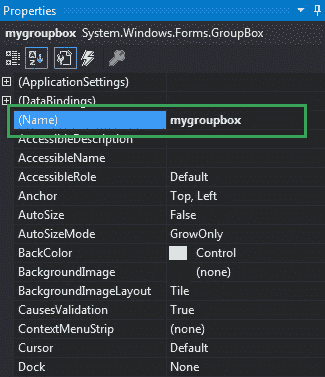

# 如何在 C# 中设置 GroupBox 的名称？

> 原文：[https://www.geeksforgeeks.org/how-to-set-the-name-of-the-groupbox-in-c-sharp/](https://www.geeksforgeeks.org/how-to-set-the-name-of-the-groupbox-in-c-sharp/)

在 Windows 窗体中，`GroupBox` 是一个容器，其中包含多个控件，这些控件相互关联。或者换句话说，`GroupBox` 是一组控件周围的框架显示，带有合适的可选标题。或者使用一个组框对一个组中的相关控件进行分类。在组框中，可以使用 `Name` 属性在表单中设置组框的名称。您可以通过两种不同的方式设置此属性：

## 1. 设计时

设置组框名称最简单的方法如下所示：

*   **Step 1:** 创建一个 Windows 窗体，如下图所示：

**Visual Studio -> 文件 -> 新建 -> 项目 -> Windows 窗体应用**


*   **Step 2:** 接下来，将 `GroupBox` 从工具箱拖放到窗体上，如下图所示：


*   **Step 3:** 拖放完成后，转到 `GroupBox` 的属性并设置其名称，如下图所示：



**输出：**


## 2. 运行时

比上面的方法稍微复杂一点。在此方法中，您可以借助给定的语法以编程方式设置 `GroupBox` 的名称：

```csharp
public string Name { get; set; }
```

该属性的值为 `System.String` 类型，该字符串代表组框的名称。以下步骤显示了如何动态设置组框的名称：

*   **步骤 1:** 使用 `GroupBox` 类提供的 `GroupBox()` 构造函数创建一个 `GroupBox`。

```csharp
// Creating a GroupBox
GroupBox gbox = new GroupBox();
```

*   **第二步:** 创建完 `GroupBox` 后，设置 `GroupBox` 类提供的 `Name` 属性。

```csharp
// Setting the name
gbox.Name = "Mybox";
```

*   **Step 3:** 最后，将此 `GroupBox` 控件添加到窗体，并使用以下语句将其他控件添加到 `GroupBox` 上：

```csharp
// Adding groupbox in the form
this.Controls.Add(gbox);

// Adding this control to the GroupBox
gbox.Controls.Add(c2);
```

**示例：**

```csharp
using System;
using System.Collections.Generic;
using System.ComponentModel;
using System.Data;
using System.Drawing;
using System.Linq;
using System.Text;
using System.Threading.Tasks;
using System.Windows.Forms;

namespace WindowsFormsApp45
{
    public partial class Form1 : Form
    {
        public Form1()
        {
            InitializeComponent();
        }

        private void Form1_Load(object sender, EventArgs e)
        {
            // Creating and setting properties 
            // of the GroupBox
            GroupBox gbox = new GroupBox();
            gbox.Location = new Point(179, 145);
            gbox.Size = new Size(329, 94);
            gbox.Text = "Select Gender";
            gbox.Name = "Mybox";

            // Adding groupbox in the form
            this.Controls.Add(gbox);

            // Creating and setting 
            // properties of the CheckBox
            CheckBox c1 = new CheckBox();
            c1.Location = new Point(40, 42);
            c1.Size = new Size(49, 20);
            c1.Text = "Male";

            // Adding this control 
            // to the GroupBox
            gbox.Controls.Add(c1);

            // Creating and setting properties 
            // of the CheckBox
            CheckBox c2 = new CheckBox();
            c2.Location = new Point(183, 39);
            c2.Size = new Size(69, 20);
            c2.Text = "Female";

            // Adding this control
            // to the GroupBox
            gbox.Controls.Add(c2);
        }
    }
}
```

**输出：**
