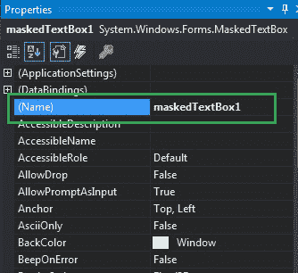
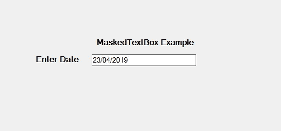
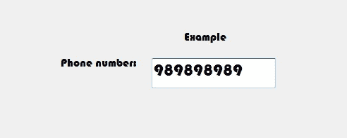

# 如何在 C# 中设置 MaskedTextBox 的名称？

> 原文:[https://www . geeksforgeeks . org/如何设置 c-sharp 中的 maskedtxbox/](https://www.geeksforgeeks.org/how-to-set-the-name-of-the-maskedtextbox-in-c-sharp/)

在 C# 中，`MaskedTextBox`控件为表单上的用户输入(如日期、电话号码等)提供了一个验证过程。或者换句话说，它被用来提供区分正确和不正确用户输入的屏蔽。在`MaskedTextBox`控件中，可以使用`Name`属性设置表单上`MaskedTextBox`的名称。您可以通过两种不同的方式设置此属性:

## 1. 设计时

设置掩码文本框的名称是最简单的方法，如下步骤所示:

*   **第一步:** 创建如下图所示的窗口表单:
    **Visual Studio->File->New->Project->windows formpp**
    
*   **第二步:** 接下来，从工具箱中拖放`MaskedTextBox`控件到表单上。
    
*   **第三步:** 拖放完成后，转到`MaskedTextBox`的属性窗口并设置其名称。
    

**输出:**



## 2. 运行时

比上面的方法稍微复杂一点。在这个方法中，您可以在给定语法的帮助下以编程方式设置`MaskedTextBox`控件的名称:

```cs
public string Name { get; set; }
```

该属性的值为`System.String`类型，表示`MaskedTextBox`控件的名称。以下步骤显示了如何动态设置掩码文本框的名称:

*   **步骤 1:** 使用`MaskedTextBox()`构造函数创建一个`MaskedTextBox`，该构造函数由`MaskedTextBox`类提供。

```cs
// Creating a MaskedTextBox
MaskedTextBox m = new MaskedTextBox();
```

*   **步骤 2:** 创建`MaskedTextBox`后，设置`MaskedTextBox`类提供的`Name`属性。

```cs
// Setting the name
m.Name = "MyBox";
```

*   **步骤 3:** 最后，使用以下语句将此`MaskedTextBox`控件添加到表单:

```cs
// Adding MaskedTextBox control on the form
this.Controls.Add(m);
```

**示例:**

```cs
using System;
using System.Collections.Generic;
using System.ComponentModel;
using System.Data;
using System.Drawing;
using System.Linq;
using System.Text;
using System.Threading.Tasks;
using System.Windows.Forms;

namespace WindowsFormsApp36 {
    public partial class Form1 : Form {
        public Form1() {
            InitializeComponent();
        }

        private void Form1_Load(object sender, EventArgs e) {
            // Creating and setting the 
            // properties of the Label
            Label l1 = new Label();
            l1.Location = new Point(413, 98);
            l1.Size = new Size(176, 20);
            l1.Text = " Example";
            l1.Font = new Font("Bauhaus 93", 12);

            // Adding label on the form
            this.Controls.Add(l1);

            // Creating and setting the 
            // properties of the Label
            Label l2 = new Label();
            l2.Location = new Point(242, 135);
            l2.Size = new Size(126, 20);
            l2.Text = "Phone number:";
            l2.Font = new Font("Bauhaus 93", 12);

            // Adding label on the form
            this.Controls.Add(l2);

            // Creating and setting the 
            // properties of MaskedTextBox
            MaskedTextBox m = new MaskedTextBox();
            m.Location = new Point(374, 137);
            m.Mask = "000000000";
            m.Size = new Size(176, 20);
            m.Name = "MyBox";
            m.Font = new Font("Bauhaus 93", 18);

            // Adding MaskedTextBox 
            // control on the form
            this.Controls.Add(m);
        }
    }
}
```

**输出:**

