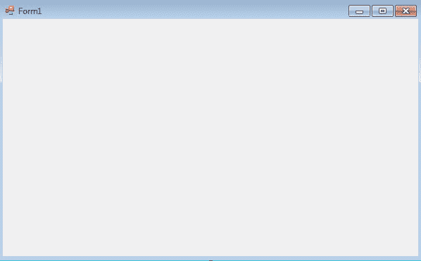
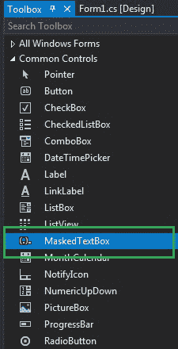
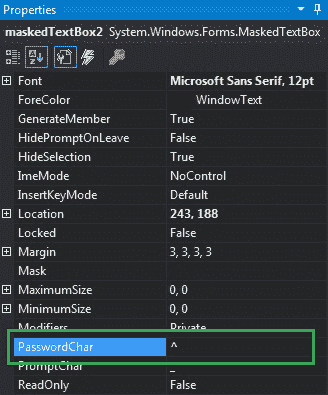
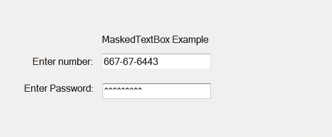
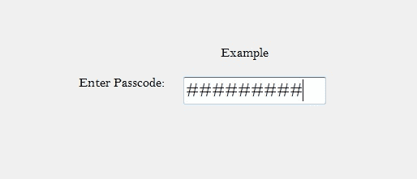

# 如何在 C# 中设置 MaskedTextBox 的密码字符？

> 原文：[https://www.geeksforgeeks.org/how-to-set-the-password-character-for-maskedtextbox-in-c-sharp/](https://www.geeksforgeeks.org/how-to-set-the-password-character-for-maskedtextbox-in-c-sharp/)

## 简介
在 C# 中，`MaskedTextBox` 控件为表单上的用户输入（如日期、电话号码等）提供了一个验证过程。或者换句话说，它被用来提供区分正确和不正确用户输入的屏蔽。在掩码文本框控件中，您可以使用掩码文本框控件提供的 `PasswordChar` 属性设置当我们在掩码文本框中输入密码等敏感数据时显示的字符。

如果这个属性的值被设置为非空字符，那么 `MaskedTextBox` 将为所有输入显示这个字符，如果这个属性的值被设置为空，那么它将不会在 `MaskedTextBox` 控件中显示任何内容。您可以通过两种不同的方式设置此属性。

## 设计时设置
最简单的方法是设置 `MaskedTextBox` 控件的 `PasswordChar` 属性值，如下步骤所示：

1.  **第一步：** 创建如下图所示的窗口表单：
    **Visual Studio -> File -> New -> Project -> Windows Forms App**
    
2.  **第二步：** 接下来，从工具箱中拖放 `MaskedTextBox` 控件到表单上，如下图所示：
    
3.  **第三步：** 拖放完成后，转到 `MaskedTextBox` 的属性窗口，设置 `MaskedTextBox` 控件的 `PasswordChar` 属性值，如下图所示：
    

**输出：**


## 运行时设置
比上面的方法稍微复杂一点。在此方法中，您可以在给定语法的帮助下，以编程方式设置 `MaskedTextBox` 控件的 `PasswordChar` 属性值：

```cs
public char PasswordChar { get; set; }
```

这里，`char` 代表密码字符值。以下步骤显示了如何动态设置 `MaskedTextBox` 控件的 `PasswordChar` 属性值：

1.  **步骤 1：** 使用 `MaskedTextBox()` 构造函数创建一个 `MaskedTextBox`，该构造函数由 `MaskedTextBox` 类提供。
    ```cs
    // Creating a MaskedTextBox
    MaskedTextBox m = new MaskedTextBox();
    ```
2.  **步骤 2：** 创建 `MaskedTextBox` 后，设置 `MaskedTextBox` 类提供的 `MaskedTextBox` 的 `PasswordChar` 属性。
    ```cs
    // Setting the PasswordChar property
    m.PasswordChar = '#';
    ```
3.  **步骤 3：** 最后，使用以下语句将此 `MaskedTextBox` 控件添加到表单：
    ```cs
    // Adding MaskedTextBox control on the form
    this.Controls.Add(m);
    ```

## 示例
```cs
using System;
using System.Collections.Generic;
using System.ComponentModel;
using System.Data;
using System.Drawing;
using System.Linq;
using System.Text;
using System.Threading.Tasks;
using System.Windows.Forms;

namespace WindowsFormsApp39 {
    public partial class Form1 : Form {
        public Form1() {
            InitializeComponent();
        }

        private void Form1_Load(object sender, EventArgs e) {
            // Creating and setting the properties of the Label
            Label l1 = new Label();
            l1.Location = new Point(413, 98);
            l1.Size = new Size(176, 20);
            l1.Text = " Example";
            l1.Font = new Font("Bell MT", 12);

            // Adding label on the form
            this.Controls.Add(l1);

            // Creating and setting the properties of the Label
            Label l2 = new Label();
            l2.Location = new Point(242, 135);
            l2.Size = new Size(126, 20);
            l2.Text = "Enter Passcode:";
            l2.Font = new Font("Bell MT", 12);

            // Adding label on the form
            this.Controls.Add(l2);

            // Creating and setting the properties of MaskedTextBox
            MaskedTextBox m = new MaskedTextBox();
            m.Location = new Point(374, 137);
            m.Mask = "000000000";
            m.Size = new Size(176, 20);
            m.Name = "MyBox";
            m.BorderStyle = BorderStyle.Fixed3D;
            m.PasswordChar = '#';
            m.Font = new Font("Bell MT", 18);

            // Adding MaskedTextBox control on the form
            this.Controls.Add(m);
        }
    }
}
```

**输出：**
