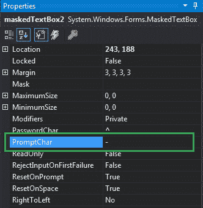
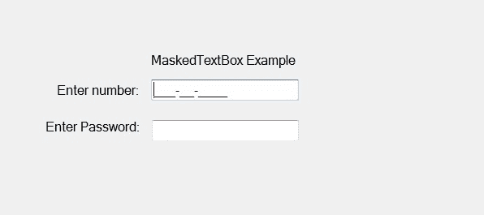
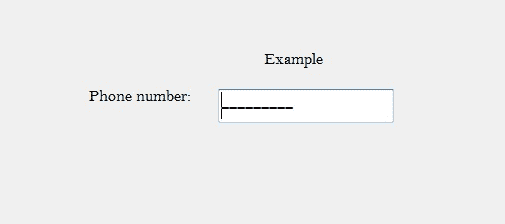

# 如何在 C# 中设置 MaskedTextBox 中的提示字符？

> 原文：[https://www.geeksforgeeks.org/how-to-set-the-prompt-character-in-maskedtextbox-in-c-sharp/](https://www.geeksforgeeks.org/how-to-set-the-prompt-character-in-maskedtextbox-in-c-sharp/)

在 C# 中，`MaskedTextBox` 控件为表单上的用户输入（如日期、电话号码等）提供了一个验证过程。或者换句话说，它被用来提供区分正确和不正确用户输入的屏蔽。在 `MaskedTextBox` 控件中，您可以使用该控件提供的 `PromptChar` 属性设置一个字符，该字符表示控件中没有用户输入。此属性的默认值是下划线（`_`）。您可以通过两种不同的方式设置此属性：

## 1. 设计时

设置 `MaskedTextBox` 控件的 `PromptChar` 属性的值是最简单的方法，如下步骤所示：

### Step 1
创建一个 Windows 窗体，如下图所示：

**Visual Studio -> 文件 -> 新建 -> 项目 -> Windows 窗体应用**


### Step 2
接下来，从工具箱中拖放 `MaskedTextBox` 控件到窗体上。如下图所示：


### Step 3
拖放后，转到 `MaskedTextBox` 的属性窗口，设置 `MaskedTextBox` 控件的 `PromptChar` 属性的值，如下图所示：



**输出：**



## 2. 运行时

比上面的方法稍微复杂一点。在此方法中，您可以在给定语法的帮助下，以编程方式设置 `MaskedTextBox` 控件的提示字符：

```cs
public char PromptChar { get; set; }
```

这里，`Char` 代表提示字符。如果提示字符的值与密码字符相似，那么它将抛出 `InvalidOperationException`。如果由 `IsValidPasswordChar(Char)` 方法确定的提示字符的值无效，也会抛出 `ArgumentException`。以下步骤显示了如何动态设置 `MaskedTextBox` 控件的提示字符：

### 步骤 1
使用 `MaskedTextBox()` 构造函数创建一个 `MaskedTextBox`，该构造函数由 `MaskedTextBox` 类提供。

```cs
// Creating a MaskedTextBox
MaskedTextBox m = new MaskedTextBox();
```

### 步骤 2
创建 `MaskedTextBox` 后，设置 `MaskedTextBox` 类提供的 `PromptChar` 属性。

```cs
// Setting the Prompt Character
m.PromptChar = '-';
```

### 步骤 3
最后，使用以下语句将此 `MaskedTextBox` 控件添加到窗体：

```cs
// Adding MaskedTextBox control on the form
this.Controls.Add(m);
```

**示例：**

```cs
using System;
using System.Collections.Generic;
using System.ComponentModel;
using System.Data;
using System.Drawing;
using System.Linq;
using System.Text;
using System.Threading.Tasks;
using System.Windows.Forms;

namespace WindowsFormsApp39 {
    public partial class Form1 : Form {
        public Form1() {
            InitializeComponent();
        }

        private void Form1_Load(object sender, EventArgs e) {
            // Creating and setting the
            // properties of the Label
            Label l1 = new Label();
            l1.Location = new Point(413, 98);
            l1.Size = new Size(176, 20);
            l1.Text = " Example";
            l1.Font = new Font("Bell MT", 12);

            // Adding label on the form
            this.Controls.Add(l1);

            // Creating and setting
            // the properties of Label
            Label l2 = new Label();
            l2.Location = new Point(242, 135);
            l2.Size = new Size(126, 20);
            l2.Text = "Phone number:";
            l2.Font = new Font("Bell MT", 12);

            // Adding label on the form
            this.Controls.Add(l2);

            // Creating and setting the
            // properties of MaskedTextBox
            MaskedTextBox m = new MaskedTextBox();
            m.Location = new Point(374, 137);
            m.Mask = "000000000";
            m.Size = new Size(176, 20);
            m.Name = "MyBox";
            m.BorderStyle = BorderStyle.Fixed3D;
            m.PromptChar = '-';
            m.Font = new Font("Bell MT", 18);

            // Adding MaskedTextBox
            // control on the form
            this.Controls.Add(m);
        }
    }
}
```

**输出：**

