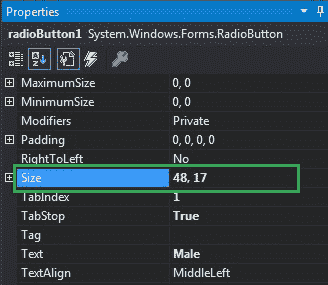

# 如何在 C# 中设置单选按钮的大小？

> 原文：[https://www.geeksforgeeks.org/how-to-set-the-size-of-the-radiobutton-in-c-sharp/](https://www.geeksforgeeks.org/how-to-set-the-size-of-the-radiobutton-in-c-sharp/)

在 Windows 窗体中，单选按钮控件用于从选项组中选择一个选项。例如，从给定的列表中选择您的性别，因此您将在三个选项中仅选择一个选项，如男性或女性或变性者。
在 Windows 窗体中，您可以使用单选按钮的`大小属性`来调整单选按钮的大小。此属性以像素为单位表示单选按钮的高度和宽度。您可以通过两种不同的方式设置此属性：

## 设计时间

按照以下步骤调整单选按钮的大小是最简单的方法：

*   **第一步：** 创建如下图所示的窗口表单：
    `Visual Studio->File->New->Project->windows formpp`
    
*   **第二步：** 从工具箱中拖动`RadioButton`控件并将其放到 Windows 窗体上。您可以根据需要将`RadioButton`控件放置在 Windows 窗体上的任何位置。
    
*   **第三步：** 拖放之后，您将进入`RadioButton`控件的属性以调整`RadioButton`的大小。
    

**输出：**


## 运行时

比上面的方法稍微复杂一点。在此方法中，您可以借助给定的语法以编程方式调整单选按钮控件的大小：

```cs
public System.Drawing.Size Size { get; set; }
```

这里，大小以像素为单位表示高度和宽度。以下步骤显示了如何动态调整单选按钮的大小：

*   **步骤 1：** 使用`RadioButton`类提供的`RadioButton()`构造函数创建单选按钮。

```cs
// Creating radio button
RadioButton r1 = new RadioButton();
```

*   **步骤 2：** 创建单选按钮后，设置`RadioButton`类提供的单选按钮的`Size`属性。

```cs
// Setting the size of the radio button
r1.Size = new Size(100, 40);
```

*   **步骤 3：** 最后，使用`Add()`方法将此`RadioButton`控件添加到窗体。

```cs
// Add this radio button to the form
this.Controls.Add(r1);
```

**示例：**

```cs
using System;
using System.Collections.Generic;
using System.ComponentModel;
using System.Data;
using System.Drawing;
using System.Linq;
using System.Text;
using System.Threading.Tasks;
using System.Windows.Forms;

namespace WindowsFormsApp23 {
    public partial class Form1 : Form {
        public Form1() {
            InitializeComponent();
        }

        private void Form1_Load(object sender, EventArgs e) {
            // Creating and setting label
            Label l = new Label();
            l.AutoSize = true;
            l.Location = new Point(176, 40);
            l.Text = "Select Post";

            // Adding this label to the form
            this.Controls.Add(l);

            // Creating and setting the properties of the RadioButton
            RadioButton r1 = new RadioButton();
            r1.Size = new Size(100, 40);
            r1.Text = "Intern";
            r1.Location = new Point(286, 40);
            r1.TextAlign = ContentAlignment.MiddleLeft;

            // Adding this label to the form
            this.Controls.Add(r1);

            // Creating and setting the properties of the RadioButton
            RadioButton r2 = new RadioButton();
            r2.Text = "Team Leader";
            r2.Location = new Point(450, 40);
            r2.TextAlign = ContentAlignment.MiddleLeft;
            r2.Size = new Size(100, 40);

            // Adding this label to the form
            this.Controls.Add(r2);
        }
    }
}
```

**输出：**

