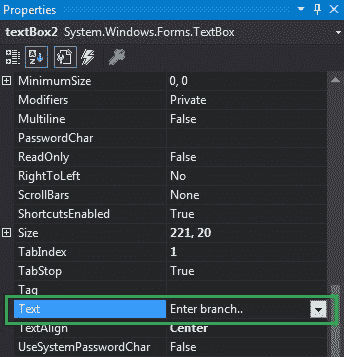
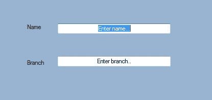
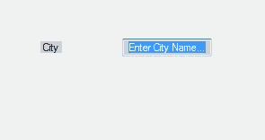

# 如何在 C# 中设置文本框中的文本？

> 原文：[https://www.geeksforgeeks.org/how-to-set-the-text-in-textbox-in-c-sharp/](https://www.geeksforgeeks.org/how-to-set-the-text-in-textbox-in-c-sharp/)

在 Windows 窗体中，文本框扮演着重要的角色。在文本框的帮助下，用户可以在应用程序中输入数据，可以是单行的，也可以是多行的。在文本框中，您可以使用文本框的 `Text` 属性设置与文本框相关联的文本。在 Windows 窗体中，可以通过两种不同的方式设置此属性：

## 1. 设计时

最简单的方法是设置文本框的 `Text` 属性，如下步骤所示：

### 步骤 1
创建一个窗口表单。
**Visual Studio -> 文件 -> 新建 -> 项目 -> 窗口形式程序**

### 步骤 2
从工具箱中拖动文本框控件，并将其放到窗口窗体上。您可以根据需要将文本框放置在 windows 窗体上的任何位置。

### 步骤 3
拖放完成后，转到 `TextBox` 控件的属性窗口，设置其 `Text` 属性。



**输出：**


## 2. 运行时

比上面的方法稍微复杂一点。在此方法中，您可以借助给定的语法以编程方式设置文本框的 `Text` 属性：

```cs
public override string Text { get; set; }
```

这里，`Text` 以字符串的形式表示。以下步骤用于设置文本框的 `Text` 属性：

### 步骤 1
使用 `TextBox` 类提供的 `TextBox()` 构造函数创建一个 `TextBox`。

```cs
// Creating textbox
TextBox Mytextbox = new TextBox();
```

### 步骤 2
创建文本框后，设置 `TextBox` 类提供的 `Text` 属性。

```cs
// Set Text property
Mytextbox.Text = "Enter City Name...";
```

### 步骤 3
最后，使用 `Add()` 方法将此文本框控件添加到窗体。

```cs
// Add this textbox to form
this.Controls.Add(Mytextbox);
```

**示例：**

```cs
using System;
using System.Collections.Generic;
using System.ComponentModel;
using System.Data;
using System.Drawing;
using System.Linq;
using System.Text;
using System.Threading.Tasks;
using System.Windows.Forms;

namespace my {

    public partial class Form1 : Form {

        public Form1()
        {
            InitializeComponent();
        }

        private void Form1_Load(object sender, EventArgs e)
        {
            // Creating and setting the properties of Lable1
            Label Mylablel = new Label();
            Mylablel.Location = new Point(96, 54);
            Mylablel.Text = "City";
            Mylablel.AutoSize = true;
            Mylablel.BackColor = Color.LightGray;

            // Add this label to form
            this.Controls.Add(Mylablel);

            // Creating and setting the properties of TextBox1
            TextBox Mytextbox = new TextBox();
            Mytextbox.Location = new Point(187, 51);
            Mytextbox.BackColor = Color.LightGray;
            Mytextbox.ForeColor = Color.DarkOliveGreen;
            Mytextbox.AutoSize = true;
            Mytextbox.Name = "text_box1";
            Mytextbox.Text = "Enter City Name...";

            // Add this textbox to form
            this.Controls.Add(Mytextbox);
        }
    }
}
```

**输出：**
