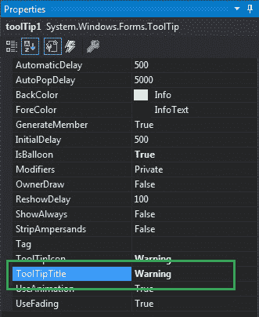
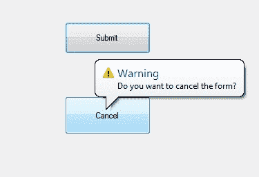
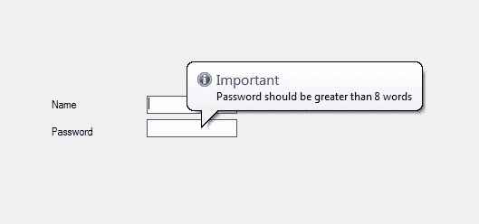

# 如何在 C# 中设置工具提示的标题？

> 原文：[https://www.geeksforgeeks.org/how-to-set-the-title-of-the-tooltip-in-c-sharp/](https://www.geeksforgeeks.org/how-to-set-the-title-of-the-tooltip-in-c-sharp/)

在 Windows 窗体中，工具提示代表一个微小的弹出框，当您将指针或光标放在控件上时，该框会出现。该控件的目的是提供有关 Windows 窗体中控件的简要说明。在工具提示中，您可以使用`ToolTipTitle`属性在屏幕上显示的工具提示窗口中设置标题。

标题总是写在标准文本的上方，用粗体字。标题的最大长度为 99 个字符。如果您尝试输入超过 99 个字符，则标题不会显示在屏幕上。您可以通过两种不同的方式设置此属性：

## 1. 设计时

按照以下步骤设置`ToolTipTitle`属性的值是最简单的方法：

*   **第一步：** 创建如下图所示的窗口表单：
    **Visual Studio -> File -> New -> Project -> Windows Forms App**
    
*   **第二步：** 从工具箱中拖动工具提示并将其放到表单上。当您将此工具提示拖放到窗体上时，它将自动添加到当前窗口中出现的每个控件的属性（在工具提示 1 中命名为`toolTip1`）中。
    
*   **第三步：** 拖放后，转到工具提示的属性并设置`ToolTipTitle`属性的值。
    

**输出：**


## 2. 运行时

比上面的方法稍微复杂一点。在此方法中，您可以借助给定的语法以编程方式设置工具提示的`ToolTipTitle`属性：

```csharp
public string ToolTipTitle { get; set; }
```

这里，该属性的值为`System.String`类型。该字符串表示工具提示窗口的标题。以下步骤显示了如何动态设置工具提示的`ToolTipTitle`属性：

*   **第一步：** 使用`ToolTip()`构造函数创建工具提示，该构造函数由`ToolTip`类提供。

```csharp
// Creating a ToolTip
ToolTip t = new ToolTip();
```

*   **第二步：** 创建工具提示后，设置`ToolTip`类提供的工具提示的`ToolTipTitle`属性。

```csharp
// Setting the ToolTipTitle property
t.ToolTipTitle = "Important";
```

*   **第三步：** 最后，使用`SetToolTip()`方法将此`ToolTip`添加到控件。此方法包含控件名称和您希望在工具提示框中显示的文本。

```csharp
t.SetToolTip(box1, "Name should start with Capital letter");
```

**示例：**

```csharp
using System;
using System.Collections.Generic;
using System.ComponentModel;
using System.Data;
using System.Drawing;
using System.Linq;
using System.Text;
using System.Threading.Tasks;
using System.Windows.Forms;

namespace WindowsFormsApp34
{
    public partial class Form1 : Form
    {
        public Form1()
        {
            InitializeComponent();
        }

        private void Form1_Load(object sender, EventArgs e)
        {
            // Creating and setting the properties of the Label
            Label l1 = new Label();
            l1.Location = new Point(140, 122);
            l1.Text = "Name";

            // Adding this Label control to the form
            this.Controls.Add(l1);

            // Creating and setting the properties of the TextBox
            TextBox box1 = new TextBox();
            box1.Location = new Point(248, 119);
            box1.BorderStyle = BorderStyle.FixedSingle;

            // Adding this TextBox control to the form
            this.Controls.Add(box1);

            // Creating and setting the properties of Label
            Label l2 = new Label();
            l2.Location = new Point(140, 152);
            l2.Text = "Password";

            // Adding this Label control to the form
            this.Controls.Add(l2);

            // Creating and setting the properties of the TextBox
            TextBox box2 = new TextBox();
            box2.Location = new Point(248, 145);
            box2.BorderStyle = BorderStyle.FixedSingle;

            // Adding this TextBox control to the form
            this.Controls.Add(box2);

            // Creating and setting the properties of the ToolTip
            ToolTip t = new ToolTip();
            t.Active = true;
            t.AutoPopDelay = 4000;
            t.InitialDelay = 600;
            t.IsBalloon = true;
            t.ToolTipIcon = ToolTipIcon.Info;
            t.ToolTipTitle = "Important";
            t.SetToolTip(box1, "Name should start with Capital letter");
            t.SetToolTip(box2, "Password should be greater than 8 words");
        }
    }
}
```

**输出：**
