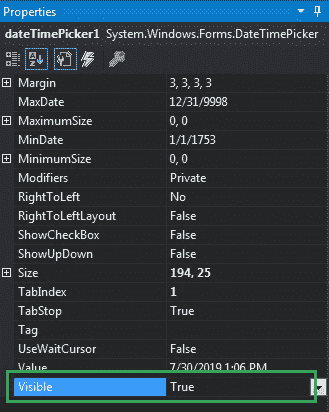

# 如何在 C# 中设置 DateTimePicker 的可见性？

> 原文：[https://www.geeksforgeeks.org/how-to-set-the-visibility-of-datetimepicker-in-c-sharp/](https://www.geeksforgeeks.org/how-to-set-the-visibility-of-datetimepicker-in-c-sharp/)

在 Windows 窗体中，`DateTimePicker` 控件用于选择和显示窗体中特定格式的日期/时间。在 `DateTimePicker` 控件中，可以使用 `Visible` 属性设置该控件的可见性。如果此属性的值设置为 `true`，则屏幕上将显示日期时间选择器控件。如果此属性的值设置为 `false`，则 `DateTimePicker` 控件不会显示在屏幕上。此属性的默认值为 `true`。您可以通过两种不同的方式设置此属性：

## 1. 设计时

设置日期时间选择器的可见性是最简单的方法，如以下步骤所示：

*   **Step 1:** 创建一个 Windows 窗体，如下图所示：
    **Visual Studio->File->New->Project->Windows Forms App**
    

*   **Step 2:** 接下来，从工具箱中拖放 `DateTimePicker` 控件到窗体上，如下图所示：
    

*   **Step 3:** 拖放完成后，转到 `DateTimePicker` 的属性窗口，设置其 `Visible` 属性，如下图所示：
    

**输出：**


## 2. 运行时

比上面的方法稍微复杂一点。在此方法中，您可以借助给定的语法以编程方式设置 `DateTimePicker` 控件的可见性：

```cs
public bool Visible { get; set; }
```

该属性的值为 `System.Boolean` 类型，非 `true` 即 `false`。以下步骤显示了如何动态设置日期时间选择器的可见性：

*   **Step 1:** 使用 `DateTimePicker` 类提供的 `DateTimePicker()` 构造函数创建一个 `DateTimePicker`。

```cs
// Creating a DateTimePicker
DateTimePicker dt = new DateTimePicker();
```

*   **Step 2:** 创建日期选择器后，设置由 `DateTimePicker` 类提供的 `Visible` 属性。

```cs
// Setting the visibility
dt.Visible = false;
```

*   **Step 3:** 最后，使用以下语句将此 `DateTimePicker` 控件添加到窗体：

```cs
// Adding this control to the form
this.Controls.Add(dt);
```

**示例：**

```cs
using System;
using System.Collections.Generic;
using System.ComponentModel;
using System.Data;
using System.Drawing;
using System.Linq;
using System.Text;
using System.Threading.Tasks;
using System.Windows.Forms;

namespace WindowsFormsApp48
{
    public partial class Form1 : Form
    {
        public Form1()
        {
            InitializeComponent();
        }

        private void Form1_Load(object sender, EventArgs e)
        {
            // Creating and setting the 
            // properties of the Label
            Label lab = new Label();
            lab.Location = new Point(183, 162);
            lab.Size = new Size(172, 20);
            lab.Text = "Select Date and Time";
            lab.Font = new Font("Comic Sans MS", 12);

            // Adding this control to the form
            this.Controls.Add(lab);

            // Creating and setting the
            // properties of the DateTimePicker
            DateTimePicker dt = new DateTimePicker();
            dt.Location = new Point(360, 162);
            dt.Size = new Size(292, 26);
            dt.MaxDate = new DateTime(2500, 12, 20);
            dt.MinDate = new DateTime(1753, 1, 1);
            dt.Format = DateTimePickerFormat.Long;
            dt.Name = "MyPicker";
            dt.Font = new Font("Comic Sans MS", 12);
            dt.Visible = false;
            dt.Value = DateTime.Today;

            // Adding this 
            // control to the form
            this.Controls.Add(dt);
        }
    }
}
```

**输出：**

在将 `Visible` 属性设置为 `false` 之前：


将 `Visible` 属性设置为 `false` 后：
