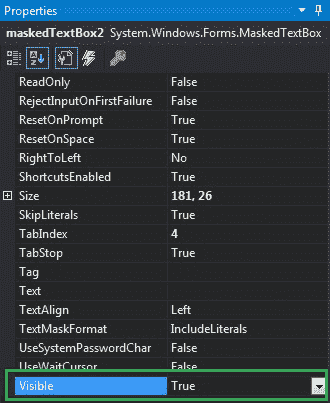
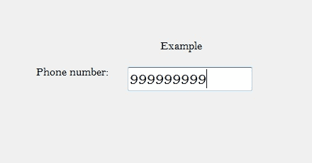
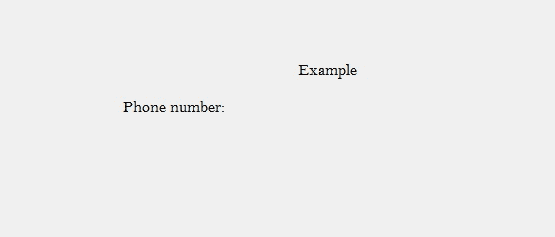

# 如何在 C# 中设置 MaskedTextBox 的可见性？

> 原文:[https://www.geeksforgeeks.org/how-to-set-the-visibility-of-maskedtextbox-in-c-sharp/](https://www.geeksforgeeks.org/how-to-set-the-visibility-of-maskedtextbox-in-c-sharp/)

在 C# 中，`MaskedTextBox`控件为表单上的用户输入(如日期、电话号码等)提供了一个验证过程。或者换句话说，它被用来提供区分正确和不正确用户输入的屏蔽。在`MaskedTextBox`控件中，您可以使用该控件提供的`Visible`属性来设置其可见性。

如果`Visible`属性的值被设置为`true`，那么`MaskedTextBox`控件及其子控件在屏幕上是可见的。如果这个属性的值被设置为`false`，那么`MaskedTextBox`控件及其子控件在屏幕上是不可见的。您可以通过两种不同的方式设置此属性。

## 设计时

最简单的方法是设置`MaskedTextBox`控件的`Visible`属性值，如下步骤所示：

*   **Step 1:** 创建一个 Windows 窗体，如下图所示：
    **Visual Studio -> 文件 -> 新建 -> 项目 -> Windows 窗体应用**
    

*   **Step 2:** 接下来，从工具箱中拖放`MaskedTextBox`控件到窗体上，如下图所示：
    

*   **Step 3:** 拖放完成后，转到`MaskedTextBox`的属性窗口，设置其`Visible`属性的值，如下图所示：
    

**输出:**


## 运行时

比上面的方法稍微复杂一点。在这个方法中，您可以在给定语法的帮助下，以编程方式设置`MaskedTextBox`控件的可见性：

```cs
public bool Visible { get; set; }
```

该属性的值为`System.Boolean`类型，非`true`即`false`。以下步骤显示了如何动态设置`MaskedTextBox`控件的可见性：

*   **步骤 1:** 使用`MaskedTextBox()`构造函数创建一个`MaskedTextBox`，该构造函数由`MaskedTextBox`类提供。
    ```cs
    // Creating a MaskedTextBox
    MaskedTextBox m = new MaskedTextBox();
    ```

*   **步骤 2:** 创建`MaskedTextBox`后，设置`MaskedTextBox`类提供的`Visible`属性。
    ```cs
    // Setting the visibility
    m.Visible = false;
    ```

*   **步骤 3:** 最后，使用以下语句将此`MaskedTextBox`控件添加到窗体：
    ```cs
    // Adding MaskedTextBox 
    // control on the form
    this.Controls.Add(m);
    ```

**示例:**

```cs
using System;
using System.Collections.Generic;
using System.ComponentModel;
using System.Data;
using System.Drawing;
using System.Linq;
using System.Text;
using System.Threading.Tasks;
using System.Windows.Forms;

namespace WindowsFormsApp39 {
    public partial class Form1 : Form {
        public Form1() {
            InitializeComponent();
        }

        private void Form1_Load(object sender, EventArgs e) {
            // Creating and setting the
            // properties of the Label
            Label l1 = new Label();
            l1.Location = new Point(413, 98);
            l1.Size = new Size(176, 20);
            l1.Text = " Example";
            l1.Font = new Font("Bell MT", 12);

            // Adding label on the form
            this.Controls.Add(l1);

            // Creating and setting the
            // properties of the Label
            Label l2 = new Label();
            l2.Location = new Point(242, 135);
            l2.Size = new Size(126, 20);
            l2.Text = "Phone number:";
            l2.Font = new Font("Bell MT", 12);

            // Adding label on the form
            this.Controls.Add(l2);

            // Creating and setting the 
            // properties of MaskedTextBox
            MaskedTextBox m = new MaskedTextBox();
            m.Location = new Point(374, 137);
            m.Mask = "000000000";
            m.Size = new Size(176, 20);
            m.Name = "MyBox";
            m.BorderStyle = BorderStyle.Fixed3D;
            m.Visible = false;
            m.Font = new Font("Bell MT", 18);

            // Adding MaskedTextBox 
            // control on the form
            this.Controls.Add(m);
        }
    }
}
```

**输出:**

在将`Visible`属性值设置为`false`之前:


将`Visible`属性值设置为`false`后:
