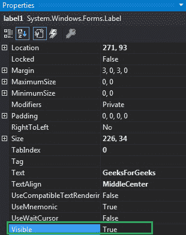
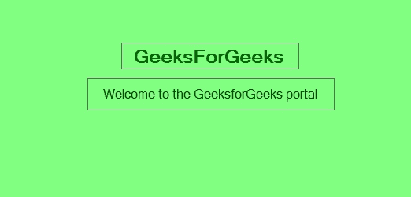
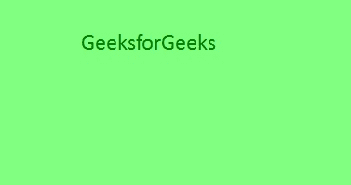

# 如何在 C# 中设置标签的可见性？

> 原文：[https://www.geeksforgeeks.org/how-to-set-the-visibility-of-the-label-in-c-sharp/](https://www.geeksforgeeks.org/how-to-set-the-visibility-of-the-label-in-c-sharp/)

在 Windows 窗体中，`Label`控件用于在窗体上显示文本，它不参与用户输入或鼠标或键盘事件。您可以使用 Windows 窗体中的`Visible`属性设置标签控件的可见性。当该属性的值设置为`true`时，标签可见。如果该属性的值设置为`false`，则标签在表单中不可见。此属性的默认值为`true`。您可以使用两种不同的方法设置此属性：

## 设计时

使用以下步骤设置`Label`控件的`Visible`属性是最简单的方法：

1.  **第一步**：创建如下图所示的窗口表单：
    `Visual Studio->File->New->Project->Windows Forms App`
    
2.  **步骤 2**：从工具箱中拖动标签控件，并将其放到窗口窗体上。您可以根据需要在 Windows 窗体上的任何位置放置一个`Label`控件。
    
3.  **步骤 3**：拖放之后，转到`Label`控件的属性窗口，设置`Label`的`Visible`属性。
    

**输出：**



## 运行时

比上面的方法稍微复杂一点。在此方法中，您可以在给定语法的帮助下，以编程方式设置 Windows 窗体中`Label`控件的可见性：

```cs
public bool Visible { get; set; }
```

这里，该属性的值为`System.Boolean`类型。以下步骤用于设置标签的`Visible`属性：

1.  **步骤 1**：使用`Label`类提供的`Label()`构造函数创建标签。

```cs
// Creating label using Label class
Label mylab = new Label();
```

2.  **步骤 2**：创建标签后，设置`Label`类提供的标签的`Visible`属性。

```cs
// Set Visible property of the label
mylab.Visible = true;
```

3.  **步骤 3**：最后，使用`Add()`方法将此`Label`控件添加到窗体。

```cs
// Add this label to the form
this.Controls.Add(mylab);
```

**示例：**

```cs
using System;
using System.Collections.Generic;
using System.ComponentModel;
using System.Data;
using System.Drawing;
using System.Linq;
using System.Text;
using System.Threading.Tasks;
using System.Windows.Forms;

namespace WindowsFormsApp16
{
    public partial class Form1 : Form
    {
        public Form1()
        {
            InitializeComponent();
        }

        private void Form1_Load(object sender, EventArgs e)
        {
            // Creating and setting the label
            Label mylab = new Label();
            mylab.Text = "GeeksforGeeks";
            mylab.Location = new Point(222, 90);
            mylab.AutoSize = true;
            mylab.Font = new Font("Calibri", 18);
            mylab.ForeColor = Color.Green;
            mylab.Visible = true;

            // Adding this control to the form
            this.Controls.Add(mylab);

            // Creating and setting the label
            Label mylab1 = new Label();
            mylab1.Text = "Welcome To GeeksforGeeks";
            mylab1.Location = new Point(155, 170);
            mylab1.AutoSize = true;
            mylab1.Font = new Font("Calibri", 18);
            mylab1.Visible = false;

            // Adding this control to the form
            this.Controls.Add(mylab1);
        }
    }
}
```

**输出：**

当`Visible`属性的值设置为`true`时：


当`Visible`属性的值设置为`false`时：
