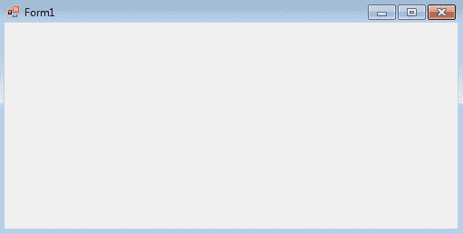
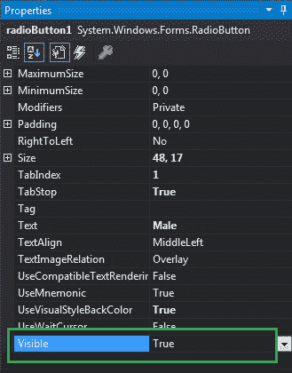
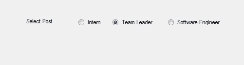
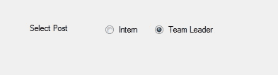

# 如何在 C# 中设置单选按钮的可见性？

> 原文：[https://www.geeksforgeeks.org/how-to-set-the-visibility-of-the-radiobutton-in-c-sharp/](https://www.geeksforgeeks.org/how-to-set-the-visibility-of-the-radiobutton-in-c-sharp/)

在 Windows 窗体中，单选按钮控件用于从选项组中选择一个选项。例如，从给定的列表中选择您的性别，因此您将在三个选项中仅选择一个选项，如男性或女性或变性者。在 Windows 窗体中，您可以使用单选按钮的 `Visible` 属性来调整单选按钮的可见性。
如果该属性的值设置为 `true`，则 `RadioButton` 在窗体上可见，如果该属性的值设置为 `false`，则 `RadioButton` 在窗体上不可见。此属性的默认值为 `true`。您可以通过两种不同的方式设置此属性：

## 1. 设计时
设置单选按钮的可见性是最简单的方法，如以下步骤所示：

### 步骤 1
创建如下图所示的窗口表单：
**Visual Studio->File->New->Project->Windows Forms App**


### 步骤 2
从工具箱中拖动 `RadioButton` 控件，并将其放到 Windows 窗体上。您可以根据需要在 Windows 窗体上的任何位置放置一个 `RadioButton` 控件。


### 步骤 3
拖放之后，转到 `RadioButton` 控件的属性窗口以设置单选按钮的可见性。


**输出：**


## 2. 运行时
比上面的方法稍微复杂一点。在此方法中，您可以借助给定的语法以编程方式设置单选按钮控件的可见性：

```cs
public bool Visible { get; set; }
```

该属性的值为 `System.Boolean` 类型。以下步骤显示了如何动态设置单选按钮的可见性：

### 步骤 1
使用 `RadioButton` 类提供的 `RadioButton()` 构造函数创建单选按钮。

```cs
// Creating radio button
RadioButton r1 = new RadioButton();
```

### 步骤 2
创建单选按钮后，设置 `RadioButton` 类提供的 `Visible` 属性。

```cs
// Setting the visibility of the radio button
r1.Visible = true;
```

### 步骤 3
最后，使用 `Add()` 方法将此 `RadioButton` 控件添加到窗体。

```cs
// Add this radio button to the form
this.Controls.Add(r1);
```

## 示例

```cs
using System;
using System.Collections.Generic;
using System.ComponentModel;
using System.Data;
using System.Drawing;
using System.Linq;
using System.Text;
using System.Threading.Tasks;
using System.Windows.Forms;

namespace WindowsFormsApp23
{
    public partial class Form1 : Form
    {
        public Form1()
        {
            InitializeComponent();
        }

        private void Form1_Load(object sender, EventArgs e)
        {
            // Creating and setting label
            Label l = new Label();
            l.AutoSize = true;
            l.Location = new Point(176, 40);
            l.Text = "Select Post";

            // Adding this label to the form
            this.Controls.Add(l);

            // Creating and setting the
            // properties of the RadioButton
            RadioButton r1 = new RadioButton();
            r1.AutoSize = true;
            r1.Text = "Intern";
            r1.Location = new Point(286, 40);
            r1.Visible = true;

            // Adding this label to the form
            this.Controls.Add(r1);

            // Creating and setting the 
            // properties of the RadioButton
            RadioButton r2 = new RadioButton();
            r2.AutoSize = true;
            r2.Text = "Team Leader";
            r2.Location = new Point(356, 40);
            r2.Visible = true;

            // Adding this label to the form
            this.Controls.Add(r2);

            // Creating and setting the 
            // properties of the RadioButton
            RadioButton r3 = new RadioButton();
            r3.AutoSize = true;
            r3.Text = "Software Engineer";
            r3.Location = new Point(470, 40);
            r3.Visible = false;

            // Adding this label to the form
            this.Controls.Add(r3);
        }
    }
}
```

**输出：**

设置单选按钮的可见性前：


设置单选按钮的可见性后：
