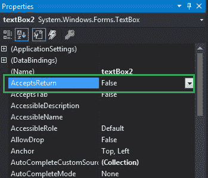
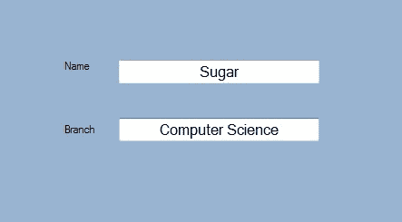
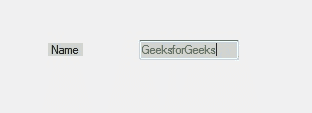

# 如何在 C# 中使用 TextBox 的 AcceptsReturn 属性？

> 原文：[https://www.geeksforgeeks.org/how-to-use-acceptsreturn-property-of-textbox-in-c-sharp/](https://www.geeksforgeeks.org/how-to-use-acceptsreturn-property-of-textbox-in-c-sharp/)

在文本框中，您可以设置一个值，该值显示在多行文本框控件中按回车键是在文本框控件中创建新的文本行，还是使用 `AcceptsReturn` 属性激活表单的默认按钮。
如果该属性的值设置为真，则回车键在多行文本框控件中创建新的文本行，如果该属性的值设置为假，则回车键激活表单的默认按钮。此属性的默认值为 `false`。在 Windows 窗体中，可以通过两种不同的方式设置此属性：

## 1. 设计时
设置文本框的 `AcceptsReturn` 属性是最简单的方法，如下步骤所示：

*   **步骤 1：** 创建窗口表单。
    `Visual Studio -> 文件 -> 新建 -> 项目 -> Windows 窗体应用程序`
    
*   **步骤 2：** 从工具箱中拖动 `TextBox` 控件，并将其放到窗口窗体上。您可以根据需要将文本框控件放置在 Windows 窗体上的任何位置。
    
*   **步骤 3：** 拖放完成后，转到 `TextBox` 控件的属性窗口，设置 `TextBox` 的 `AcceptsReturn` 属性。
    

**输出：**


## 2. 运行时
比之前的方法稍微复杂一点。在此方法中，您可以在给定语法的帮助下，以编程方式设置文本框的 `AcceptsReturn` 属性：

```cs
public bool AcceptsReturn { get; set; }
```

这里，该属性的值是布尔类型。以下步骤用于设置文本框的 `AcceptsReturn` 属性：

*   **步骤 1：** 使用 `TextBox` 类提供的 `TextBox()` 构造函数创建一个 `TextBox`。

```cs
// Creating textbox
TextBox Mytextbox = new TextBox();
```

*   **步骤 2：** 创建文本框后，设置 `TextBox` 类提供的 `TextBox` 的 `AcceptsReturn` 属性。

```cs
// Set AcceptsReturn property
Mytextbox.AcceptsReturn = false;
```

*   **步骤 3：** 最后，使用 `Add()` 方法将此文本框控件添加到窗体。

```cs
// Add this textbox to form
this.Controls.Add(Mytextbox);
```

## 示例

```cs
using System;
using System.Collections.Generic;
using System.ComponentModel;
using System.Data;
using System.Drawing;
using System.Linq;
using System.Text;
using System.Threading.Tasks;
using System.Windows.Forms;

namespace my
{
    public partial class Form1 : Form
    {
        public Form1()
        {
            InitializeComponent();
        }

        private void Form1_Load(object sender, EventArgs e)
        {
            // Creating and setting the properties of Lable1
            Label Mylablel = new Label();
            Mylablel.Location = new Point(96, 54);
            Mylablel.Text = "Name";
            Mylablel.AutoSize = true;
            Mylablel.BackColor = Color.LightGray;

            // Add this label to form
            this.Controls.Add(Mylablel);

            // Creating and setting the properties of TextBox1
            TextBox Mytextbox = new TextBox();
            Mytextbox.Location = new Point(187, 51);
            Mytextbox.BackColor = Color.LightGray;
            Mytextbox.ForeColor = Color.DarkOliveGreen;
            Mytextbox.AutoSize = true;
            Mytextbox.AcceptsReturn = false;

            // Add this textbox to form
            this.Controls.Add(Mytextbox);
        }
    }
}
```

**输出：**
