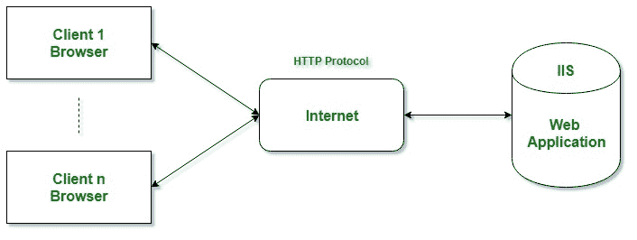

# ASP.NET 简介

> 原文：[https://www.geeksforgeeks.org/introduction-to-asp-net/](https://www.geeksforgeeks.org/introduction-to-asp-net/)

ASP.NET 是一个由微软设计和开发的网络应用框架。ASP.NET 是开源的 [.NET Framework](https://www.geeksforgeeks.org/introduction-to-net-framework/) 的子集，也是经典 ASP（`Active Server Pages`）的继承者。作为 .NET Framework 1.0 的一部分，它于 2002 年 1 月首次发布。因此，一个问题浮现在脑海：在 2002 年之前，我们使用哪种技术来开发 web 应用程序和服务？答案是 `经典 ASP`。所以在 .NET 和 ASP.NET 之前，我们使用的是 `经典 ASP`。

ASP.NET 是建立在公共语言运行时（`CLR`）之上的，它允许程序员使用任何 .NET 语言（如 `C#`、`VB.NET` 等）来编写代码。它是专门为使用 HTTP 协议而设计的，旨在帮助 web 开发人员创建动态网页、web 应用程序、网站和 web 服务，因为它提供了与 `HTML`、`CSS` 和 `JavaScript` 的良好集成。

.NET Framework 用于创建各种应用程序和服务，如控制台、网络和窗口应用程序等。但是 ASP.NET 只用于创建网络应用程序和网络服务。这就是为什么我们把 ASP.NET 称为 .NET 框架的一部分。

下表说明了 ASP.NET 版本历史：

| 年份 | 版本 |
| --- | --- |
| **2002** | **1.0** |
| **2003** | **1.1** |
| **2005** | **2.0** |
| **2006** | **3.0** |
| **2007** | **3.5** |
| **2008** | 3.5 SP1 |
| **2010** | **4.0** |
| **2012** | **4.5** |
| **2013** | **4.5.1** |
| **2014** | **4.5.2** |
| **2015** | **4.6** |
| **2015** | **4.6.1** |
| **2016** | **4.6.2** |
| **2017** | **4.7** |
| **2017** | **4.7.1** |

**注：** 2015 年，版本 `5 RC1` 推出，后来这个版本从 ASP.NET 主线分离出来，变成了一个新项目，称为 `ASP.NET Core 1.0` 版本，并带来了一些重大改进。

## 什么是 Web 应用？

Web 应用程序是仅安装在网络服务器上的应用程序，用户可以使用网络浏览器（如微软 Internet Explorer、谷歌 Chrome、Mozilla Firefox、苹果 Safari 等）访问该应用程序。还有一些其他的技术，比如 `Java`、`PHP`、`Perl`、`Ruby on Rails` 等，也可用于开发 Web 应用程序。Web 应用程序提供了跨平台特性。用户只需要一个网络浏览器就可以访问 Web 应用程序。使用 .NET 框架或其子集开发的 ASP.NET 应用程序需要在服务器端的 `微软 Internet 信息服务（IIS）` 下执行。IIS 的工作是向客户端浏览器提供 Web 应用程序生成的 `HTML` 代码结果，客户端浏览器发起请求，如下图所示。

**不要在 ASP.NET、ASP.NET Core、ASP.NET MVC 等术语上混淆。** ASP（`Active Server Pages`）支持很多开发模型，如下所示：

*   **经典 ASP**：是微软开发的第一个服务器端脚本语言。
*   **ASP.NET**：是 web 开发框架，是经典 ASP 的继承者。ASP.NET 4.6 是 .NET Framework 下的最新版本。
*   **ASP.NET Core**：2015 年 11 月，微软发布了后来被分离的 5.0 版 ASP.NET，被称为 `ASP.NET Core`。此外，它被认为是 ASP.NET 的一个重要的重新设计，具有开源和跨平台的特点。在这个版本之前，ASP.NET 只被认为是 Windows 平台的技术。
*   **ASP.NET Web Forms**：这些是事件驱动的应用模型，不被认为是新的 `ASP.NET Core` 的一部分。这些用于提供服务器端事件和控件来开发 Web 应用程序。
*   **ASP.NET MVC**：是可以和新的 `ASP.NET Core` 合并的模型-视图-控制器（`MVC`）应用模型。它被用来建立动态网站，因为它提供了快速的开发体验。
*   **ASP.NET Pages**：这些是可以合并到 `ASP.NET Core` 的单页应用。
*   **ASP.NET Web API**：是 Web 应用编程接口（`API`）。

另外，为了创建网络应用程序，ASP.NET 提供了 3 种开发风格，分别是 `ASP.NET Pages`、`ASP.NET MVC` 和 `Web Forms`。

## 为什么选择 ASP.NET？

ASP.NET 在开发者中受欢迎有很多原因。下面列出了一些原因：

**扩展 .NET Framework**：ASP.NET 是 .NET 框架的一部分，因为它扩展了 .NET 框架，并提供了一些用于开发网络应用的库和工具。它为 .NET Framework 提供了用于常见 Web 模式的库，如 `MVC`、`编辑器扩展`、`处理 Web 请求的基础框架` 和 `网页模板语法（如 Razor）` 等。

**性能**：比市面上其他可用的 Web 框架都要快。

**后端代码**：在 ASP.NET 的帮助下，你可以用 [`C#`](https://www.geeksforgeeks.org/csharp-programming-language/) 编写数据访问和任何逻辑的后端代码。

**动态网页**：在 ASP.NET 中，`Razor` 提供了借助 `C#` 和 `HTML` 开发动态网页的语法。ASP.NET 可以与 [`JavaScript`](https://www.geeksforgeeks.org/javascript-tutorial/) 集成，它还包括了像 `SPA`（单页应用）框架，如 `React` 和 `Angular`。

**支持不同的操作系统**：可以在 `Windows`、`Linux`、`Docker`、`MacOS` 上开发和执行 ASP.NET 应用。`Visual Studio` 提供了构建 .NET 应用的工具，支持不同的操作系统。