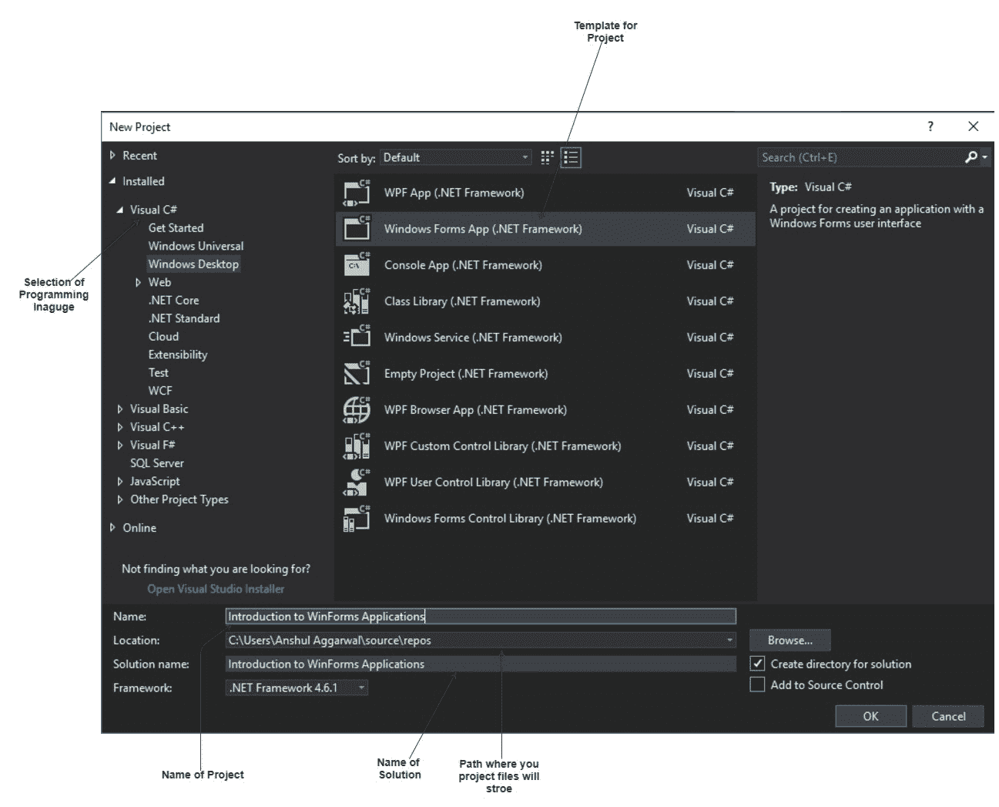
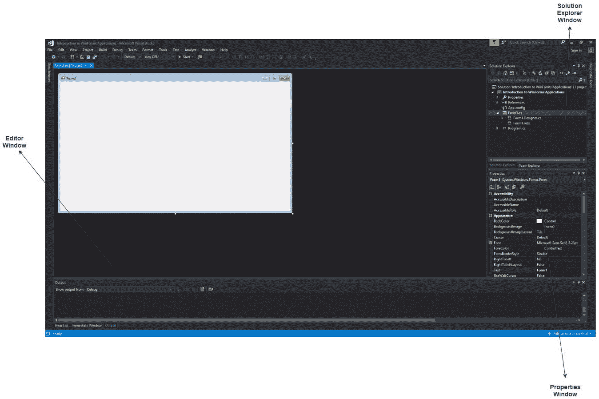
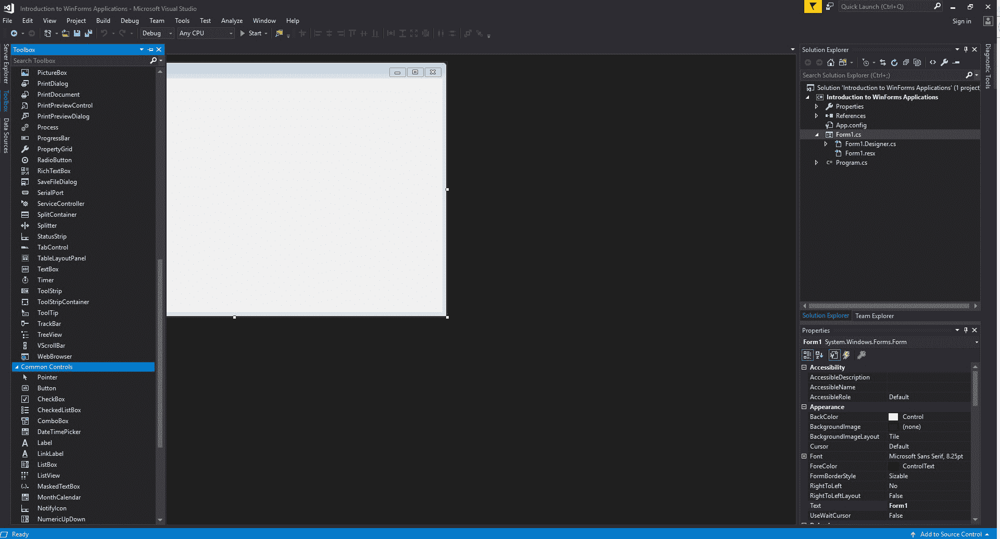
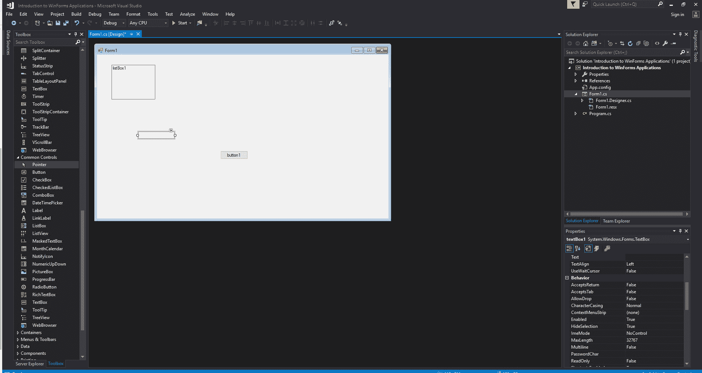
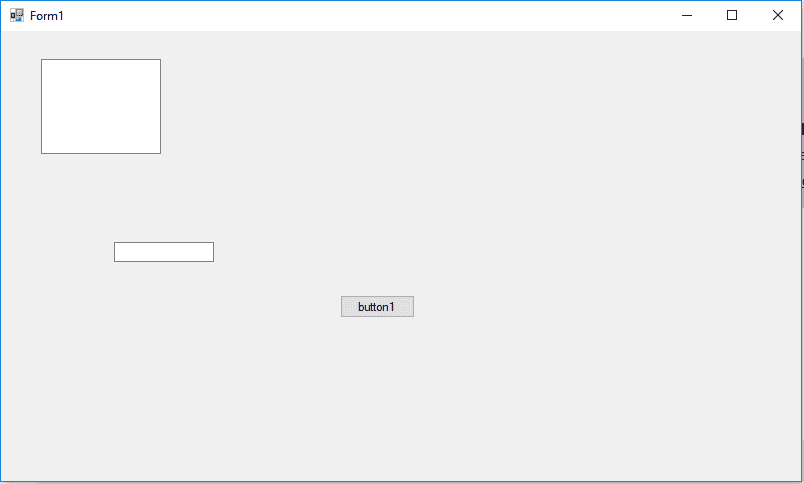

# C# Windows 窗体应用程序简介

> 原文：[https://www.geeksforgeeks.org/introduction-to-c-sharp-windows-forms-applications/](https://www.geeksforgeeks.org/introduction-to-c-sharp-windows-forms-applications/)

Windows 窗体是一个捆绑在`.NET Framework`中的图形用户界面类库。它的主要目的是提供一个更容易的界面来开发桌面、平板电脑、个人电脑的应用程序。它也被称为`WinForms`。使用窗口窗体或`WinForms`开发的应用程序被称为运行在台式计算机上的**窗口窗体应用程序**。`WinForms`只能用于开发 Windows 窗体应用程序，而不能用于开发 web 应用程序。`WinForms`应用程序可以包含不同类型的控件，如标签、列表框、工具提示等。

## 使用 Visual Studio 2017 创建 Windows 窗体应用程序

首先，打开 Visual Studio，然后转到 **文件 -> 新建 -> 项目** 以创建一个新项目，然后从左侧菜单中选择语言为`Visual C#`。在当前窗口中间单击 **Windows Forms App(.NET Framework)**。之后，给出项目名称并单击 **确定**。

这里的解决方案就像一个容器，包含程序可能需要的项目和文件。

之后，将显示以下窗口，该窗口将分为三个部分，如下所示：

1.  **编辑器窗口或主窗口**：在这里，您将处理表单和代码编辑。您可以注意到表单的布局现在是空白的。您将双击表单，然后它将打开该表单的代码。
2.  **解决方案资源管理器窗口**：用于在解决方案中的所有项目之间导航。例如，如果您将从该窗口中选择一个文件，则特定信息将显示在属性窗口中。
3.  **属性窗口**：该窗口用于在解决方案资源管理器中更改所选项目的不同属性。此外，您可以更改将添加到表单中的组件或控件的属性。

您也可以通过将其设置为默认值来重置窗口布局。要设置默认布局，请转到 Visual Studio 菜单中的 **窗口 -> 重置窗口布局**。

现在，**要向您的 WinForms 应用程序添加控件**，请转到 Visual Studio 最左侧的 **工具箱** 选项卡。在这里，您可以看到控件列表。要访问最常用的控件，请转到 **工具箱** 选项卡中的 **公共控件**。

现在，将您需要的控件拖放到已创建的窗体上。例如，您可以添加`TextBox`、`ListBox`、`Button`等，如下所示。通过单击特定的已放置控件，您可以在 Visual Studio 最右边的角落查看并更改其属性。

在上图中，您可以看到文本框被选中，其属性如文本对齐、最大长度等在最右边的角落打开。您可以根据应用程序的需要更改其属性值。控件的代码将在后台自动添加。可以查看解决方案资源管理器窗口中存在的`Form1.Designer.cs`文件。

要运行程序，您可以使用 **F5 键** 或 Visual Studio 工具栏中的 **播放按钮**。要停止程序，您可以使用工具栏中的暂停按钮。您还可以通过转到菜单栏中的 **调试 -> 开始调试** 菜单来运行程序。

