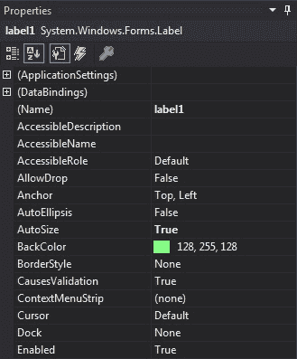
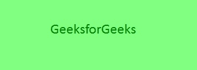

# C# 中的标签

> 原文：[https://www.geeksforgeeks.org/label-in-c-sharp/](https://www.geeksforgeeks.org/label-in-c-sharp/)

在 Windows 窗体中，`Label` 控件用于在窗体上显示文本，它不参与用户输入或鼠标或键盘事件。标签是一个类，在 `System.Windows.Forms` 命名空间下定义。在 Windows 窗体中，可以通过两种不同的方式创建标签：

## 设计时

使用以下步骤创建标签控件是最简单的方法：

1.  **第一步**：创建如下图所示的窗口表单：
    **Visual Studio -> File -> New -> Project -> Windows Forms App**
    
2.  **第二步**：从工具箱中拖动标签控件，并将其放到窗口窗体上。您可以根据需要在 Windows 窗体上的任何位置放置一个 `Label` 控件。
    
3.  **第三步**：拖放后，转到 `Label` 控件的属性窗口，根据需要设置 `Label` 的属性。
    

**输出：**


## 运行时

比上面的方法稍微复杂一点。在此方法中，您可以使用 `Label` 类设置创建自己的标签控件。创建动态标签的步骤：

1.  **步骤 1**：使用 `Label` 类提供的 `Label()` 构造函数创建标签。

```csharp
// Creating label using Label class
Label mylab = new Label();
```

2.  **步骤 2**：创建标签后，设置 `Label` 类提供的标签属性。

```csharp
// Set the text in Label
mylab.Text = "GeeksforGeeks";

// Set the location of the Label
mylab.Location = new Point(222, 90);

// Set the AutoSize property of the Label control
mylab.AutoSize = true;

// Set the font of the content present in the Label Control
mylab.Font = new Font("Calibri", 18);

// Set the foreground color of the Label control
mylab.ForeColor = Color.Green;

// Set the padding in the Label control
mylab.Padding = new Padding(6);
```

3.  **步骤 3**：最后，使用 `Add()` 方法将此 `Label` 控件添加到窗体。

```csharp
// Add this label to the form
this.Controls.Add(mylab);
```

**示例：**

```csharp
using System;
using System.Collections.Generic;
using System.ComponentModel;
using System.Data;
using System.Drawing;
using System.Linq;
using System.Text;
using System.Threading.Tasks;
using System.Windows.Forms;

namespace WindowsFormsApp18
{
    public partial class Form1 : Form
    {
        public Form1()
        {
            InitializeComponent();
        }

        private void Form1_Load(object sender, EventArgs e)
        {
            // Creating and setting the label
            Label mylab = new Label();
            mylab.Text = "GeeksforGeeks";
            mylab.Location = new Point(222, 90);
            mylab.AutoSize = true;
            mylab.Font = new Font("Calibri", 18);
            mylab.ForeColor = Color.Green;
            mylab.Padding = new Padding(6);

            // Adding this control to the form
            this.Controls.Add(mylab);
        }
    }
}
```

**输出：**


## 标签控件的重要属性

| 属性 | 描述 |
| :--- | :--- |
| `AutoSize` | 此属性用于设置一个值，该值指示是否自动调整标签控件的大小以显示其全部内容。 |
| `BackColor` | 此属性用于设置标签控件的背景色。 |
| `BackgroundImage` | 此属性用于设置标签控件的背景图像。 |
| `BorderStyle` | 此属性用于设置标签控件的边框样式。 |
| `FlatStyle` | 此属性用于设置标签控件的平面样式外观。 |
| `Font` | 此属性用于设置标签控件显示的文本的字体。 |
| `FontHeight` | 此属性用于设置标签控件的字体高度。 |
| `ForeColor` | 此属性用于设置标签控件的前景色。 |
| `Height` | 此属性用于设置标签控件的高度。 |
| `Image` | 此属性用于设置标签上显示的图像。 |
| `Location` | 此属性用于设置标签控件左上角相对于其窗体左上角的坐标。 |
| `Name` | 此属性用于设置标签控件的名称。 |
| `Padding` | 此属性用于在标签控件中设置填充。 |
| `Size` | 此属性用于设置标签控件的高度和宽度。 |
| `Text` | 此属性用于设置与此标签控件关联的文本。 |
| `TextAlign` | 此属性用于设置标签中文本的对齐方式。 |
| `Visible` | 此属性用于设置一个值，该值指示是否显示控件及其所有子控件。 |
| `Width` | 此属性用于设置标签控件的宽度。 |