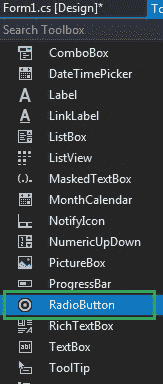
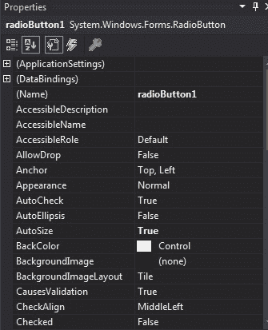
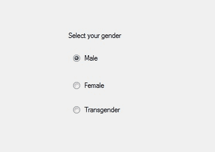
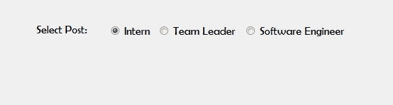

# C# 中的单选按钮

> 原文: [https://www.geeksforgeeks.org/radiobutton-in-c-sharp/](https://www.geeksforgeeks.org/radiobutton-in-c-sharp/)

在 Windows 窗体中，单选按钮控件用于从选项组中选择一个选项。例如，从给定的列表中选择您的性别，因此您将在三个选项中仅选择一个选项，如男性或女性或变性者。在 C# 中，`RadioButton` 是一个类，在 `System.Windows.Forms` 命名空间下定义。在单选按钮中，您可以显示文本、图像或两者，当您选择一组中的一个单选按钮时，其他单选按钮会自动清除。您可以通过两种不同的方式创建单选按钮：

## 1. 设计时

这是创建单选按钮控件最简单的方法，如以下步骤所示：

*   **第一步:** 创建如下图所示的窗口表单:
    `Visual Studio->File->New->Project->Windows Form App`


*   **步骤 2:** 从工具箱中拖动 `RadioButton` 控件，并将其放到 Windows 窗体上。您可以根据需要在 Windows 窗体上的任何位置放置一个 `RadioButton` 控件。



*   **第三步:** 拖放后，您将转到 `RadioButton` 控件的属性，根据您的要求修改 `RadioButton` 控件。



*   **输出:**



## 2. 运行时

比上面的方法稍微复杂一点。在这个方法中，您可以在 `RadioButton` 类的帮助下以编程方式创建一个 `RadioButton`。以下步骤显示了如何动态创建单选按钮：

*   **步骤 1:** 使用 `RadioButton` 类提供的 `RadioButton()` 构造函数创建单选按钮。

```cs
// Creating radio button
RadioButton r1 = new RadioButton();
```

*   **步骤 2:** 创建 `RadioButton` 后，设置 `RadioButton` 类提供的 `RadioButton` 的属性。

```cs
// Set the AutoSize property 
r1.AutoSize = true;

// Add text in RadioButton
r1.Text = "Intern";

// Set the location of the RadioButton
r1.Location = new Point(286, 40);

// Set Font property 
r1.Font = new Font("Berlin Sans FB", 12);
```

*   **第 3 步:** 最后使用 `Add()` 方法将这个 `RadioButton` 控件添加到表单中。

```cs
// Add this radio button to the form
this.Controls.Add(r1);
```

*   **示例:**

```cs
using System;
using System.Collections.Generic;
using System.ComponentModel;
using System.Data;
using System.Drawing;
using System.Linq;
using System.Text;
using System.Threading.Tasks;
using System.Windows.Forms;

namespace WindowsFormsApp24 {

public partial class Form1 : Form {

public Form1()
    {
        InitializeComponent();
    }

private void RadioButton2_CheckedChanged(object sender,
                                           EventArgs e)
    {
    }

private void Form1_Load(object sender, EventArgs e)
    {
        // Creating and setting label
        Label l = new Label();
        l.AutoSize = true;
        l.Location = new Point(176, 40);
        l.Text = "Select Post:";
        l.Font = new Font("Berlin Sans FB", 12);

        // Adding this label to the form
        this.Controls.Add(l);

        // Creating and setting the
        // properties of the RadioButton
        RadioButton r1 = new RadioButton();
        r1.AutoSize = true;
        r1.Text = "Intern";
        r1.Location = new Point(286, 40);
        r1.Font = new Font("Berlin Sans FB", 12);

        // Adding this label to the form
        this.Controls.Add(r1);

        // Creating and setting the
        // properties of the RadioButton
        RadioButton r2 = new RadioButton();
        r2.AutoSize = true;
        r2.Text = "Team Leader";
        r2.Location = new Point(356, 40);
        r2.Font = new Font("Berlin Sans FB", 12);
        // Adding this label to the form
        this.Controls.Add(r2);

        // Creating and setting the
        // properties of the RadioButton
        RadioButton r3 = new RadioButton();
        r3.AutoSize = true;
        r3.Text = "Software Engineer";
        r3.Location = new Point(480, 40);
        r3.Font = new Font("Berlin Sans FB", 12);

        // Adding this label to the form
        this.Controls.Add(r3);
    }
}
}
```

*   **输出:**



## 重要属性

| 属性 | 描述 |
| --- | --- |
| `Appearance` | 此属性用于设置决定单选按钮外观的值。 |
| `AutoCheck` | 此属性用于设置一个值，该值指示单击单选按钮控件时，“选中”值和单选按钮控件的外观是否自动更改。 |
| `AutoSize` | 此属性用于设置一个值，该值指示单选按钮控件是否根据其内容调整大小。 |
| `BackColor` | 此属性用于设置单选按钮控件的背景色。 |
| `CheckAlign` | 此属性用于设置单选按钮的复选框部分的位置。 |
| `Checked` | 此属性用于设置一个值，该值指示是否选中单选按钮控件。 |
| `Font` | 此属性用于设置单选按钮控件显示的文本的字体。 |
| `ForeColor` | 此属性用于设置单选按钮控件的前景色。 |
| `Location` | 此属性用于设置 `RadioButton` 控件左上角相对于其窗体左上角的坐标。 |
| `Name` | 此属性用于设置单选按钮控件的名称。 |
| `Padding` | 此属性用于设置单选按钮控件中的填充。 |
| `Text` | 此属性用于设置与此单选按钮控件关联的文本。 |
| `TextAlign` | 此属性用于设置单选按钮控件上文本的对齐方式。 |
| `Visible` | 此属性用于设置一个值，该值指示是否显示单选按钮控件及其所有子控件。 |

## 重要事件

| 事件 | 描述 |
| --- | --- |
| `Click` | 单击单选按钮控件时会发生此事件。 |
| `CheckedChanged` | 当 `Checked` 属性的值更改时，会发生此事件。 |
| `AppearanceChanged` | 当 `Appearance` 属性值更改时，会发生此事件。 |
| `DoubleClick` | 当用户双击单选按钮控件时，会发生此事件。 |
| `Leave` | 当输入焦点离开单选按钮控件时，会发生此事件。 |
| `MouseClick` | 当鼠标单击单选按钮控件时，会发生此事件。 |
| `MouseDoubleClick` | 当用户用鼠标双击单选按钮控件时，会发生此事件。 |
| `MouseHover` | 当鼠标指针停留在单选按钮控件上时，会发生此事件。 |
| `MouseLeave` | 当鼠标指针离开单选按钮控件时，会发生此事件。 |