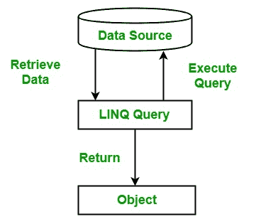

# 什么是 LINQ 查询？

> 原文：[https://www.geeksforgeeks.org/what-is-query-in-linq/](https://www.geeksforgeeks.org/what-is-query-in-linq/)

查询是用于从数据源恢复数据的表达式。一般来说，查询是用某种专门的语言来表达的。开发了不同类型的语言来访问不同类型的数据源，如关系数据库的 `SQL`、`XML` 的 `XQuery` 等。因此，每当开发人员需要为不同类型的数据源学习不同类型的语言时，这种情况会导致开发人员开发一种语言，通过这种语言，他们可以在单一语言的帮助下访问任何类型的数据源。

`LINQ` 查询满足了这个要求，使用 `LINQ` 查询可以访问任何类型的数据源，如 `XML` 文档、`SQL` 数据库、`ADO.NET` 数据集等。由 `LINQ` 供应商提供。在 `LINQ` 查询中，查询总是将结果作为对象返回，这允许您对结果使用面向对象的方法，而不用担心将不同的数据格式转换成对象。



## 例：

### C\#

```cs
// C# program to demonstrate the 
// Simple query example
using System;
using System.Linq;

class GFG {

    // Main Method
    static public void Main()
    {
        // Creating data source
        string[] language = {"C#", "VB", "Java", "C++", 
                        "C", "Perl", "Ruby", "Python"};

        // Creating a query to get the 
        // value from the data source
        var result = from lang in language
                     where lang.Contains('C')
                     select lang;

        // display the result of the query
        foreach(var l in result)
        {
            Console.WriteLine(l);
        }
    }
}
```

## 输出：

```cs
C#
C++
C
```

在上例中，`LINQ` 查询包含三个不同的动作：

1.  **获取数据源：** 在上面的例子中，数据源是一个数组。

```cs
string[] language = {"C#", "VB", "Java", "C++", "C", "Perl", "Ruby", "Python"};
```

其中隐式支持泛型 `IEnumerable<T>` 接口。在 `LINQ` 查询中，一个基本规则是任何对象的数据源都必须支持 `IEnumerable<T>` 接口或继承自 `IEnumerable<T>` 接口的接口。

2.  **创建查询：** 现在下一步是创建一个查询。借助查询，您可以从数据源获取信息。查询存储在查询变量中，并使用查询表达式初始化。查询表达式包含您想要在数据源上执行的操作，通常，查询表达式包含三个子句，即 `from`、`where` 和 `select`。`from` 子句用于指定数据源，`where` 子句应用过滤器，`select` 子句提供返回项的类型。

    **示例：**

```cs
var result = from lang in language
             where lang.Contains('C')
             select lang;
```

这里产生了用查询表达式初始化的查询变量。

    **注意：** 查询变量本身不执行任何操作。它仅用于存储查询表达式的结果，并在查询执行时使用。

3.  **执行查询：** 查询变量存储查询表达式的结果。但是，当您使用 `foreach` 循环迭代查询变量以显示查询结果时，就会执行查询。当您使用 `foreach` 循环执行查询时，它被称为*延迟执行*。在上面的例子中，我们使用了延迟执行。

```cs
foreach(var l in result){
    Console.WriteLine(l);
}
```