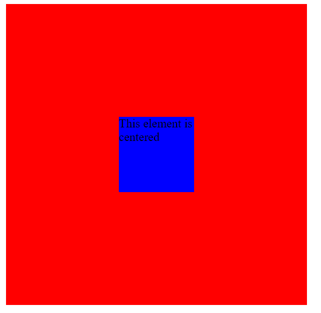

# 使用 CSS 的 4 种不同的元素居中方式

> 原文: [https://www.geeksforgeeks.org/4-different-ways-to-center-an-element-using-css/](https://www.geeksforgeeks.org/4-different-ways-to-center-an-element-using-css/)

当我们创建一个网页时，我们很可能遇到了一个集中元素的问题。因此，让我们看一下使用 CSS 将元素居中的 4 种不同方法:

1.  使用 Flex
2.  保证金属性
3.  网格属性
4.  绝对财产

现在让我们使用示例来看看这些属性是如何工作的。

## HTML 代码

**文件名:** `index.html`

```html
<!DOCTYPE html>
<html>

<head>
    <title>Page Title</title>
    <link rel="stylesheet" href="styles.css" />
</head>

<body>
    <div class="parent">
        <div class="child">
            This element is centered
        </div>
    </div>
</body>

</html>
```

在上面的代码中，我们创建了一个父 `div` 和一个子 `div`。我们将看看如何在父 `div` 中居中子 `div`。一个名为 `styles.css` 的样式表已经链接到我们定义了父 `div` 和子 `div` 样式的文件。

### 文件名: `styles.css`

```css
.parent {
  height: 400px;
  width: 400px;
  background-color: red;
}
.child {
  height: 100px;
  width: 100px;
  background-color: blue;
}
```

## 方法 1: 使用 Flex

我们可以使用 `Flexbox` 来对元素进行居中。我们可以将父 `div` 的 `display` 属性设置为 `flex`，并且可以使用 `justify-content: center` (水平) 和 `align-items: center` (垂直) 属性轻松地将子 `div` 居中。

### CSS 代码

```css
.parent {
  display: flex;
  justify-content: center;
  align-items: center;
}
```

## 方法 2: 边距属性

另一个简单的方法是将子 `div` 居中，将其 `margin` 设置为 `auto`，并使父 `div` 显示为 `grid`。

### CSS 代码

```css
.parent {
  display: grid;
}
.child {
  margin: auto;
}
```

## 方法 3: 网格属性

将元素居中的一个非常简单的方法是在父 `div` 上使用 `grid` 属性，并设置 `place-items: center`。

### CSS 代码

```css
.parent {
  display: grid;
  place-items: center;
}
```

## 方法 4: 绝对属性

我们也可以使用 `position` 属性来居中元素。

### CSS 代码

```css
.parent {
  position: relative;
}
.child {
  position: absolute;
  top: 50%;
  left: 50%;
  transform: translate(-50%, -50%);
}
```

## 输出

所有这些方式的输出都是相同的，如下所示:

