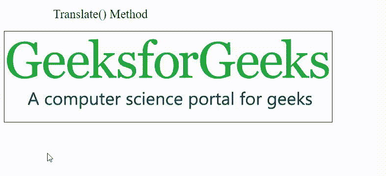
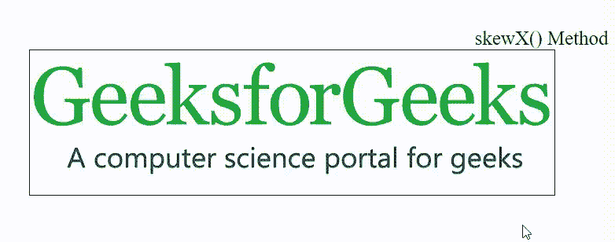
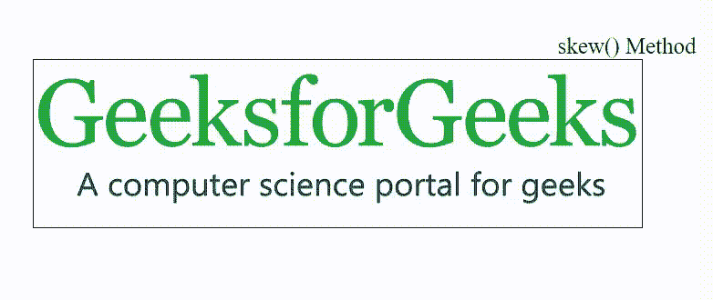

# CSS 2D 变换

> 原文: [https://www.geeksforgeeks.org/css-2d-transforms/](https://www.geeksforgeeks.org/css-2d-transforms/)

CSS 中的 [变换](https://www.geeksforgeeks.org/css-transform-property/) 用于通过元素的形状、大小和位置来修改元素。它沿着 X 轴和 Y 轴变换元素。下面列出了 6 种主要的转换类型:

*   `translate()`
*   `rotate()`
*   `scale()`
*   `skewX()`
*   `skewY()`
*   `matrix()`

我们将实现所有这些功能并通过示例理解它们的概念。

## `translate()` 方法

[`translate()` 方法](https://www.geeksforgeeks.org/css-translate-function/) 用于将元素从其实际位置沿 X 轴和 Y 轴移动。

### 示例

本示例描述了 CSS `translate()` 方法，用于从元素的实际位置修改元素的位置。

```html
<!DOCTYPE html>
<html>

<head>
    <title>2D Transform</title>
    <style>
    .geeks {
        font-size: 25px;
        margin: 20px 0;
        margin-left: 100px;
    }

    img {
        border: 1px solid black;
        transition-duration: 2s;
        -webkit-transition-duration: 2s;
    }

    img:hover {
        transform: translate(100px, 100px);

        /* prefix for IE 9 */
        -ms-transform: translate(100px, 100px);

        /* prefix for Safari and Chrome */
        -webkit-transform: translate(100px, 100px);
    }
    </style>
</head>

<body>
    <div class="geeks">Translate() Method</div>
        
</body>

</html>
```

### 输出



## `rotate()` 方法

[`rotate()` 方法](https://www.geeksforgeeks.org/css-rotate-function/) 根据给定的度数顺时针或逆时针旋转元素。括号中给出了度数。

### 示例

本示例描述了顺时针或逆时针旋转元素的 CSS `rotate()` 方法。

```html
<!DOCTYPE html>
<html>

<head>
    <title>2D Transform</title>
    <style>
    img {
        border: 1px solid black;
    }

    img:hover {

        /* IE 9 */
        -ms-transform: rotate(20deg);

        /* Safari */
        -webkit-transform: rotate(20deg);

        /* Standard syntax */
        transform: rotate(20deg);
    }

    .geeks {
        font-size: 25px;
        text-align: center;
        margin-top: 100px;
    }
    </style>
</head>

<body>
    <div class="geeks">Rotation() Method</div>
        
</body>

</html>
```

### 输出


### 逆时针旋转

使用负值逆时针旋转元素。

### 示例

本示例描述了 CSS `rotate()` 方法，使用负值逆时针旋转元素。

```html
<!DOCTYPE html>
<html>

<head>
    <title>2D Transform</title>
    <style>
    img {
        border: 1px solid black;
    }

    img:hover {
        /* IE 9 */
        -ms-transform: rotate(-20deg);

        /* Safari */
        -webkit-transform: rotate(-20deg);

        /* Standard syntax */
        transform: rotate(-20deg);
    }

    .geeks {
        font-size: 25px;
        text-align: center;
        margin-top: 100px;
    }
    </style>
</head>

<body>
    <div class="geeks">Counter-clock Rotate() Method</div>
        
</body>

</html>
```

### 输出


## `scale()` 方法

[`scale()` 方法](https://www.geeksforgeeks.org/css-scale-function/) 用于根据给定的宽度和高度参数增加或减少元素的大小。

### 示例

本示例描述了 CSS `scale()` 方法，根据元素的宽度和高度来调整元素的大小。

```html
<!DOCTYPE html>
<html>

<head>
    <title>2D Transform</title>
    <style>
    img {
        border: 1px solid black;
    }

    img:hover {
        /* IE 9 */
        -ms-transform: scale(1, 2);
        /* Safari */
        -webkit-transform: scale(1, 1);
        /* Standard syntax */
        transform: scale(1, 2);
    }

    .geeks {
        font-size: 25px;
        text-align: center;
        margin-top: 100px;
    }
    </style>
</head>

<body>
    <div class="geeks">Scale() Method</div>
        
</body>

</html>
```

### 输出


**注意:** 元素的大小可以使用其宽度和高度的一半来减小。

## `skewX()` 方法

[`skewX()` 方法](https://www.geeksforgeeks.org/css-skewx-function/) 用于沿 X 轴以给定角度偏斜元素。

### 示例

本示例描述了在 X 轴上倾斜元素的 CSS `skewX()` 方法。

```html
<!DOCTYPE html>
<html>

<head>
    <title>2D Transform</title>
    <style>
    img {
        border: 1px solid black;
    }

    img:hover {

        /* IE 9 */
        -ms-transform: skewX(20deg);

        /* Safari */
        -webkit-transform: skewX(20deg);

        /* Standard syntax */
        transform: skewX(20deg);
    }

    .geeks {
        font-size: 25px;
        text-align: center;
        margin-top: 100px;
    }
    </style>
</head>

<body>
    <div class="geeks">skewX() Method</div>
        
</body>

</html>
```

### 输出



## `skewY()` 方法

[`skewY()` 方法](https://www.geeksforgeeks.org/css-skewy-function/) 此法用于沿 Y 轴以给定角度偏斜元素。

### 示例

本示例描述了 CSS `skewY()` 方法在 Y 轴上倾斜元素。

```html
<!DOCTYPE html>
<html>

<head>
    <title>2D Transform</title>
    <style>
    img {
        border: 1px solid black;
    }

    img:hover {

        /* IE 9 */
        -ms-transform: skewY(20deg);

        /* Safari */
        -webkit-transform: skewY(20deg);

        /* Standard syntax */
        transform: skewY(20deg);
    }

    .geeks {
        font-size: 25px;
        text-align: center;
        margin-top: 100px;
    }
    </style>
</head>

<body>
    <div class="geeks">skewY() Method</div>
        
</body>

</html>
```

### 输出


## `skew()` 方法

[`skew()` 方法](https://www.geeksforgeeks.org/css-skew-function/) 此方法沿 X 轴和 Y 轴以给定角度偏斜元素。以下示例将元素沿 X 轴倾斜 20 度，沿 Y 轴倾斜 10 度。

### 示例

此示例描述了 CSS `skew()` 方法，用于沿 X 轴和 Y 轴以给定角度倾斜元素。

```html
<!DOCTYPE html>
<html>

<head>
    <title>2D Transform</title>
    <style>
    img {
        border: 1px solid black;
    }

    img:hover {

        /* IE 9 */
        -ms-transform: skew(20deg, 10deg);

        /* Safari */
        -webkit-transform: skew(20deg, 10deg);

        /* Standard syntax */
        transform: skew(20deg, 10deg);
    }

    .geeks {
        font-size: 25px;
        text-align: center;
        margin-top: 100px;
    }
    </style>
</head>

<body>
    <div class="geeks">skew() Method</div>
        
</body>

</html>
```

### 输出



## `matrix()` 方法

[`matrix()` 方法](https://www.geeksforgeeks.org/css-matrix-function/) 此方法将所有 2D 变换属性合并为一个属性。矩阵变换属性接受六个参数作为矩阵(`scaleX()`, `skewY()`, `skewX()`, `scaleY()`, `translateX()`, `translateY()`)。

### 示例

本示例描述了将所有 2D 变换属性组合成单个属性的 CSS `matrix()` 方法。

```html
<!DOCTYPE html>
<html>

<head>
    <title>2D Transform</title>
    <style>
    img {
        border: 1px solid black;
    }

    img:hover {

        /* IE 9 */
        -ms-transform: matrix(1, -0.3, 0, 1, 0, 0);

        /* Safari */
        -webkit-transform: matrix(1, -0.3, 0, 1, 0, 0);

        /* Standard syntax */
        transform: matrix(1, -0.3, 0, 1, 0, 0);
    }

    .geeks {
        font-size: 25px;
        text-align: center;
        margin-top: 100px;
    }
    </style>
</head>

<body>
    <div class="geeks">matrix() Method</div>
        
</body>

</html>
```

### 输出


## 支持的浏览器

*   `Google Chrome` 36.0
*   `Microsoft Edge` 12.0
*   `Internet Explorer` 10.0
*   `Firefox` 16.0
*   `Opera` 23.0
*   `Safari` 9.0

**注意:** `Internet Explorer` 不支持全局值 `initial` 和 `unset`。