# CSS | 背景-滤镜属性

> 原文: [https://www.geeksforgeeks.org/css-backdrop-filter-property/](https://www.geeksforgeeks.org/css-backdrop-filter-property/)

CSS `backdrop-filter` 属性用于对元素后面的区域应用效果。这与 `filter` 属性不同，`filter` 属性将效果应用于整个元素。它可以用来消除使用额外的元素来单独设置背景的样式。

## 语法

`backdrop-filter: blur() | brightness() | contrast() | drop-shadow() | grayscale() | hue-rotate() | invert() | opacity() | saturate() | sepia() | none | initial | inherit`

## 属性值

### `blur()`
用于对图像应用高斯模糊。此函数的默认值为 `0`，即不应用模糊效果。

**示例:**

```html
<!DOCTYPE html>
<html>
<head>
    <title>CSS | backdrop-filter</title>
    <style>
        .container {
            background-image: url("https://media.geeksforgeeks.org/wp-content/uploads/geeksforgeeks-25.png");
            background-size: cover;
            display: flex;
            align-items: center;
            justify-content: center;
            height: 100px;
            width: 360px;
        }
        .foreground {
            backdrop-filter: blur(5px);
            padding: 2px;
        }
    </style>
</head>
<body>
    <h1 style="color: green">GeeksforGeeks</h1>
    <b>CSS | backdrop-filter</b>
    <div class="container">
        <div class="foreground">
            This text is not affected by backdrop-filter.
        </div>
    </div>
</body>
</html>
```

**输出:**
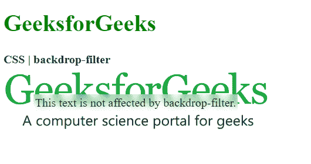

### `brightness()`
用于使图像变亮或变暗。值超过 `100%` 会使图像变亮，低于 `100%` 会使图像变暗。如果亮度变为 `0%`，图像将完全变黑。

**示例:**

```html
<!DOCTYPE html>
<html>
<head>
    <title>CSS | backdrop-filter</title>
    <style>
        .container {
            background-image: url("https://media.geeksforgeeks.org/wp-content/uploads/geeksforgeeks-25.png");
            background-size: cover;
            display: flex;
            align-items: center;
            justify-content: center;
            height: 100px;
            width: 360px;
        }
        .foreground {
            backdrop-filter: brightness(25%);
            padding: 2px;
        }
    </style>
</head>
<body>
    <h1 style="color: green">GeeksforGeeks</h1>
    <b>CSS | backdrop-filter</b>
    <div class="container">
        <div class="foreground">
            This text is not affected by backdrop-filter.
        </div>
    </div>
</body>
</html>
```

**输出:**
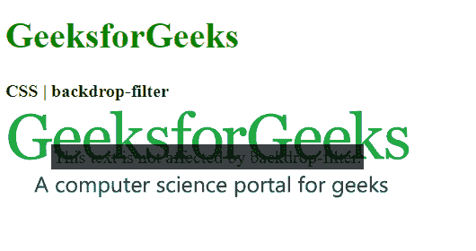

### `contrast()`
用于设置图像的对比度。原始图像的对比度为 `100%`。如果对比度低于 `0%`，图像将完全变黑。

**示例:**

```html
<!DOCTYPE html>
<html>
<head>
    <title>CSS | backdrop-filter</title>
    <style>
        .container {
            background-image: url("https://media.geeksforgeeks.org/wp-content/uploads/geeksforgeeks-25.png");
            background-size: cover;
            display: flex;
            align-items: center;
            justify-content: center;
            height: 100px;
            width: 360px;
        }
        .foreground {
            backdrop-filter: contrast(20%);
            padding: 2px;
        }
    </style>
</head>
<body>
    <h1 style="color: green">GeeksforGeeks</h1>
    <b>CSS | backdrop-filter</b>
    <div class="container">
        <div class="foreground">
            This text is not affected by backdrop-filter.
        </div>
    </div>
</body>
</html>
```

**输出:**
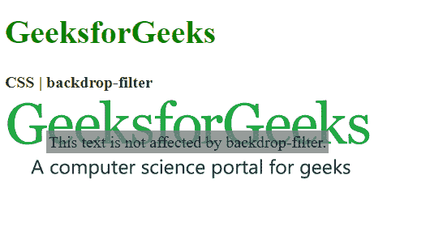

### `drop-shadow()`
用于对元素应用投影效果。它接受水平和垂直阴影偏移量以及扩展和颜色值。

**示例:**

```html
<!DOCTYPE html>
<html>
<head>
    <title>CSS | backdrop-filter</title>
    <style>
        .container {
            background-image: url("https://media.geeksforgeeks.org/wp-content/uploads/geeksforgeeks-25.png");
            background-size: cover;
            display: flex;
            align-items: center;
            justify-content: center;
            height: 100px;
            width: 360px;
        }
        .foreground {
            backdrop-filter: drop-shadow(20px 10px red);
            padding: 2px;
        }
    </style>
</head>
<body>
    <h1 style="color: green">GeeksforGeeks</h1>
    <b>CSS | backdrop-filter</b>
    <div class="container">
        <div class="foreground">
            This text is not affected by backdrop-filter.
        </div>
    </div>
</body>
</html>
```

**输出:**
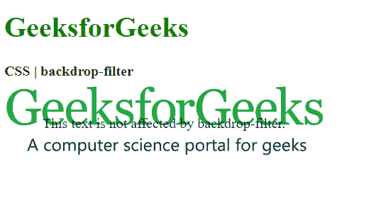

### `grayscale()`
用于将图像的颜色转换为灰度。值为 `0%` 表示原始图像，`100%` 表示完全灰度的图像。

**示例:**

```html
<!DOCTYPE html>
<html>
<head>
    <title>CSS | backdrop-filter</title>
    <style>
        .container {
            background-image: url("https://media.geeksforgeeks.org/wp-content/uploads/geeksforgeeks-25.png");
            background-size: cover;
            display: flex;
            align-items: center;
            justify-content: center;
            height: 100px;
            width: 360px;
        }
        .foreground {
            backdrop-filter: grayscale(75%);
            padding: 2px;
        }
    </style>
</head>
<body>
    <h1 style="color: green">GeeksforGeeks</h1>
    <b>CSS | backdrop-filter</b>
    <div class="container">
        <div class="foreground">
            This text is not affected by backdrop-filter.
        </div>
    </div>
</body>
</html>
```

**输出:**
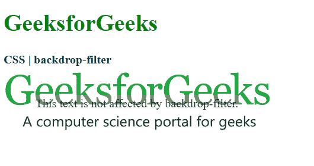

### `hue-rotate()`
用于对图像应用色相旋转。函数值表示图像在色环上调整的度数。默认值为 `0`，表示原始图像。

**示例:**

```html
<!DOCTYPE html>
<html>
<head>
    <title>CSS | backdrop-filter</title>
    <style>
        .container {
            background-image: url("https://media.geeksforgeeks.org/wp-content/uploads/geeksforgeeks-25.png");
            background-size: cover;
            display: flex;
            align-items: center;
            justify-content: center;
            height: 100px;
            width: 360px;
        }
        .foreground {
            backdrop-filter: hue-rotate(180deg);
            padding: 2px;
        }
    </style>
</head>
<body>
    <h1 style="color: green">GeeksforGeeks</h1>
    <b>CSS | backdrop-filter</b>
    <div class="container">
        <div class="foreground">
            This text is not affected by backdrop-filter.
        </div>
    </div>
</body>
</html>
```

**输出:**
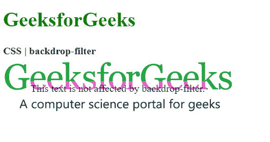

### `invert()`
用于反转图像。默认值为 `0%`，表示原始图像，`100%` 将使图像完全反转。

**示例:**

```html
<!DOCTYPE html>
<html>
<head>
    <title>CSS | backdrop-filter</title>
```

# CSS | backdrop-filter

```html
<style>
    .container {
        background-image: url("https://media.geeksforgeeks.org/wp-content/uploads/geeksforgeeks-25.png");
        background-size: cover;
        display: flex;
        align-items: center;
        justify-content: center;
        height: 100px;
        width: 360px;
    }
    .foreground {
        backdrop-filter: invert(100%);
        padding: 2px;
    }
</style>
</head>

<body>
    <h1 style="color: green">
        GeeksforGeeks
    </h1>

<b>CSS | backdrop-filter</b>

<div class="container">
    <div class="foreground">
        This text is not affected by backdrop-filter.
    </div>
</div>
</body>

</html>
```

**输出:**
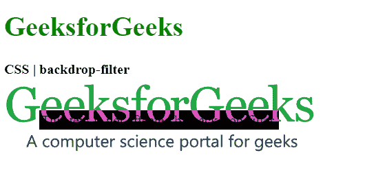

## `invert()`

`invert()` 函数用于反转背景的颜色。默认值为 0%，表示原始图像，100% 表示完全反转的图像。

**示例:**

```html
<!DOCTYPE html>
<html>

<head>
    <title>CSS | backdrop-filter</title>

<style>
    .container {
        background-image: url("https://media.geeksforgeeks.org/wp-content/uploads/geeksforgeeks-25.png");
        background-size: cover;
        display: flex;
        align-items: center;
        justify-content: center;
        height: 100px;
        width: 360px;
    }
    .foreground {
        backdrop-filter: invert(100%);
        padding: 2px;
    }
</style>
</head>

<body>
    <h1 style="color: green">
        GeeksforGeeks
    </h1>

<b>CSS | backdrop-filter</b>

<div class="container">
    <div class="foreground">
        This text is not affected by backdrop-filter.
    </div>
</div>
</body>

</html>
```

**输出:**


## `opacity()`

`opacity()` 函数用于设置图像的不透明度。默认值为 0%，表示图像完全透明，值为 100% 表示原始图像完全不透明。

**示例:**

```html
<!DOCTYPE html>
<html>

<head>
    <title>CSS | backdrop-filter</title>

<style>
    .container {
        background-image: url("https://media.geeksforgeeks.org/wp-content/uploads/geeksforgeeks-25.png");
        background-size: cover;
        display: flex;
        align-items: center;
        justify-content: center;
        height: 100px;
        width: 360px;
    }
    .foreground {
        backdrop-filter: opacity(50%);
        padding: 2px;
    }
</style>
</head>

<body>
    <h1 style="color: green">
        GeeksforGeeks
    </h1>

<b>CSS | backdrop-filter</b>

<div class="container">
    <div class="foreground">
        This text is not affected by backdrop-filter.
    </div>
</div>
</body>

</html>
```

**输出:**
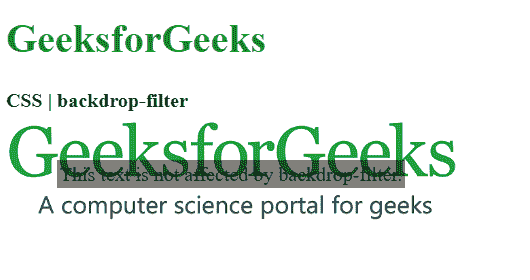

## `saturate()`

`saturate()` 函数用于设置元素的饱和度。默认值为 100%，表示原始图像。0% 的值表示完全不饱和的图像，超过 100% 的值表示超饱和的图像。

**示例:**

```html
<!DOCTYPE html>
<html>

<head>
    <title>CSS | backdrop-filter</title>

<style>
    .container {
        background-image: url("https://media.geeksforgeeks.org/wp-content/uploads/geeksforgeeks-25.png");
        background-size: cover;
        display: flex;
        align-items: center;
        justify-content: center;
        height: 100px;
        width: 360px;
    }
    .foreground {
        backdrop-filter: saturate(50%);
        padding: 2px;
    }
</style>
</head>

<body>
    <h1 style="color: green">
        GeeksforGeeks
    </h1>

<b>CSS | backdrop-filter</b>

<div class="container">
    <div class="foreground">
        This text is not affected by backdrop-filter.
    </div>
</div>
</body>

</html>
```

**输出:**
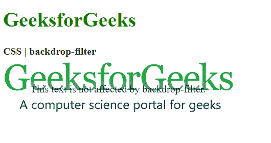

## `sepia()`

`sepia()` 函数用于将图像转换为棕褐色调，使其外观更温暖。0% 的值代表原始图像，100% 代表完全棕褐色的图像。

**示例:**

```html
<!DOCTYPE html>
<html>

<head>
    <title>CSS | backdrop-filter</title>

<style>
    .container {
        background-image: url("https://media.geeksforgeeks.org/wp-content/uploads/geeksforgeeks-25.png");
        background-size: cover;
        display: flex;
        align-items: center;
        justify-content: center;
        height: 100px;
        width: 360px;
    }
    .foreground {
        backdrop-filter: sepia(100%);
        padding: 2px;
    }
</style>
</head>

<body>
    <h1 style="color: green">
        GeeksforGeeks
    </h1>

<b>CSS | backdrop-filter</b>

<div class="container">
    <div class="foreground">
        This text is not affected by backdrop-filter.
    </div>
</div>
</body>

</html>
```

**输出:**
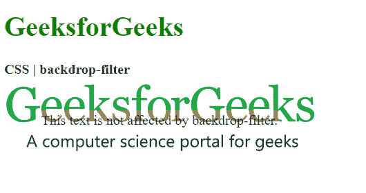

## `none`

`none` 是默认值，不向图像应用任何效果。

**示例:**

```html
<!DOCTYPE html>
<html>

<head>
    <title>CSS | backdrop-filter</title>

<style>
    .container {
        background-image: url("https://media.geeksforgeeks.org/wp-content/uploads/geeksforgeeks-25.png");
        background-size: cover;
        display: flex;
        align-items: center;
        justify-content: center;
        height: 100px;
        width: 360px;
    }
    .foreground {
        backdrop-filter: none;
        padding: 2px;
    }
</style>
</head>

<body>
    <h1 style="color: green">
        GeeksforGeeks
    </h1>

<b>CSS | backdrop-filter</b>

<div class="container">
    <div class="foreground">
        This text is not affected by backdrop-filter.
    </div>
</div>
</body>

</html>
```

**输出:**
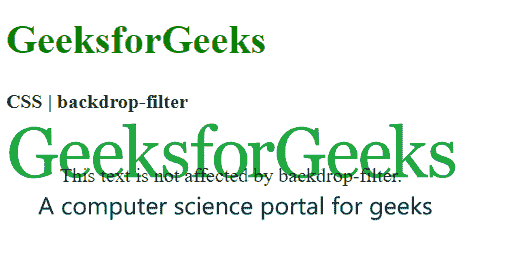

## `initial`

`initial` 用于将此属性设置为其默认值。

**示例:**

```html
<!DOCTYPE html>
<html>

<head>
    <title>CSS | backdrop-filter</title>

<style>
    .container {
        background-image: url("https://media.geeksforgeeks.org/wp-content/uploads/geeksforgeeks-25.png");
        background-size: cover;
        display: flex;
        align-items: center;
        justify-content: center;
        height: 100px;
        width: 360px;
    }
    .foreground {
        backdrop-filter: initial;
        padding: 2px;
    }
</style>
</head>

<body>
    <h1 style="color: green">
        GeeksforGeeks
    </h1>

<b>CSS | backdrop-filter</b>

<div class="container">
    <div class="foreground">
        This text is not affected by backdrop-filter.
    </div>
</div>
</body>

</html>
```

**输出:**
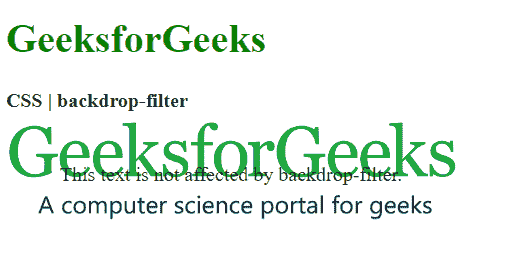

## `inherit`

`inherit` 从其父元素继承属性。

## 支持的浏览器

`backdrop-filter` 属性支持的浏览器如下：

*   谷歌 Chrome 76.0
*   Edge 17.0
*   Safari 9.0
*   Opera 34.0