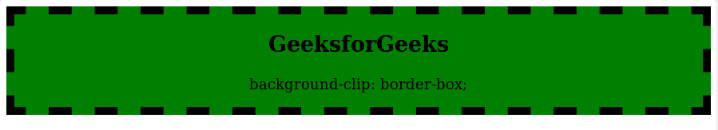
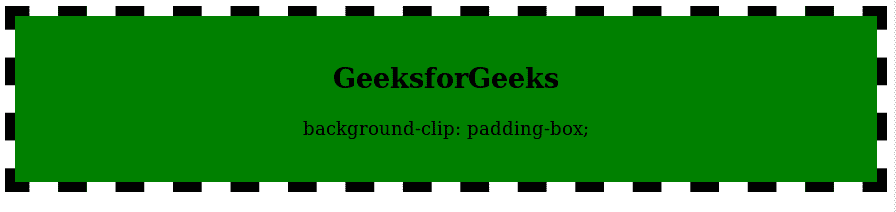
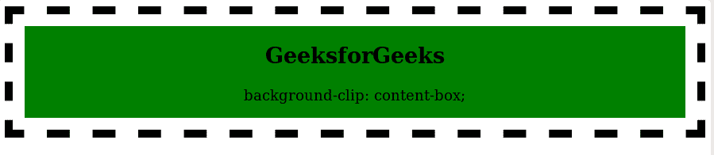
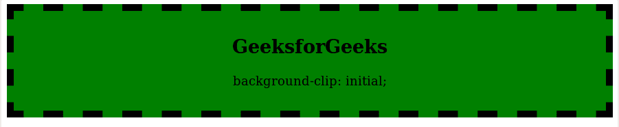

# CSS 背景剪辑属性

> 原文: [https://www.geeksforgeeks.org/css-background-clip-property/](https://www.geeksforgeeks.org/css-background-clip-property/)

CSS 中的 `background-clip` 属性用于定义如何在元素中扩展背景（颜色或图像）。

**默认值:**

*   `border-box`

**语法:**

```html
background-clip: border-box|padding-box|content-box|initial|inherit;
```

## 属性值

### `border-box`
`border-box` 属性值用于设置整个分区的背景颜色。

*   **语法:**

```html
background-clip: border-box;
```

*   **示例:**

```html
<!DOCTYPE html>
<html>
    <head>
        <title>Border Box</title>
        <style>
            .gfg {
                background-color: green;
                background-clip:border-box;
                text-align:center;
                border:10px dashed black;
            }
        </style>
    </head>

    <body>
        <div class = "gfg">
            <h2>
                GeeksforGeeks
            </h2>
            <p>
                background-clip: border-box;
            </p>
        </div>
    </body>
</html>
```

*   **输出:**



### `padding-box`
`padding-box` 属性值用于设置边框内的背景。

*   **语法:**

```html
background-clip:padding-box;
```

*   **示例:**

```html
<!DOCTYPE html>
<html>
    <head>
        <title>padding-box property</title>
        <style>
            .gfg {
                background-color: green;
                background-clip:padding-box;
                padding: 25px;
                border: 10px dashed black;
            }
        </style>
    </head>

    <body style = "text-align:center">
        <div class = "gfg">
            <h2>
                GeeksforGeeks
            </h2>
            <p>
                background-clip: padding-box;
            </p>
        </div>
    </body>
</html>
```

*   **输出:**



### `content-box`
`content-box` 属性值仅用于设置内容的背景颜色。

*   **语法:**

```html
background-clip:content-box;
```

*   **示例:**

```html
<!DOCTYPE html>
<html>
    <head>
        <title>content-box property</title>
        <style>
            .gfg {
                background-color: green;
                background-clip:content-box;
                padding: 15px;
                border: 10px dashed black;
            }
        </style>
    </head>

    <body style = "text-align:center">
        <div class = "gfg">
            <h2>
                GeeksforGeeks
            </h2>
            <p>
                background-clip: content-box;
            </p>
        </div>
    </body>
</html>
```

*   **输出:**



### `initial`
`initial` 值为默认值。它用于设置覆盖整个部门的背景颜色。

*   **语法:**

```html
background-clip:initial-box;
```

*   **示例:**

```html
<!DOCTYPE html>
<html>
    <head>
        <title>Initial</title>
        <style>
            .gfg {
                background-color: green;
                background-clip:initial;
                padding: 15px;
                border: 10px dashed black;
            }
        </style>
    </head>

    <body style = "text-align:center">
        <div class = "gfg">
            <h2>
                GeeksforGeeks
            </h2>
            <p>
                background-clip: initial;
            </p>
        </div>
    </body>
</html>
```

*   **输出:**



## 支持的浏览器

`background-clip` 属性支持的浏览器如下:

*   Google Chrome 4.0
*   Internet Explorer 9.0
*   Firefox 4.0
*   Opera 10.5
*   Safari 3.0